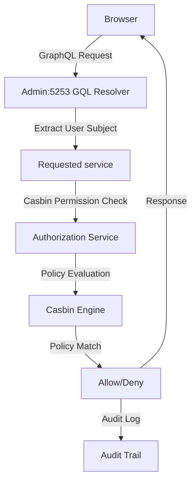
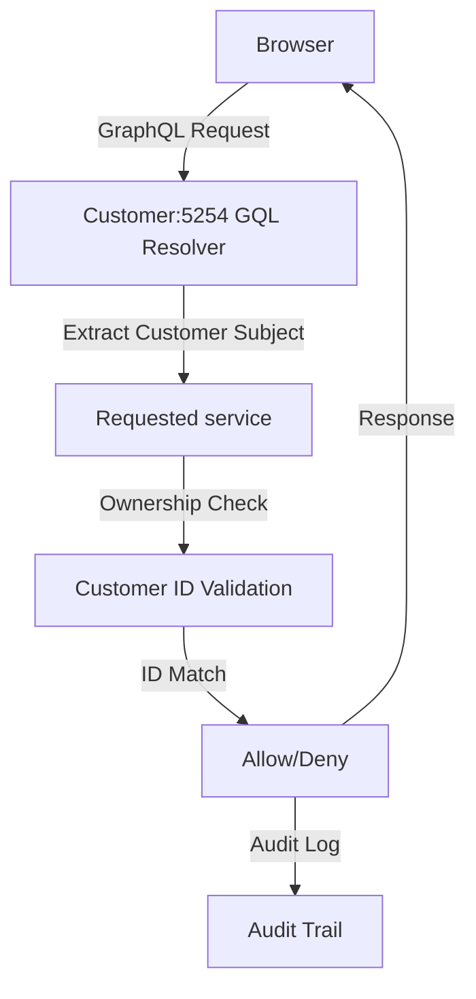

### Authorization Overview

#### Two-Tier Authorization System

The Lana Bank application uses **different authorization techniques** depending on the API:

1. **Admin Server (port: 5253)**: Full RBAC system with Casbin authorization engine for complex role-based permissions
2. **Customer Server (port: 5254)**: Simple ownership-based access control for self-service functionality

- **Core Components:**

  - **Casbin**: Authorization engine with PostgreSQL policy storage ([./lib/authz/src/rbac.conf](./lib/authz/src/rbac.conf)), uses a custom RBAC model to match permissions against policies for the particular role, enforcing access control.
  - **rbac-types**: Centralized type system for RBAC entities to generate all action-permission mappings ([./lana/rbac-types](./lana/rbac-types))
  - **authz**: Authorization library with audit integration ([./lib/authz](./lib/authz))

- **Key Concepts:**
  - **Subject**: Admin user or Customer performing the action
  - **Object**: Resource being accessed (e.g., `Disbursal`, `Obligation`, `Credit facility`)
  - **Action**: Operation being performed (e.g., `CREATE`, `READ`, `UPDATE`, `DELETE`)
  - **Permission Set**: Named collection of permissions (e.g., `CREDIT_VIEWER`, `CREDIT_WRITER`) - Admin only
  - **Role**: Assignment of permission sets to users (e.g., `accountant`, `manager`) - Admin only
  - **Ownership**: Customer can only access their own data

### High-level authorization flow - Admin Server

- **Policy Storage**: Casbin policies stored in PostgreSQL `casbin_rule` table
- **Dynamic Policy Generation**: Initial policies, roles and action-permission mappings are generated from code definitions during bootstrap ([./core/access/src/bootstrap.rs](./core/access/src/bootstrap.rs))
- **Permission-based navigationn**: The admin dashboard uses dynamic navigation that changes based on user permissions

##### Admin Server Flow

- Admin sends GraphQL query/mutation with JWT
- GraphQL resolver extracts user subject from JWT token
- Requested service calls the authorization service with (subject, object, action)
- Casbin policy engine evaluates user's role permissions against policies for the role/permissions sets
- The audit service logs authorization decision (allow/deny)
- Returns the result or authorization error

### High-level authorization flow - Customer Server

- **Ownership Validation**: Simple customer ID matching against resource ownership, no casbin policies
- **Self-Service Only**: Customers can only access their own data
- **Static navigationn**: The customer dashboard has fixed navigation, no permission checks

##### Customer Server Flow

- Customer sends GraphQL query with JWT
- GraphQL resolver extracts user subject from JWT token
- The requested service validates resource ownership against customer ID
- Audit service logs customer action for compliance
- Returns the customer's data or ownership error
