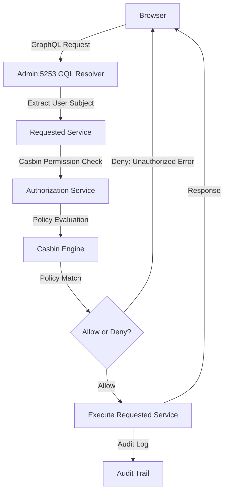

### Authorization Overview

#### Two-Tier Authorization System

The Lana Bank application uses a full RBAC system with casbin authorization-engine for complex role-based permissions

- **Core Components:**
  - **Casbin**: Authorization engine with PostgreSQL policy storage ([./lib/authz/src/rbac.conf](./lib/authz/src/rbac.conf)), uses a custom RBAC model to match permissions against policies for the particular role, enforcing access control.
  - **rbac-types**: Centralized type system for RBAC entities to generate all action-permission mappings ([./lana/rbac-types](./lana/rbac-types))
  - **authz**: Authorization library with audit integration ([./lib/authz](./lib/authz))

- **Key Concepts:**
  - **Subject**: Admin user or Customer performing the action
  - **Object**: Resource being accessed (e.g., `Disbursal`, `Obligation`, `Credit facility`)
  - **Action**: Operation being performed (e.g., `CREATE`, `READ`, `UPDATE`, `DELETE`)
  - **Permission Set**: Named collection of permissions (e.g., `CREDIT_VIEWER`, `CREDIT_WRITER`)
  - **Role**: Assignment of permission sets to users (e.g., `accountant`, `manager`)
  - **Ownership**: Customer can only access their own data

### High-level authorization flow - Admin Server

- **Policy Storage**: Casbin policies stored in PostgreSQL `casbin_rule` table
- **Dynamic Policy Generation**: Initial policies, roles and action-permission mappings are generated from code definitions during bootstrap ([./core/access/src/bootstrap.rs](./core/access/src/bootstrap.rs))
- **Permission-based navigationn**: The admin dashboard uses dynamic navigation that changes based on user permissions

##### Admin Server Flow

- Admin sends GraphQL query/mutation with JWT
- GraphQL resolver extracts user subject from JWT token
- Requested service calls the authorization service with (subject, object, action)
- Casbin policy engine evaluates user's role permissions against policies for the role/permissions sets
- The audit service logs authorization decision (allow/deny)
- Returns the result or authorization error

### Casbin Policy Model Overview

#### Database Schema

Casbin stores all rules as **strings** in a flexible schema in the `casbin_rule` table:
All matching operates on **string comparison** and **pattern matching**.
Rules reference entities using **`name:UUID`** format (e.g., `role:UUID`, `permission_set:UUID`) that correspond to actual database tables.

### Rule Types

#### Policy Rules (`p`)
**Format:** `p = sub, obj, act`  
Defines **what permissions exist**: permission sets can perform specific actions on resource patterns.

**Example:** `permission_set:reports` can perform `read` on `report/finance/*`

#### Grouping Rules (`g`)
**Format:** `g = _, _`  
Defines **inheritance relationships**: creates hierarchical chains like `user` → `role` → `permission_set`.

**Example:** `user:alice` inherits from `role:manager` or `role:manager` inherits from `permission_set:reports`

### Access Control Flow

#### Request Format
**Definition:** `r = sub, obj, act`  
Represents a user (`sub`) requesting to perform an action (`act`) on a specific resource (`obj`).

#### Matching Process
**Matcher:** `g(r.sub, p.sub) && keyMatch(r.obj, p.obj) && r.act == p.act`
1. **Inheritance Check:** Recursively verifies across the permission sets that the user inherits via the role
2. **Resource Match:** Pattern-based matching with wildcard support
3. **Action Match:** Exact string equality for actions

#### Authorization Result
Access is **granted** only when all three string-based conditions are satisfied, creating a secure and flexible role-based access control system.