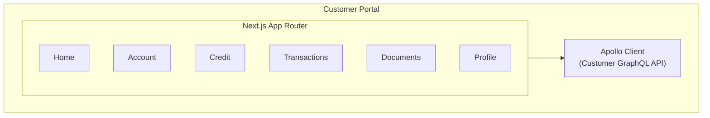
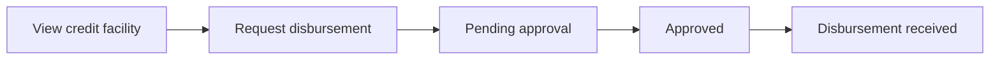

# Customer Portal

This document describes the Customer Portal architecture and development.

## Purpose

The Customer Portal allows bank customers to:

- View account status
- Request credit facilities
- Check balances and transactions
- Request withdrawals
- Download documents and statements

## Architecture



## Project Structure

```
apps/customer-portal/
├── app/
│   ├── layout.tsx           # Main layout
│   ├── page.tsx             # Home page
│   ├── account/             # Account overview
│   ├── transactions/        # Transaction history
│   ├── credit/              # Credit requests
│   ├── documents/           # Documents
│   └── profile/             # Customer profile
├── components/
│   ├── layout/              # Layout components
│   ├── account/             # Account components
│   └── shared/              # Shared components
└── lib/
    ├── apollo.ts            # Apollo configuration
    └── keycloak.ts          # Keycloak configuration
```

## User Flows

### Disbursement Request



## Authentication

### Keycloak Configuration

```typescript
export const keycloak = new Keycloak({
  url: process.env.NEXT_PUBLIC_KEYCLOAK_URL,
  realm: 'customer',
  clientId: 'customer-portal',
});
```

## Development

### Commands

```bash
# Development
pnpm dev

# Production build
pnpm build

# Lint
pnpm lint
```

### Environment Variables

```env
NEXT_PUBLIC_GRAPHQL_URL=http://app.localhost:4455/graphql
NEXT_PUBLIC_KEYCLOAK_URL=http://localhost:8081
NEXT_PUBLIC_KEYCLOAK_REALM=customer
NEXT_PUBLIC_KEYCLOAK_CLIENT_ID=customer-portal
```

