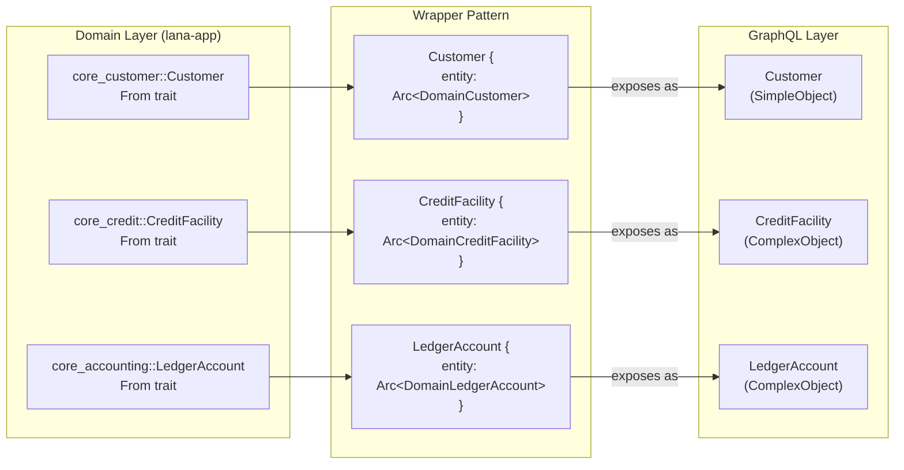
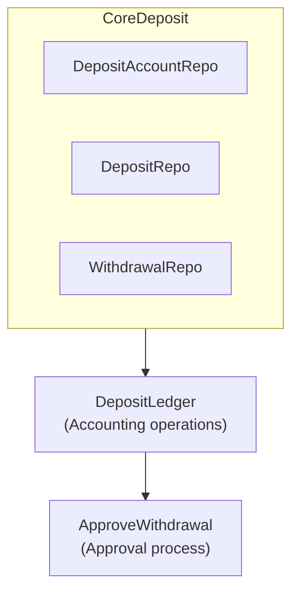

# Deposit and Withdrawal System

The Deposit and Withdrawal System manages customer deposit accounts and facilitates deposit/withdrawal operations within the platform.

## Purpose

The system handles the complete customer funds lifecycle:
- Deposit account creation
- Deposit recording
- Withdrawal processing
- Approval workflows

All financial operations are integrated with Cala Ledger for double-entry accounting.

## System Architecture

## Main Entities

### Deposit Account

| Field | Type | Description |
|-------|------|-------------|
| id | UUID | Unique identifier |
| publicId | String | Readable public ID |
| accountHolderId | UUID | Customer ID |
| status | Enum | Account status |
| accountType | Enum | Account type |

### Deposit

| Field | Type | Description |
|-------|------|-------------|
| id | UUID | Unique identifier |
| depositAccountId | UUID | Target account |
| amount | UsdCents | Amount in USD cents |
| reference | String | External reference |
| status | Enum | Deposit status |

### Withdrawal

| Field | Type | Description |
|-------|------|-------------|
| id | UUID | Unique identifier |
| depositAccountId | UUID | Source account |
| amount | UsdCents | Amount in USD cents |
| reference | String | External reference |
| status | Enum | Withdrawal status |

## Account Types

| Type | Description | Usage |
|------|-------------|-------|
| Individual | Personal account | Individual customers |
| GovernmentEntity | Government account | Government entities |
| PrivateCompany | Business account | Private companies |
| Bank | Bank account | Financial institutions |
| FinancialInstitution | Institutional account | Other institutions |
| ForeignAgencyOrSubsidiary | Foreign account | Foreign agencies |
| NonDomiciledCompany | Non-resident account | Non-domiciled companies |

## Account Status

| Status | Description |
|--------|-------------|
| ACTIVE | Operational account |
| INACTIVE | Deactivated account |
| FROZEN | Frozen account |

## Related Documentation

- [Deposit Operations](operations) - Deposits and withdrawals

