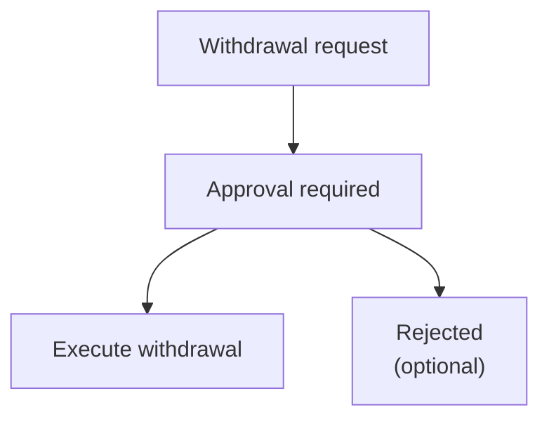

# Deposit and Withdrawal Operations

This document describes deposit and withdrawal operations, including workflows and approval procedures.

## Deposit Operations

### Recording Deposits

Deposits are recorded when external funds are received into a customer account.


### Create a Deposit

#### From Admin Panel

1. Navigate to **Customers** > select customer
2. Go to deposit account
3. Click **Record Deposit**
4. Complete:
   - Amount in USD
   - External reference
5. Confirm operation

#### Via GraphQL API

```graphql
mutation RecordDeposit($input: DepositRecordInput!) {
  depositRecord(input: $input) {
    deposit {
      id
      amount
      reference
      status
      createdAt
    }
  }
}
```

## Withdrawal Operations

### Withdrawal Flow

Withdrawals require an approval process before execution.



### Initiate a Withdrawal

#### From Admin Panel

1. Navigate to **Customers** > select customer
2. Go to deposit account
3. Click **Initiate Withdrawal**
4. Complete:
   - Amount in USD
   - External reference
5. Withdrawal enters approval process

### Withdrawal Status

| Status | Description |
|--------|-------------|
| PENDING_APPROVAL | Withdrawal pending approval |
| APPROVED | Withdrawal approved |
| CONFIRMED | Withdrawal executed and confirmed |
| DENIED | Withdrawal rejected |
| CANCELLED | Withdrawal cancelled |

## Approval Process

Withdrawals are subject to the governance system with process type `APPROVE_WITHDRAWAL_PROCESS`.

### Approve a Withdrawal

1. Navigate to **Pending Approvals**
2. Select withdrawal to approve
3. Review details:
   - Customer
   - Amount
   - Available balance
4. Click **Approve** or **Reject**

## Accounting Integration

### Deposit Entries

When a deposit is recorded:

| Account | Debit | Credit |
|---------|-------|--------|
| Cash (Asset) | X | |
| Customer Deposits (Liability) | | X |

### Withdrawal Entries

When a withdrawal is confirmed:

| Account | Debit | Credit |
|---------|-------|--------|
| Customer Deposits (Liability) | X | |
| Cash (Asset) | | X |

## Permissions Required

| Operation | Permission |
|-----------|---------|
| Record deposit | DEPOSIT_CREATE |
| View deposits | DEPOSIT_READ |
| Initiate withdrawal | WITHDRAWAL_CREATE |
| Approve withdrawal | WITHDRAWAL_APPROVE |
| Confirm withdrawal | WITHDRAWAL_CONFIRM |

