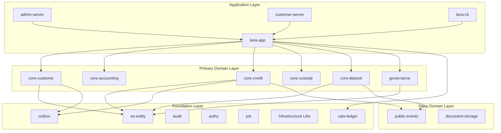

# Custody and Portfolio Management

This document describes the integration with custody providers and portfolio management systems.



## Overview

Lana integrates with cryptocurrency custody providers:

- **BitGo**: Primary custody provider
- **Komainu**: Alternative custody provider

## Architecture

```
┌─────────────────────────────────────────────────────────────────┐
│                    CUSTODY INTEGRATION                          │
│                                                                  │
│  ┌─────────────────────────────────────────────────────────┐   │
│  │                    Lana Core                             │   │
│  │              (Credit Collateral Module)                  │   │
│  └─────────────────────────────────────────────────────────┘   │
│                              │                                  │
│                              ▼                                  │
│  ┌─────────────────────────────────────────────────────────┐   │
│  │                  Custody Adapter                         │   │
│  │           (Provider-agnostic interface)                  │   │
│  └─────────────────────────────────────────────────────────┘   │
│                              │                                  │
│               ┌──────────────┴──────────────┐                  │
│               ▼                             ▼                  │
│  ┌─────────────────┐              ┌─────────────────┐         │
│  │     BitGo       │              │    Komainu      │         │
│  │   (Provider)    │              │   (Provider)    │         │
│  └─────────────────┘              └─────────────────┘         │
└─────────────────────────────────────────────────────────────────┘
```

## Custody Provider Interface

```rust
#[async_trait]
pub trait CustodyProvider {
    async fn create_wallet(&self, params: WalletParams) -> Result<Wallet>;
    async fn get_address(&self, wallet_id: WalletId) -> Result<Address>;
    async fn get_balance(&self, wallet_id: WalletId) -> Result<Balance>;
    async fn initiate_transfer(&self, transfer: TransferRequest) -> Result<TransferId>;
    async fn get_transfer_status(&self, transfer_id: TransferId) -> Result<TransferStatus>;
}
```

## Wallet Management

### Wallet Types

| Type | Purpose |
|------|---------|
| Hot Wallet | Operational liquidity |
| Cold Wallet | Long-term storage |
| Collateral Wallet | Customer collateral |

### Wallet Lifecycle

```
┌──────────────┐    ┌──────────────┐    ┌──────────────┐
│   Request    │───▶│   Create     │───▶│   Active     │
│   Wallet     │    │   Wallet     │    │   Wallet     │
└──────────────┘    └──────────────┘    └──────────────┘
                                               │
                                               ▼
                                        ┌──────────────┐
                                        │   Archive    │
                                        │   Wallet     │
                                        └──────────────┘
```

## Collateral Management

### Posting Collateral

```rust
pub async fn post_collateral(
    &self,
    facility_id: CreditFacilityId,
    amount: Satoshis,
) -> Result<CollateralRecord> {
    // Generate deposit address
    let address = self.custody.get_address(collateral_wallet).await?;

    // Create pending collateral record
    let record = CollateralRecord::pending(facility_id, amount, address);

    self.repo.save(record).await
}
```

### Monitoring Deposits

Background job monitors for incoming deposits:

```rust
pub async fn check_deposits(&self) -> Result<()> {
    let pending = self.repo.get_pending_collateral().await?;

    for record in pending {
        let balance = self.custody.get_balance(record.wallet_id).await?;

        if balance >= record.expected_amount {
            self.confirm_collateral(record.id).await?;
        }
    }

    Ok(())
}
```

## Portfolio Valuation

### Price Feeds

```rust
pub struct PriceOracle {
    providers: Vec<Box<dyn PriceProvider>>,
}

impl PriceOracle {
    pub async fn get_btc_usd_price(&self) -> Result<Decimal> {
        // Aggregate from multiple providers
        let prices: Vec<Decimal> = futures::future::join_all(
            self.providers.iter().map(|p| p.get_price("BTC", "USD"))
        ).await.into_iter().filter_map(Result::ok).collect();

        // Return median price
        Ok(median(&prices))
    }
}
```

### LTV Calculation

```rust
pub async fn calculate_ltv(&self, facility_id: CreditFacilityId) -> Result<Decimal> {
    let facility = self.facility_repo.find_by_id(facility_id).await?;
    let collateral = self.collateral_repo.get_for_facility(facility_id).await?;

    let btc_price = self.oracle.get_btc_usd_price().await?;
    let collateral_value = collateral.amount * btc_price;

    let ltv = facility.outstanding / collateral_value;
    Ok(ltv)
}
```

## Margin Calls

### LTV Thresholds

| Threshold | Action |
|-----------|--------|
| 60% | Initial margin requirement |
| 70% | Warning notification |
| 80% | Margin call issued |
| 90% | Liquidation initiated |

### Margin Call Process

```
┌──────────────┐    ┌──────────────┐    ┌──────────────┐
│   LTV > 70%  │───▶│   Notify     │───▶│   Customer   │
│   Detected   │    │   Customer   │    │   Adds       │
└──────────────┘    └──────────────┘    │   Collateral │
                                        └──────────────┘
                                               │
       ┌───────────────────────────────────────┘
       ▼
┌──────────────┐    ┌──────────────┐
│   LTV > 90%  │───▶│  Liquidate   │
│   No Action  │    │  Collateral  │
└──────────────┘    └──────────────┘
```

## Security

### Key Management

- Multi-signature wallets
- Hardware security modules (HSM)
- Key ceremony procedures

### Access Controls

- Role-based permissions
- Dual authorization for large transfers
- Audit logging

