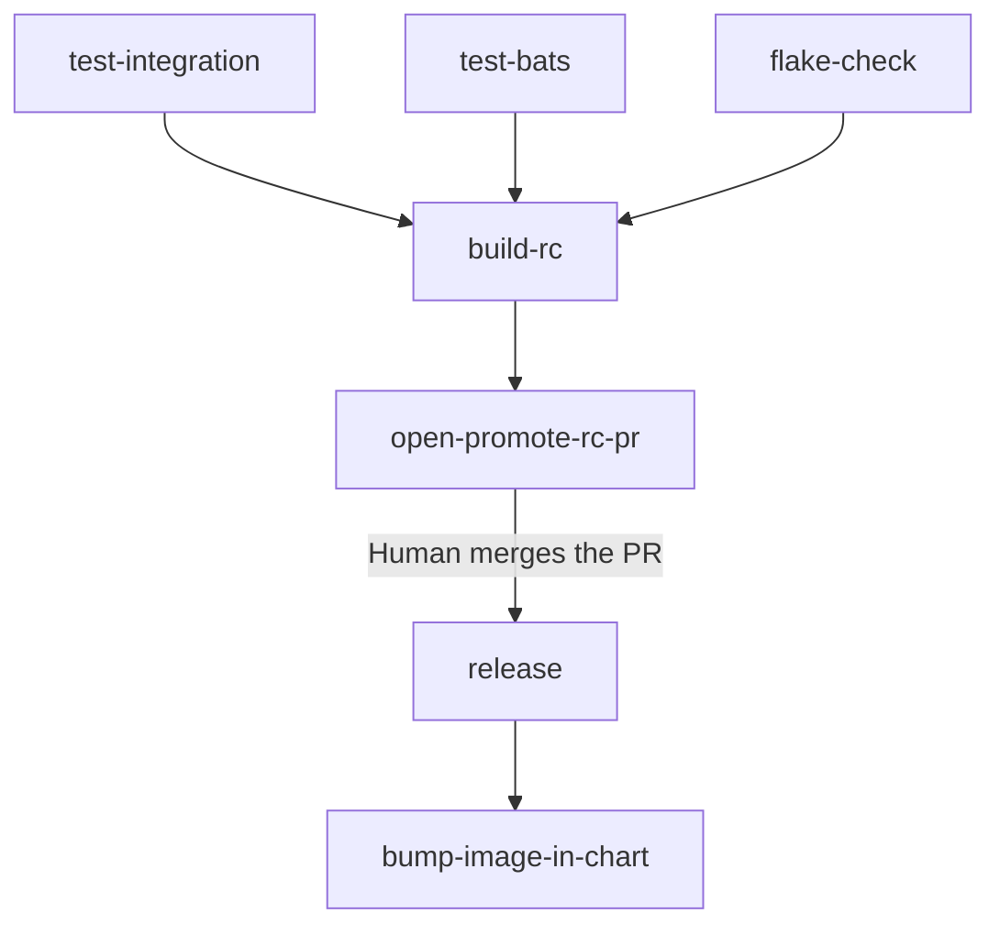

# CI/CD & Release Engineering

This page walks through the full journey of a code change — from the moment a developer opens a pull request, all the way to production. There are three main systems involved:

- **GitHub Actions** validates code on every pull request.
- **Concourse** builds releases, tests Helm charts, and deploys to environments.
- **Cepler** controls which environments get updated and in what order.

The design philosophy is simple: every step must pass before the next one starts, and there are human checkpoints at the most important moments. Nothing reaches production by accident.

## High-Level Overview

```mermaid
graph LR
    subgraph GH["GitHub Actions (PR Checks)"]
        A1["nextest"]
        A2["bats"]
        A3["cypress"]
        A4["check-code-apps"]
        A5["flake-check"]
        A6["codeql + pnpm audit"]
    end
    subgraph CONC_REL["Concourse: lana-bank pipeline"]
        B1["test-integration"]
        B2["test-bats"]
        B3["flake-check"]
        B4["build-rc"]
        B5["release"]
        B6["bump-image-in-chart"]
    end
    subgraph CONC_CHARTS["Concourse: galoy-private-charts"]
        C1["testflight"]
        C2["bump-in-deployments"]
    end
    subgraph DEPLOY["galoy-deployments + Cepler"]
        D1["staging"]
        D2["qa"]
        D3["production"]
    end
    GH -->|"merge to main"| CONC_REL
    CONC_REL -->|"image digests"| CONC_CHARTS
    CONC_CHARTS -->|"vendir sync"| DEPLOY
```



Now let's walk through each step in detail.

---

## Step 1: Pull Request Checks (GitHub Actions)

When a developer opens a pull request against `main`, GitHub Actions kicks off a suite of checks that all run in parallel. Every single one must pass before the PR can be merged — there are no exceptions.

### What gets checked

| Workflow | What it does | Why it matters |
|----------|-------------|----------------|
| **nextest** | Runs all Rust unit and integration tests via `nix run .#nextest` | Catches logic bugs and regressions in the backend |
| **bats** | Spins up the full application stack and runs BATS end-to-end tests against it | Verifies that the whole system works together, not just individual pieces |
| **cypress** | Runs Cypress browser tests against the admin panel and customer portal | Makes sure the UI actually works; also generates screenshots for regulatory manuals |
| **check-code-apps** | Lints, type-checks, and builds both Next.js frontends | Catches TypeScript errors, lint violations, and broken builds in the frontend |
| **flake-check** | Runs `nix flake check` to validate the Nix flake | Ensures the build system itself is healthy |
| **codeql** | GitHub's CodeQL static analysis for both JS/TS and Rust | Finds potential security vulnerabilities through static analysis |
| **pnpm-audit** | Audits npm dependencies for known vulnerabilities | Blocks PRs that introduce dependencies with high-severity CVEs |
| **data-pipeline** | Provisions a throwaway BigQuery environment, runs the data pipeline tests, then tears it down | Validates that the Dagster/dbt data pipeline still works with schema changes |
| **cocogitto** | Checks that commit messages follow the conventional commits format | Needed because the version number and changelog are generated automatically from commit messages |
| **spelling** | Runs the `typos` tool to catch common misspellings | Simple but catches embarrassing typos in code and docs |
| **lana-bank-docs** | Builds the full documentation site (API docs, versioned docs, screenshot validation) | Catches broken doc builds, missing API descriptions, and invalid doc site configuration |

### How Nix caching makes this fast

Compiling the Rust codebase from scratch takes a long time. To avoid doing that on every single PR, all the GitHub Actions workflows pull pre-built binaries from a shared **Cachix** binary cache called `galoymoney`.

Here's the pattern you'll see in every workflow file:

```yaml
- uses: DeterminateSystems/nix-installer-action@v16
- uses: cachix/cachix-action@v15
  with:
    name: galoymoney
    authToken: ${{ secrets.CACHIX_AUTH_TOKEN }}
    skipPush: true
```

The `skipPush: true` part is key — GitHub Actions only **reads** from the cache, it never writes to it. The cache gets populated by a separate Concourse pipeline (described in the [Nix Cache Pipeline](#nix-cache-pipeline) section below). This separation exists because Concourse has powerful caching workers with persistent storage, while GitHub Actions runners are ephemeral and would produce redundant pushes.

Most workflows also reclaim 10-20 GB of disk space at the start by removing pre-installed software (Docker images, Android SDK, etc.) that GitHub runners ship with. The large Rust compilations need that breathing room.

### What happens when a check fails

If any check fails, the PR is blocked from merging. The developer fixes the issue, pushes again, and the checks re-run. There's no way to bypass a failing check.

---

## Step 2: Building a Release (Concourse, lana-bank repo)

Once a PR is merged into `main`, the Concourse release pipeline takes over. This pipeline lives in the `ci/release/` directory of the lana-bank repo and is written using [YTT](https://carvel.dev/ytt/) templates.

The pipeline has a clear dependency chain:



### 2a. Re-running the tests on main

You might wonder: we already ran tests in GitHub Actions on the PR, so why run them again? Because the PR was tested against a potentially stale version of `main`. Between the time the PR was opened and the time it was merged, other PRs may have landed. Running tests again on the actual merged commit catches integration issues that only appear when multiple changes combine.

Three jobs run in parallel:

- **test-integration** runs `cargo nextest` — the same Rust test suite from the PR checks.
- **test-bats** runs the BATS end-to-end tests (with up to 2 attempts, since E2E tests can be flaky).
- **flake-check** validates the Nix flake.

All three must pass before anything gets built.

### 2b. Building the Release Candidate (`build-rc`)

Once tests pass, the pipeline builds a release candidate (RC). The idea behind RCs is that you can build and test multiple candidates before committing to a final release. Here's what happens:

1. **Figure out the version number.** A Nix script called `next-version` uses [cocogitto](https://docs.cocogitto.io/) to scan the conventional commit messages since the last release and determine the next semantic version. For example, if the last release was `0.41.0` and there's been a `feat:` commit, the next version becomes `0.42.0-rc.1`. If another RC was already built for this version, it increments to `rc.2`, `rc.3`, and so on.

2. **Inject the version into the frontend apps.** The script `prep-release-apps.sh` writes `NEXT_PUBLIC_APP_VERSION=0.42.0-rc.1` into the `.env` files of both the admin panel and customer portal, so the UI can display which version is running.

3. **Compile the Rust binary.** `nix build --impure .#lana-cli-release` produces the `lana-cli` binary. The `--impure` flag is needed because the build reads environment variables like `VERSION` and `COMMITHASH` that were set by the CI pipeline.

4. **Build four Docker images** and push them to Google Artifact Registry (`gcr.io/galoyorg`):
   - **`lana-bank`** — the main server (built from `Dockerfile.rc`, which copies the pre-compiled binary into a distroless base image)
   - **`lana-bank-admin-panel`** — the admin panel frontend
   - **`lana-bank-customer-portal`** — the customer portal frontend
   - **`dagster-code-location-lana-dw`** — the Dagster data pipeline code

5. **Tag the images.** Each image gets both an `edge` tag (meaning "latest RC") and a version-specific tag like `0.42.0-rc.1`.

### 2c. Opening the Promote-RC PR (`open-promote-rc-pr`)

After the RC images are built, the pipeline automatically opens a pull request back in the lana-bank repo. This PR does a few things:

- It generates a **CHANGELOG** entry using [git-cliff](https://git-cliff.org/), which reads the conventional commit messages and groups them into categories (features, bug fixes, etc.).
- It regenerates **API documentation** and **event schemas**, and creates a versioned snapshot of the docs site.
- It pushes everything to a branch called `bot-promote-rc` and opens a **draft PR** labeled `promote-rc`.

This PR is the **human gate** in the pipeline. An engineer reviews the changelog to make sure it looks right, checks that the RC looks good in any ad-hoc testing, and then merges the PR when they're ready to cut a release. Nothing happens automatically from here — the release only proceeds when a human says "go."

There's also a safety check: the `promote-rc-file-check` GitHub Action verifies that this PR only touches `CHANGELOG.md` and `docs-site/**` files. If the bot accidentally included other changes, the check fails and blocks the merge.

### 2d. Cutting the Final Release (`release`)

When someone merges the promote-rc PR, the `release` job triggers. It does three things:

1. **Builds the final Docker images.** These are the same four images as the RC, but now tagged with the clean version number (e.g., `0.42.0`) and also `latest`. The release images use `Dockerfile.release` instead of `Dockerfile.rc` — the difference is that the release Dockerfile downloads the binary from the GitHub release artifacts rather than copying it from a build step.

2. **Creates a GitHub Release.** This includes the `lana-cli` binary as a downloadable artifact and the changelog as the release notes. The release is tagged with the version number.

3. **Updates the version counter.** The pipeline stores the current version in a dedicated git branch called `version` (just a text file with the version number in it). This gets bumped so the next RC starts from the right base.

### 2e. Updating the Helm Chart (`bump-image-in-chart`)

Right after the release, the pipeline needs to tell the Helm chart about the new images. It does this by opening a PR in the **galoy-private-charts** repository:

1. It pulls the **SHA256 digest** of each newly built Docker image. Digests are used instead of tags because they're immutable — a tag like `latest` can be pointed at a different image later, but a digest always refers to the exact same bytes. This is important for production safety.

2. It updates `values.yaml` in the Helm chart with the new digests and version:
   ```yaml
   lanaBank:
     image:
       digest: "sha256:0a858023..." # METADATA:: repository=https://github.com/GaloyMoney/lana-bank;commit_ref=e348f09;app=lana-bank;
     adminPanel:
       image:
         digest: "sha256:acdb373d..."
     customerPortal:
       image:
         digest: "sha256:5d98584b..."
   ```
   Notice the `METADATA` comment next to each digest. This is a breadcrumb that links the image back to the exact source commit it was built from. It's invaluable when debugging production issues — you can look at the running image's digest, find this comment in the chart, and trace it back to the source code.

3. It also copies Terraform modules (`tf/bq-setup` and `tf/honeycomb`) from the source repo into the chart, so the chart always bundles the matching infrastructure config.

4. It opens a PR in galoy-private-charts with a body that includes a link to the code diff (e.g., "compare old_ref...new_ref on GitHub"). This makes it easy to see exactly what code changes are included in this chart update.

5. This PR gets **auto-merged** by a GitHub workflow (`bot-automerge-lana.yml`) that watches for PRs with both the `galoybot` and `lana-bank` labels. No human intervention needed here — the testflight (described next) is what validates the chart.

### How version numbers work

Versions follow [Semantic Versioning](https://semver.org/) and are derived automatically from conventional commit messages using [cocogitto](https://docs.cocogitto.io/):

- `feat:` commits produce a **minor** bump (e.g., 0.41.0 -> 0.42.0)
- `fix:` commits produce a **patch** bump (e.g., 0.42.0 -> 0.42.1)
- `feat!:` or `BREAKING CHANGE` produce a **major** bump (e.g., 0.42.0 -> 1.0.0)

This is why the `cocogitto` GitHub Action enforces conventional commit format on every PR — if commit messages don't follow the convention, the version can't be computed automatically.

The current version is stored in a git branch called `version` as a plain text file. It's managed by the Concourse [semver resource](https://github.com/concourse/semver-resource).

---

## Step 3: Testing the Helm Chart (galoy-private-charts)

The **galoy-private-charts** repository holds the Helm chart that bundles lana-bank and all the services it needs to run. Think of the Helm chart as a "deployment recipe" — it describes not just the lana-bank server, but also the database, the identity provider, the API gateway, the data pipeline, and everything else.

### What the chart includes

| Component | What it is | Image |
|-----------|-----------|-------|
| lana-bank server | The core banking application | `gcr.io/galoyorg/lana-bank` |
| Admin Panel | Next.js frontend for bank operators | `gcr.io/galoyorg/lana-bank-admin-panel` |
| Customer Portal | Next.js frontend for bank customers | `gcr.io/galoyorg/lana-bank-customer-portal` |
| Dagster | Data pipeline orchestration | `us.gcr.io/galoyorg/dagster-code-location-lana-dw` |
| PostgreSQL | Database (Bitnami subchart) | Bitnami PostgreSQL |
| Keycloak | Identity provider with admin and customer realms (Codecentric subchart) | Keycloak |
| Oathkeeper | API gateway that validates JWTs and routes requests (Ory subchart) | Ory Oathkeeper |
| OAuth2 Proxy | OAuth2 authentication proxy | OAuth2 Proxy |
| Gotenberg | PDF/document generation | Gotenberg |

All application images are pinned by **SHA256 digest** rather than tag. This guarantees that what was tested is exactly what gets deployed — there's no possibility of a tag being silently re-pointed to a different image.

### The testflight: a throwaway deployment

When the chart changes (i.e., after the image-bump PR from Step 2e is auto-merged), the Concourse pipeline in this repo runs a job called **testflight**. The name comes from the idea of a "test flight" — you deploy the chart to a temporary, isolated environment to see if it actually works, then throw the environment away.

Here's what happens during a testflight:

1. **Terraform creates a fresh namespace** on the staging GKE cluster, named something like `lana-bank-testflight-e348f09`. It provisions test secrets (database credentials, API keys, etc.) by copying them from the staging environment.

2. **Helm installs the full chart** into this namespace, with a 15-minute timeout. This deploys the lana-bank server, both frontends, PostgreSQL, Keycloak, Oathkeeper, Dagster — the whole stack.

3. **A smoketest runs** against the deployed services. This verifies that the core endpoints are up and responding.

4. **Terraform destroys the namespace**, cleaning up all the resources. Whether the test passed or failed, the namespace is removed.

If the smoketest fails, the pipeline stops here. The chart is not promoted forward, and someone needs to investigate what went wrong.

### Pushing the chart to galoy-deployments

If the testflight passes, a second job runs: **bump-lana-bank-in-deployments**. This is the bridge between the chart repo and the deployment repo.

It checks out the **galoy-deployments** repository, runs `make bump-vendored-ref DEP=lana-bank REF=<git_ref>` to point the vendir config at the new chart commit, then runs `vendir sync` to actually pull the new chart files into the vendor directory. Finally, it commits and pushes this change to `galoy-deployments/main`.

At this point, the deployment repo knows about the new chart version. The next step is for Cepler to pick it up and start deploying to environments.

---

## Step 4: Environment Deployment (galoy-deployments + Cepler)

The **galoy-deployments** repository is where the rubber meets the road. It contains Terraform configurations for every environment (staging, QA, production), the vendored Helm chart, and the Cepler configuration that controls environment progression.

### What is Cepler and why do we need it?

[Cepler](https://github.com/bodymindarts/cepler) is a deployment promotion tool. The problem it solves is straightforward: when you have multiple environments (staging, QA, production), you don't want a change to reach production until it's been validated in the earlier environments first.

Cepler tracks which files have changed and which environments have successfully deployed those changes. It enforces rules like "QA can only deploy changes that have already succeeded in staging." This prevents the classic mistake of accidentally deploying untested code to production.

Cepler has a few core concepts:

- **Deployment**: A named unit of work (e.g., `lana-bank`). Each deployment has its own configuration file and its own set of environments.
- **Environment**: A deploy target like `gcp-galoy-staging` or `gcp-volcano-qa`. Each environment defines which file patterns it watches for changes.
- **`latest`**: A list of glob patterns. When files matching these patterns change, Cepler considers this environment "out of date" and triggers a deployment.
- **`passed`**: The name of another environment that must have successfully deployed the same changes first. This is how you create a promotion chain (staging -> QA -> production).
- **`propagated`**: Files that should be inherited from the `passed` environment rather than tracked independently. This is how shared module code flows from staging to QA without QA needing to independently track those files.
- **State files**: Cepler keeps state files in the `.cepler/` directory that record exactly which commit and file versions have been deployed to each environment.

### Cepler configuration in practice

Here's a simplified version of the lana-bank Cepler config:

```yaml
# cepler/lana-bank.yml
deployment: lana-bank
environments:
  gcp-galoy-staging:
    latest:
      - modules/lana-bank/**
      - modules/lana-bank-gcp-pg/**
      - modules/infra/vendor/tf/postgresql/**
      - gcp/galoy-staging/shared/*
      - gcp/galoy-staging/lana-bank/*

  gcp-volcano-qa:
    passed: gcp-galoy-staging
    propagated:
      - modules/lana-bank/**
      - modules/lana-bank-gcp-pg/**
      - modules/infra/vendor/tf/postgresql/**
    latest:
      - gcp/volcano-qa/shared/*
      - gcp/volcano-qa/lana-bank/*

  azure-volcano-staging:
    latest:
      - modules/lana-bank/**
      - modules/lana-bank-azure-pg/**
      - modules/infra/vendor/tf/postgresql/**
      - azure/volcano-staging/lana-bank/*
```

Reading this from top to bottom:

- **Staging** (`gcp-galoy-staging`) watches the lana-bank module, the GCP PostgreSQL module, and its own environment-specific config. Whenever any of those files change, staging gets a new deployment.

- **QA** (`gcp-volcano-qa`) has `passed: gcp-galoy-staging`, which means it will only deploy changes that have already been successfully deployed to staging. The `propagated` section lists the shared modules — Cepler inherits the staging-tested versions of these files rather than tracking them independently. QA also watches its own environment-specific config in `latest`, so changes to QA-only settings deploy immediately without waiting for staging.

- **Azure staging** (`azure-volcano-staging`) is an independent track. It uses a different database module (`lana-bank-azure-pg` instead of `lana-bank-gcp-pg`) and has its own file patterns. It doesn't depend on the GCP staging environment — it's a separate cloud.

### How Cepler works with Concourse

The galoy-deployments Concourse pipeline uses two custom resource types to integrate with Cepler:

1. **`cepler-in`** is a Concourse resource that periodically checks the `cepler-gates` git branch. When it detects that there are pending changes for a given environment (based on the rules in the cepler config), it triggers a deployment job.

2. The deployment job then does the actual work: it runs Terraform to provision databases and configure secrets, deploys the Helm chart to Kubernetes, and runs any post-deployment checks.

3. **`cepler-out`** is called after a successful deployment. It updates the cepler state file, recording that this environment is now at the new version. This is what unblocks downstream environments — when staging's state is updated, Cepler knows that QA can now proceed.

If a deployment fails, the state is not updated, and downstream environments remain blocked. This is the safety net that prevents broken code from cascading through environments.

### Repository structure

```
galoy-deployments/
├── modules/
│   ├── lana-bank/                   # Base deployment module
│   │   ├── main.tf                  # Terraform: deploys Helm release
│   │   ├── variables.tf             # Input variables (domain, flags, etc.)
│   │   ├── lana-bank-values.yml.tmpl  # Helm values template
│   │   └── vendor/lana-bank/        # Vendored chart from galoy-private-charts
│   ├── lana-bank-gcp-pg/           # Provisions 3 PostgreSQL instances on GCP
│   └── lana-bank-azure-pg/         # Provisions PostgreSQL on Azure
├── gcp/
│   ├── galoy-staging/
│   │   ├── shared/                  # GCP project config shared by all modules
│   │   └── lana-bank/main.tf       # Staging-specific overrides
│   └── volcano-qa/
│       └── lana-bank/main.tf       # QA-specific overrides
├── azure/
│   └── volcano-staging/
│       └── lana-bank/main.tf       # Azure staging overrides
├── cepler/
│   ├── lana-bank.yml               # Environment progression rules
│   └── .cepler/lana-bank/          # State files (one per environment)
└── vendir.yml                       # Vendir config for chart syncing
```

### Module overriding

The base module in `modules/lana-bank/` defines the common deployment logic. Each environment then instantiates this module with its own settings. This is how you can have the same application code running in different configurations across environments.

For example, staging enables artificial time (useful for testing time-dependent features like interest accrual) and points at a staging domain:

```hcl
# gcp/galoy-staging/lana-bank/main.tf
module "lana-bank" {
  source                 = "../../../modules/lana-bank/"
  lana_domain            = "staging.lana.galoy.io"
  enable_artificial_time = true
  additional_bq_owners   = ["dev-team@galoy.io"]
}
```

While production disables artificial time and uses the real domain:

```hcl
# gcp/volcano-production/lana-bank/main.tf
module "lana-bank" {
  source                 = "../../../modules/lana-bank/"
  lana_domain            = "app.lana.galoy.io"
  enable_artificial_time = false
}
```

The database module (`lana-bank-gcp-pg`) provisions three separate PostgreSQL instances for the lana-bank server, Dagster, and Keycloak respectively. Each environment can configure these differently (e.g., enabling high availability and replication for production, but not for staging).

### How Vendir syncs the chart

[Vendir](https://carvel.dev/vendir/) is a tool from the Carvel project that "vendors" (copies) external dependencies into a repository. In galoy-deployments, it's used to pull the lana-bank Helm chart from galoy-private-charts into a local `vendor/` directory.

The config looks like this:

```yaml
# vendir.yml (simplified)
directories:
  - path: modules/lana-bank/vendor/lana-bank
    contents:
      - path: chart
        git:
          url: git@github.com:GaloyMoney/galoy-private-charts.git
          ref: c81465e06a81725560919ef746d0e1a0e4f8a2ac
        includePaths:
          - charts/lana-bank/**/*
        newRootPath: charts/lana-bank
```

When the `bump-lana-bank-in-deployments` job runs (from Step 3b), it updates the `ref` field to point at the new chart commit and runs `vendir sync`. Vendir then clones the galoy-private-charts repo at that exact commit, extracts the chart files, and copies them into the vendor directory. This way, galoy-deployments always has a complete, self-contained copy of the chart — it never reaches out to another repo at deploy time.

---

## Step 5: Production Promotion

Production deployments follow the same Cepler-driven pattern as staging and QA, but with an extra layer of human oversight.

1. **Changes must pass staging first.** The cepler config's `passed:` field ensures that any change headed for production has already been successfully deployed to staging (and potentially QA). If staging is broken, production won't even be attempted.

2. **The `cepler-gates` branch adds a manual gate.** Even after staging succeeds, production doesn't deploy automatically. The galoy-deployments repo has a special git branch called `cepler-gates` that contains promotion controls. Cepler checks this branch to determine whether a production deployment is "allowed."

3. **A human approves the promotion.** To release to production, an engineer updates the `cepler-gates` branch to indicate that the current staging version is approved for production. This is an explicit, auditable action.

4. **Cepler detects the gate is open** and the Concourse pipeline deploys to production using Terraform and Helm, just like it does for staging. After a successful deployment, the cepler state is updated.

This design means that you always know exactly what's running in production, and you can always trace it back through QA, staging, the Helm chart, the Docker images, all the way to the source commit.

---

## Nix Cache Pipeline

Alongside the release pipeline, there's a separate Concourse pipeline dedicated to keeping the **Cachix binary cache** warm. This pipeline is defined in `ci/nix-cache/pipeline.yml` in the lana-bank repo.

### Why does this exist?

Compiling Rust from scratch is slow. The lana-bank codebase has a lot of dependencies, and a cold build can take a very long time. The Nix cache pipeline makes sure that pre-built binaries are always available, so both developers and CI systems can skip the compilation step and just download the result.

The cache is hosted on [Cachix](https://app.cachix.org/) under the name `galoymoney`.

### How it works in practice

There's an intentional split in responsibilities between Concourse and GitHub Actions:

- **Concourse** does the heavy lifting: it builds Nix derivations and **pushes** them to the Cachix cache. Concourse workers have persistent storage and can run long builds efficiently.
- **GitHub Actions** is a consumer: it **reads** from the cache (with `skipPush: true`) but never writes to it. GitHub Actions runners are ephemeral, and having them push to the cache would produce a lot of redundant uploads.

This split keeps things efficient and avoids cache pollution from parallel GitHub Actions runs.

### Cache pipeline jobs

| Job | When it runs | What it does |
|-----|-------------|-------------|
| **build-release-main** | Every push to `main` | Builds the release binary and pushes all derivations to Cachix. This keeps the cache fresh for the most common build path. |
| **cache-dev-profile** | When a PR is opened or updated | Caches the `nix develop` shell and CI utility scripts. This means `nix develop` is fast for developers who use Cachix locally. |
| **populate-nix-cache-pr** | When a PR is opened or updated | The main workhorse. Builds derivations in stages: first `lana-deps` (the Rust dependency tree), then `nextest`, `simulation`, `lana-cli-debug`, and `bats` in parallel, and finally `nix flake check` and the full release build. Each derivation is pushed to Cachix as soon as it completes. |
| **rebuild-nix-cache** | Manual trigger | Loops through all open PRs and re-triggers cache builds for them. Useful when the cache has gone stale or a dependency has changed. |

### The developer experience

When everything is working well, here's what a developer sees:

1. They open a PR.
2. In the background, the Concourse `populate-nix-cache-pr` job starts building derivations for that PR's code.
3. GitHub Actions also starts running — but many of the Nix derivations it needs are already in the cache from step 2 (or from a previous build of `main`), so it downloads pre-built binaries instead of compiling them.
4. If the Concourse cache build finishes before GitHub Actions needs a particular derivation, the GitHub Actions job gets a cache hit and proceeds quickly. If not, the job may build it from scratch, but the next run will be faster.

The `wait-cachix-paths` utility script is available for cases where a CI step needs to wait for the cache to be populated before proceeding. It polls the Cachix API until the requested derivation is available.

Developers can also use the cache locally by running `cachix use galoymoney`. After that, `nix develop` and `nix build` will download pre-built artifacts whenever possible.

---

## Putting It All Together

Here's the complete journey one more time, but now you should understand what's happening at each step and why:

1. **Developer opens a PR.** GitHub Actions runs 10+ parallel checks (tests, lint, security scans). Meanwhile, Concourse starts pre-building Nix derivations and pushing them to Cachix.

2. **PR is merged to `main`.** Concourse re-runs the tests against the actual merged commit to catch integration issues. On success, it builds a release candidate — four Docker images tagged with an RC version.

3. **The pipeline opens a promote-rc PR.** This PR contains the generated CHANGELOG and updated docs. An engineer reviews it and merges when they're ready to release. This is the first human checkpoint.

4. **The release job runs.** It builds final Docker images, creates a GitHub Release, and bumps the image digests in the galoy-private-charts Helm chart.

5. **The chart PR is auto-merged in galoy-private-charts.** Concourse deploys the chart to a throwaway testflight namespace, runs a smoketest, and tears it down. If it passes, the chart reference is pushed to galoy-deployments.

6. **Cepler picks up the change in galoy-deployments.** It deploys to staging first. Only after staging succeeds does QA become eligible.

7. **An engineer approves the production gate.** They update the `cepler-gates` branch, Cepler detects the change, and Concourse deploys to production. This is the second human checkpoint.

At any point, you can trace what's running in an environment all the way back to the source commit — through the cepler state, the vendir config, the chart's values.yaml metadata comments, the Docker image digest, and the GitHub Release.

---

## Quick Reference

| Tool | What it does | Where it's configured |
|------|-------------|----------------------|
| **GitHub Actions** | Runs PR validation checks | `.github/workflows/` in lana-bank |
| **Concourse** | Builds releases, tests charts, deploys to environments | `ci/` in lana-bank, galoy-private-charts, and galoy-deployments |
| **Cachix** | Stores pre-built Nix binaries (`galoymoney` cache) | Concourse nix-cache pipeline + GitHub Actions workflows |
| **YTT** | Templates Concourse pipeline YAML | `ci/release/` and `ci/nix-cache/` in lana-bank |
| **Cocogitto** | Computes the next version from conventional commits | `cog.toml` in lana-bank |
| **git-cliff** | Generates the CHANGELOG from conventional commits | `ci/vendor/config/git-cliff.toml` in lana-bank |
| **Vendir** | Vendors the Helm chart from galoy-private-charts into galoy-deployments | `vendir.yml` in galoy-deployments |
| **Cepler** | Controls environment promotion (staging -> QA -> production) | `cepler/*.yml` in galoy-deployments |
| **Helm** | Packages the application and its dependencies for Kubernetes | `charts/lana-bank/` in galoy-private-charts |
| **Terraform / OpenTofu** | Provisions databases, secrets, and deploys Helm releases | `modules/` in galoy-deployments |
