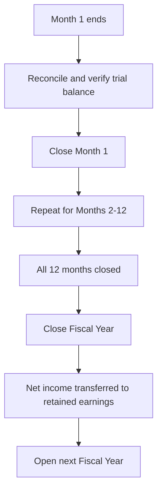

# Period Closing

Period closing is the accounting process of finalizing financial records for a completed time period. In Lana, closing serves two critical purposes: it locks the ledger against backdated transactions (preventing accidental or unauthorized modifications to historical records) and it transfers net income from the Profit and Loss statement to the Balance Sheet at year-end.

## Monthly Closing

Monthly closing is the more frequent of the two closing operations. When a month is closed, the system locks the entire ledger against any transactions with an effective date on or before the closed date. This is an irreversible operation.

### How Monthly Closing Works

1. **Precondition check**: The system verifies that the calendar month has actually passed. A month cannot be closed until the current system date is past the end of that month. This prevents premature closure.
2. **Sequential enforcement**: Monthly closes must be performed in order. The system always applies the close to the oldest unclosed month of the current fiscal year. An operator cannot skip ahead and close December before closing November.
3. **Ledger lock**: Once the close is executed, the `month_closed_as_of` date is updated. The Cala ledger's velocity controls then reject any transaction that attempts to post with an effective date on or before this date. This provides a hard guarantee that closed periods cannot be modified.
4. **Reporting window**: After closing a month, all financial statements for that period are finalized. The trial balance, balance sheet, and P&L for the closed month will not change.

### When to Close a Month

Operators should close months after completing all necessary reconciliation for the period:

- Verify that the trial balance balances (total debits equal total credits)
- Confirm that all expected transactions for the period have been posted (interest accruals, fee recognitions, manual adjustments)
- Review and resolve any discrepancies before closing, since they cannot be corrected by backdating after the close

## Fiscal Year Closing

Fiscal year closing is a year-end operation that transfers net income from the Profit and Loss statement to the Balance Sheet. This is the standard accounting procedure for resetting temporary accounts (revenue and expenses) and carrying the period's results into permanent equity accounts.

### Prerequisites

The fiscal year can only be closed after all twelve months (or however many months the fiscal year spans) have been individually closed. If any month remains open, the year-end close cannot proceed.

### The Closing Transaction

When the fiscal year is closed, the system posts a special journal entry that:

1. **Zeros out revenue accounts**: All revenue account balances are offset, bringing them to zero. This prepares the accounts for the next fiscal year.
2. **Zeros out expense accounts**: Similarly, all expense and cost-of-revenue account balances are offset.
3. **Transfers net income to retained earnings**: The difference between revenue and expenses (the net income or net loss) is posted to the retained earnings account in the Equity section of the Balance Sheet.
   - If the bank earned a profit, the retained earnings gain account is credited.
   - If the bank incurred a loss, the retained earnings loss account is debited.

The effective date of this closing transaction is set to the fiscal year's closing date.

After this transaction, the P&L accounts start the new fiscal year at zero, while the Balance Sheet carries forward the cumulative result in retained earnings.

## Handling Negative Balances and Contra-Accounts

### Effective Balance Calculation

The Cala ledger calculates effective balances based on the account's normal balance type:

- **Debit-normal accounts** (assets, expenses): Effective balance = Debits - Credits
- **Credit-normal accounts** (liabilities, equity, revenue): Effective balance = Credits - Debits

Effective balances can be negative. For example, an expense account with more credits than debits has a negative effective balance. The closing process must handle these negative balances correctly when constructing the year-end journal entry.

### Contra-Accounts

A contra-account is an account within an account set on the chart of accounts that has a different normal balance type than its parent. Contra-accounts are used to reduce the balance of a related account while maintaining detailed tracking.

For example, a bank might have a loan-loss provision modeled as a credit-normal account within the expenses section. If actual loan losses for a period were less than the provision, an accountant would credit this expense account, effectively reducing the total expense recognition. The closing process must account for these contra-balances when calculating net income.

## Operational Sequence

The complete period-closing workflow for a fiscal year follows this sequence:

1. **Monthly cycle**: As each month passes, the operator reconciles the books and closes the month.
2. **Year-end**: After the last month is closed, the operator initiates the fiscal year close.
3. **New year**: After the fiscal year is closed, the next fiscal year must be explicitly opened before new-year transactions can be posted.

Each step is irreversible, enforcing a clear audit trail and preventing retroactive modifications to finalized periods.
