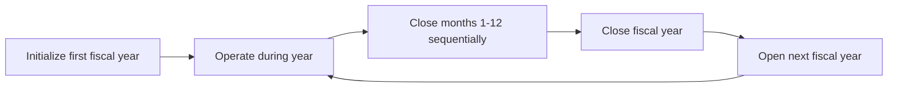

# Fiscal Year

A fiscal year is the fundamental accounting period in Lana. It defines the twelve-month window over which financial performance is measured, and it controls when the ledger can accept transactions. No accounting transactions can be posted until a fiscal year has been initialized, making it a prerequisite for all financial operations in the system.

## Important Assumptions

- Profit and Loss statement accounts deal in USD only. All revenue and expense tracking is denominated in US dollars.
- Fiscal years are sequential and non-overlapping. Each fiscal year covers exactly twelve months.
- All operations within the fiscal year framework are irreversible. Once a month or year is closed, it cannot be reopened.

## Initialization

The first fiscal year must be initialized before the system can process any financial transactions. This initialization sets the starting date for the bank's accounting records and enables the ledger's velocity controls, which govern when transactions can be posted.

There are two ways to initialize the first fiscal year:

### Automatic Initialization

If the accounting initialization configuration includes an opening date, the system will automatically create the first fiscal year on startup. This is the typical approach for new deployments where the bank wants to begin operations immediately.

### Manual Initialization

An operator can initialize the first fiscal year through the admin panel or the system API. This approach is used when the bank needs to control the exact start date, for example when migrating from another system or when the start of operations does not coincide with deployment.

### What Initialization Does

When a fiscal year is initialized, the system:

1. Creates the fiscal year entity with its start and end dates.
2. Updates the account set metadata on the chart of accounts root to enable velocity controls.
3. Opens the ledger for transactions within the fiscal year's date range.

After initialization, deposits can be recorded, credit facilities can be created, and all other financial operations can proceed.

## Monthly Closing

Each fiscal year is composed of individual months that must be closed sequentially. Monthly closing locks the ledger against transactions with an effective date on or before the closed date.

### Sequential Close Requirement

Months must be closed in chronological order. The system always applies the close to the oldest unclosed month of the fiscal year. An operator cannot close March before closing February. This ensures that each period's records are reviewed and finalized before moving on.

### Preconditions

A month can only be closed if the calendar month has passed according to the current system time. January cannot be closed until February 1st at the earliest. This prevents premature closure that could lock out legitimate transactions.

### Effect on the Ledger

Once a month is closed, the Cala ledger's velocity controls reject any transaction that attempts to post with an effective date within or before the closed month. This provides a hard guarantee that historical records are immutable. If an error is discovered after closing, it must be corrected with a new transaction in the current open period, not by modifying the closed period.

### Operational Best Practices

Before closing a month, operators should:

1. **Review the trial balance** to confirm that debits equal credits.
2. **Verify automated entries** — check that all expected interest accruals, fee recognitions, and other automated journal entries have posted for the period.
3. **Process manual adjustments** — record any end-of-period adjustments (loan loss provisions, accrual corrections, reclassifications) before closing.
4. **Reconcile external data** — compare bank statements, custodian reports, and other external sources against the ledger balances.

## Fiscal Year Closing

After all twelve months have been individually closed, the fiscal year itself can be closed. This is the year-end procedure that transfers net income from the Profit and Loss statement to the Balance Sheet.

### The Closing Entry

The fiscal year close posts a special transaction to the ledger with an effective date set to the fiscal year's closing date. This transaction:

- Offsets all revenue, cost-of-revenue, and expense account balances, bringing them to zero.
- Posts the net result (revenue minus expenses) to the retained earnings accounts in the equity section of the balance sheet.
- If the result is a gain, it is credited to the retained earnings gain account.
- If the result is a loss, it is debited to the retained earnings loss account.

After this entry, the P&L accounts start the next fiscal year with zero balances, while the balance sheet carries forward the cumulative retained earnings.

### Irreversibility

Like monthly closes, the fiscal year close is irreversible. Once completed, the year-end closing entry cannot be reversed or modified. The financial statements for the closed year are final.

## Opening the Next Fiscal Year

After a fiscal year is closed, the next fiscal year must be explicitly opened before any transactions can be posted in the new period. This is an intentional design choice that requires a conscious decision to advance the accounting calendar.

The new fiscal year begins on the day after the previous year's closing date and spans twelve months. Until it is opened, the system will reject any transactions with effective dates in the new period.

### Workflow Summary

This cycle repeats annually. Each fiscal year provides a clean boundary for financial reporting and ensures that the bank's books are properly closed and carried forward at regular intervals.
