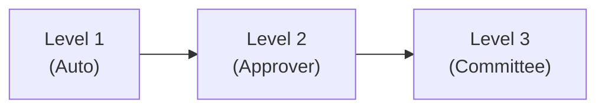

# Approval Policy Configuration

This document describes how to configure policies governing approval processes in the governance system.

## Policy Concept

A policy defines the rules and conditions under which an operation can be approved:

- **Process type**: Operation category
- **Thresholds**: Limits for different approval levels
- **Escalation rules**: When to escalate to higher committees

## Policy Types

### Credit Facility Policy

Defines rules for approving credit proposals:

| Level | Amount | Required Approval |
|-------|--------|-------------------|
| Low | < $10,000 | 1 approver |
| Medium | $10,000 - $100,000 | 2 approvers |
| High | > $100,000 | Full committee |

### Disbursement Policy

Defines rules for approving disbursements:

| Level | Amount | Required Approval |
|-------|--------|-------------------|
| Low | < $5,000 | Automatic |
| Medium | $5,000 - $50,000 | 1 approver |
| High | > $50,000 | 2 approvers |

### Withdrawal Policy

Defines rules for approving withdrawals:

| Level | Amount | Required Approval |
|-------|--------|-------------------|
| Low | < $1,000 | Automatic |
| Medium | $1,000 - $10,000 | 1 approver |
| High | > $10,000 | Operations committee |

## Policy Configuration

### Create a Policy

```graphql
mutation CreateApprovalPolicy($input: ApprovalPolicyCreateInput!) {
  approvalPolicyCreate(input: $input) {
    policy {
      id
      processType
      thresholds {
        level
        amount
        requiredApprovals
      }
    }
  }
}
```

## Escalation Rules

### Escalation Flow



### Escalation Conditions

| Condition | Action |
|-----------|--------|
| Amount exceeds threshold | Escalate to next level |
| Time exceeded | Notify and escalate |
| Rejected at lower level | Escalate for review |

## Domain Integration

Policies integrate with domain services:

- Credit facilities use `APPROVE_CREDIT_FACILITY_PROPOSAL_PROCESS`
- Disbursements use `APPROVE_DISBURSAL_PROCESS`
- Withdrawals use `APPROVE_WITHDRAWAL_PROCESS`

## Permissions Required

| Operation | Permission |
|-----------|---------|
| Create policy | POLICY_CREATE |
| View policies | POLICY_READ |
| Modify policy | POLICY_UPDATE |
| Delete policy | POLICY_DELETE |

## Policy Auditing

All policy modifications are logged in the audit system:

- Who made the change
- What was modified
- When it occurred
- Previous and new values

## Admin Panel Walkthrough: Assign Committee and Resolve Actions

### 1) Assign committee to policy

**Step 12.** Open policies page.


**Step 13.** Select a policy.


**Step 14.** Assign committee and threshold.


**Step 15.** Verify assignment success.


### 2) Review pending actions

**Step 16.** Open actions queue.


**Step 17.** Confirm pending request appears.


### 3) Approve or deny process

**Step 18.** Open request details for decision.


**Step 19.** Click **Approve**.


**Step 20.** Verify approval success and state transition.


**Step 21.** Open request for denial flow.


**Step 22.** Click **Deny** and provide reason.


**Step 23.** Verify denial success and terminal status.


