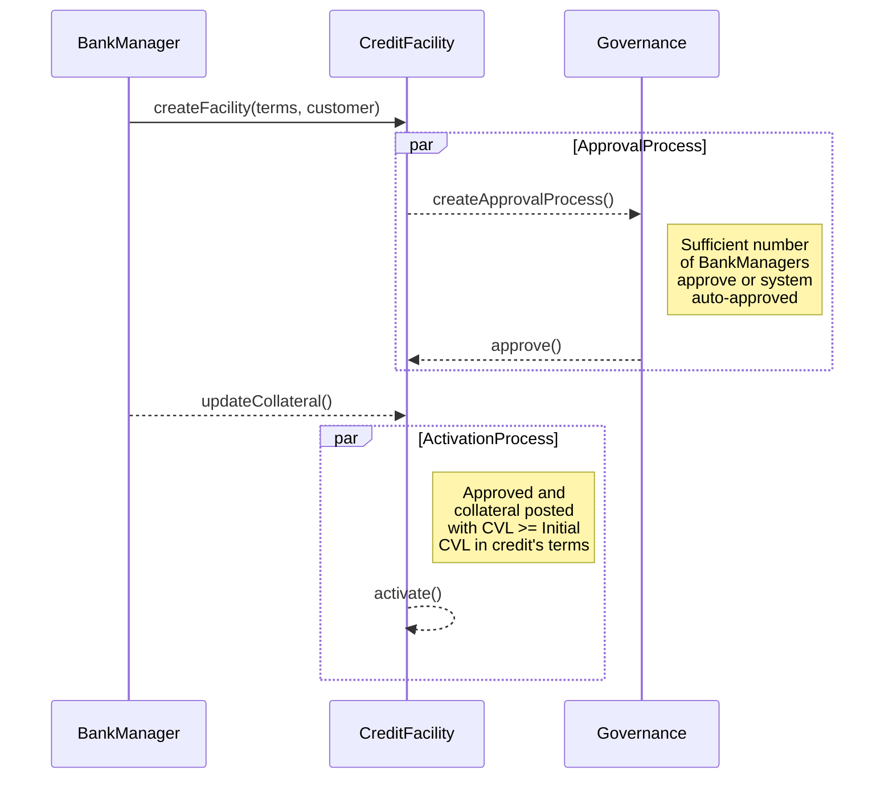

# Credit Facility

A `CreditFacility` is a legally binding lending agreement between a bank and a customer that establishes a maximum credit limit the bank is willing to extend.

It specifies:

1. **Credit Limit** - The *maximum* amount of credit available to the customer.
2. **Loan Terms** - Details such as interest rates, fees, and risk parameters.
3. **Maturity Provisions** - Details when the credit facility will mature or expire.
4. **Repayment Schedule** - The timeline and conditions under which the customer must repay the borrowed amount and any accrued interest.

In our domain model, a `CreditFacility` is the central entity that manages the lifecycle of credit, including disbursals, obligations, and payments.
We have `InterestAccrualCycle` to manage the interest accrual process, which is crucial for calculating the interest on the disbursed amounts.

## Facility Approval & Activation

A `CreditFacility` goes through an approval process where it is created by a bank manager and then submitted to governance module. The governance module defines the rules for approval, which can be manual (requiring a certain number of approvals from bank users) or automatic (system auto-approved).

Activation of a `CreditFacility` can happen only after `Collateral` for the Facility has been posted and the `CreditFacility` is approved by the governance process.
Collateral's CVL should be more than initial CVL as defined in the `CreditFacility` terms for the facility to activate.

Upon activation of the facility, `InterestAccrualCycle` is initialized to start accruing interest on disbursed amounts.

## Operational States and Controls

In day-to-day operations, facility setup is controlled by two independent gates:

1. **Governance gate** - the proposal must satisfy the approval policy.
2. **Collateral gate** - posted collateral must satisfy the configured `initial_cvl`.

Both gates must be satisfied before the facility becomes usable for disbursals. This prevents
funds from being released before governance authorization and risk coverage are in place.

### State progression you should expect

- **Pending Customer Approval**: proposal created, customer has not accepted yet.
- **Pending Approval**: customer accepted; proposal now waits for governance decisions.
- **Approved**: governance threshold met; pending facility is created.
- **Pending Collateralization**: facility exists but cannot disburse yet.
- **Completed (pending facility)**: collateral gate satisfied.
- **Active (credit facility)**: facility can issue disbursals; interest cycle runs.

### Operator checks before moving forward

- Confirm the selected terms template is the expected product configuration.
- Confirm proposal amount and currency context match the customer request.
- Confirm approval policy (manual vs auto) for the selected governance setup.
- Confirm collateral entry reflects current custody value and unit scale.
- Confirm final status transition happened before initiating any disbursal.

## Domain Rules That Matter in Operations

The terms selected at proposal time are copied into the facility and become the contract used by
runtime checks. The most operationally important thresholds are:

- `initial_cvl`: minimum CVL needed to activate a pending facility.
- `margin_call_cvl`: minimum CVL expected after a new disbursal is considered.
- `liquidation_cvl`: lower protection threshold that can trigger liquidation processing.

These checks are not only informational in the UI; they are part of command validation in the
credit domain. In practice, this means a proposal can be approved yet still remain non-operational
until collateral quality and amount satisfy policy.

### Practical interpretation for operators

- **Proposal approved != lendable**. Lending starts only when facility status becomes `Active`.
- **Collateral updates are risk actions**. They directly influence activation and ongoing safety.
- **Template quality is critical**. Incorrect thresholds or intervals in terms produce incorrect
  lifecycle behavior later.

## Admin Panel Walkthrough: Proposal to Active Facility

The following sequence mirrors how operators create, approve, and activate a facility in the admin panel.

### 1) Create the proposal

At this stage, you are establishing the legal and risk envelope. The terms template is
especially important because its values are copied into the facility and drive downstream
behavior (interest accrual cadence, due windows, liquidation thresholds, and fees).

**Step 1.** From the customer page, click **Create**.

**Step 2.** Select **Credit Facility** to open the proposal form.

**Step 3.** Enter the facility amount and select the terms template.

**Step 4.** Submit the proposal.

**Step 5.** Confirm the proposal detail page shows status **Pending Customer Approval**.

**Step 6.** Verify the proposal appears in the proposals list.

### 2) Customer acceptance and governance approval

This stage separates customer consent from internal authorization. Even if a bank user creates
the proposal, no facility should move ahead until the customer accepts and governance rules pass.

Operationally, a successful conclusion at this stage should produce a pending facility that can
enter collateralization checks. If approval is rejected, the proposal does not proceed to a
lendable path.

**Step 7.** Open the proposal detail page.

**Step 8.** Click **Customer Accepts**.

**Step 9.** Confirm the customer acceptance action.

**Step 10.** Verify status changes to **Pending Approval**.

**Step 11.** Start governance approval by clicking **Approve**.

**Step 12.** Confirm approval in the dialog.

**Step 13.** Verify the proposal status is **Approved**.

**Step 14.** Click **View Pending Facility**.

### 3) Collateralization and activation

After approval, the facility is still non-operational until collateral requirements are met.
Activation is the moment lending can begin and interest processing starts for future balances.

When activation succeeds, treat this as the handoff point to disbursal operations. Any delay in
activation generally indicates either insufficient collateral relative to terms or missing status
transitions upstream.

**Step 15.** On the pending facility page, confirm status **Pending Collateralization**.

**Step 16.** Click **Update Collateral**.

**Step 17.** Enter the new collateral amount.

**Step 18.** Confirm collateral update succeeds.

**Step 19.** Verify pending facility status moves to **Completed**.

**Step 20.** Click **View Facility**.

**Step 21.** Confirm credit facility status is **Active**.

**Step 22.** Verify the active facility appears in the facilities list.

