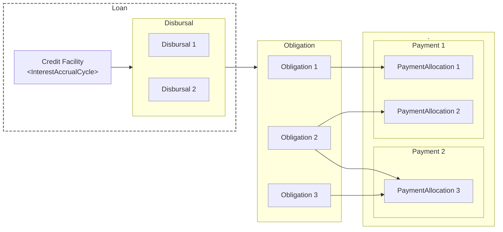
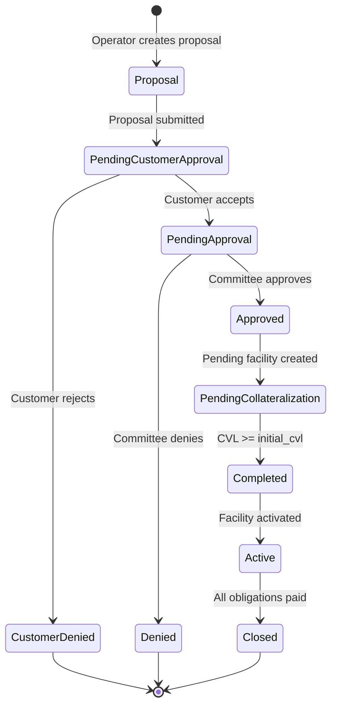

# Credit Module

The credit module manages the full lifecycle of Bitcoin-backed loans in Lana. It handles everything from initial proposal creation through collateralization, disbursement of funds, interest accrual, repayment tracking, and eventual facility closure. All credit operations are secured by Bitcoin collateral, with continuous monitoring of collateral-to-loan value ratios to protect the bank against market risk.

## How Credit Works in Lana

Lana provides credit facilities where a customer borrows USD backed by Bitcoin collateral. The fundamental flow is:

1. A bank operator creates a **proposal** defining the loan amount and terms for a specific customer.
2. The customer accepts the proposal, and it goes through **governance approval** (committee voting or auto-approval).
3. Upon approval, the customer must **post Bitcoin collateral** sufficient to meet the initial collateral-to-loan value (CVL) ratio.
4. Once collateral requirements are met, the facility **activates** and the customer can draw funds through **disbursals**.
5. Interest **accrues** daily on outstanding principal and is consolidated into payable **obligations** monthly.
6. The customer makes **payments** that are automatically allocated to outstanding obligations in priority order.
7. When all obligations are fully paid, the facility **closes** and collateral can be returned.

Throughout this lifecycle, the system continuously monitors the BTC/USD exchange rate and recalculates the CVL. If the collateral value drops below safety thresholds, the system can trigger margin calls or initiate liquidation proceedings.

## Entity Relationships

The credit module is built around five core entities:

- A [**Credit Facility**](./facility) is the lending agreement that defines the credit limit, terms, and collateral requirements. It advances funds to a borrower through one or more disbursals.
- A [**Disbursal**](./disbursal) represents a specific drawdown of funds from the facility to the customer. Each disbursal goes through its own approval process and, when confirmed, creates a principal obligation.
- An [**Obligation**](./obligation) tracks an individual amount owed by the borrower, either for principal (from a disbursal) or interest (from an accrual cycle). Obligations follow a time-driven lifecycle from not-yet-due through due, overdue, and potentially defaulted.
- A [**Payment**](./payment) captures funds remitted by the borrower. Each payment is automatically broken down into payment allocations that settle specific obligations in priority order.
- [**Terms**](./terms) define the interest rates, fee schedules, timing intervals, and collateral thresholds that govern the facility. Terms are set at proposal time and remain fixed for the life of the facility.

## Collateral and Risk Management

Because Lana issues USD loans backed by Bitcoin, the relationship between collateral value and loan exposure is central to risk management. The system tracks three CVL (Collateral Value to Loan) thresholds defined in the facility terms:

| Threshold | Purpose |
|-----------|---------|
| **Initial CVL** | The minimum collateral ratio required to activate the facility. The customer must post enough BTC so that its USD value exceeds this ratio relative to the facility amount. |
| **Margin Call CVL** | A safety buffer below the initial threshold. If the CVL drops below this level due to BTC price declines, the system flags the facility for a margin call, alerting operators and the borrower that additional collateral may be needed. New disbursals are also blocked if they would push the CVL below this level. |
| **Liquidation CVL** | The critical floor. If the CVL falls below this threshold, the system initiates a liquidation process where the bank can sell collateral to recover the outstanding debt. |

These thresholds must maintain a strict hierarchy: Initial CVL > Margin Call CVL > Liquidation CVL. The system enforces this at proposal creation time.

The CVL is continuously recalculated as the BTC/USD price changes, as collateral is deposited or withdrawn, and as the outstanding loan balance changes through disbursals and payments. A hysteresis buffer prevents rapid oscillation between states when the CVL hovers near a threshold boundary.

## Facility Lifecycle Overview

For detailed information on each stage, see [Credit Facilities](./facility).

## Interest Lifecycle

Interest accrual uses a two-level timing system. Daily accrual jobs record interest in the ledger as it is earned. Monthly cycle jobs consolidate those accruals into payable interest obligations. This design satisfies both accounting requirements (revenue recognized as earned) and borrower experience (predictable monthly billing).

For the full mechanics, see [Interest Processing](./interest-process).

## Module Pages

| Page | Description |
|------|-------------|
| [Credit Facilities](./facility) | Creating proposals, approval process, collateralization, activation, and facility states |
| [Disbursals](./disbursal) | Drawing funds from active facilities, approval flow, and settlement |
| [Obligations](./obligation) | Debt tracking, obligation types, lifecycle states, and timing parameters |
| [Payments](./payment) | Payment processing, allocation priority rules, and accounting impact |
| [Terms](./terms) | Interest rates, fee schedules, timing intervals, CVL thresholds, and terms templates |
| [Interest Processing](./interest-process) | Daily accrual, monthly cycles, obligation creation, and ledger entries |
| [Ledger](./ledger.md) | Overview of account sets and transaction templates |
