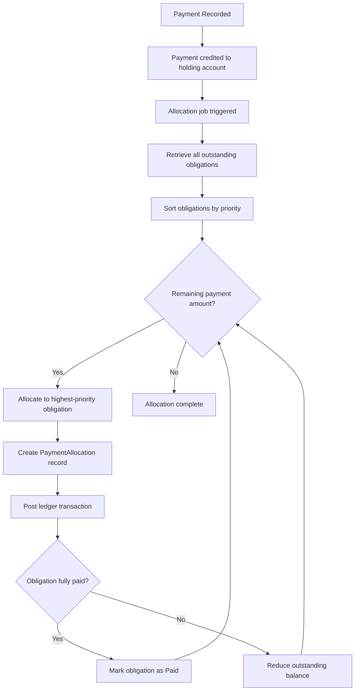

# Payment

A payment represents funds remitted by the borrower toward a credit facility. When a borrower makes a payment, the system automatically breaks it down into individual allocations that settle specific obligations according to a defined priority order. This ensures that the most critical debts are addressed first and that the repayment plan stays current.

## Payment Processing Flow

When a payment is recorded against a credit facility, the following sequence occurs:

1. **Payment Recording**: The payment amount is recorded and credited to a payment holding account in the ledger. This holding account acts as a temporary staging area before funds are distributed to individual obligations.

2. **Allocation Job Triggered**: The payment recording event triggers the allocation background job, which handles the distribution of funds across outstanding obligations.

3. **Obligation Retrieval and Sorting**: The system retrieves all outstanding obligations for the credit facility and sorts them according to the priority rules described below.

4. **Sequential Allocation**: The system works through the sorted list of obligations, allocating as much of the payment as possible to each one. For each allocation, a ledger transaction moves funds from the holding account to the appropriate receivable account.

5. **Completion Check**: After each allocation, the system checks whether the obligation is fully satisfied. If the outstanding balance reaches zero, the obligation is marked as Paid.

## Allocation Priority

The allocation algorithm distributes payment funds in a strict priority order. This ordering ensures that the most delinquent and risk-relevant obligations are settled first:

| Priority | Criteria | Rationale |
|----------|----------|-----------|
| 1 | **Defaulted** obligations (oldest first) | Most severe delinquency, highest risk |
| 2 | **Overdue** obligations (oldest first) | Active delinquency requiring resolution |
| 3 | **Due** obligations (oldest first) | Currently expected payments |
| 4 | **Interest** before **Principal** (within same status) | Interest obligations are prioritized over principal at the same delinquency level |
| 5 | **Not Yet Due** obligations (oldest first) | Early payments applied to upcoming obligations |

Within each status category, obligations are processed from oldest to newest. This ensures a first-in-first-out approach where earlier debts are cleared before more recent ones.

The interest-before-principal rule within the same status tier reflects standard lending practice: accrued interest should be settled before principal is reduced, since interest continues to accrue on outstanding principal.

## Partial Payments

The system handles partial payments gracefully. If a payment is not large enough to cover all outstanding obligations:

- The payment is allocated to obligations in priority order until the payment amount is exhausted.
- Obligations that receive partial allocation have their outstanding balance reduced by the allocated amount but remain in their current status.
- The next payment received will continue the allocation from where the previous one left off, starting again from the highest-priority remaining obligation.

For example, if a borrower owes $1,000 across three obligations and makes a $400 payment, the system will fully pay the first obligation (if it is $400 or less) and partially pay the next one. The borrower's repayment plan will update to show the reduced balances.

## Payment Allocation Records

Each allocation creates a PaymentAllocation record that permanently links a portion of a payment to a specific obligation. These records serve as an audit trail and provide transparency into how funds were distributed.

A PaymentAllocation contains:

| Field | Description |
|-------|-------------|
| **Payment ID** | The payment from which funds are being allocated |
| **Obligation ID** | The obligation receiving the allocation |
| **Amount** | The dollar amount allocated from this payment to this obligation |
| **Allocation Index** | A sequential index tracking the order of allocations for a given obligation |

A single payment can generate multiple allocation records (one per obligation it touches), and a single obligation can receive allocations from multiple payments over time.

## Accounting Impact

Each payment allocation generates a ledger transaction that:

- **Debits** the payment holding account (reducing the unallocated payment balance)
- **Credits** the appropriate receivable account for the obligation (reducing the amount owed)

For interest obligations, the credit goes to the interest receivable account. For principal obligations, the credit goes to the disbursed receivable account. This ensures that the general ledger accurately reflects the reduction in outstanding receivables as payments are processed.

## Obligation Completion

When the sum of all payment allocations against an obligation equals its initial amount, the obligation's outstanding balance reaches zero and it transitions to the Paid status. This transition is automatic and immediate. Once paid, an obligation requires no further action from the borrower or the operator.

When all obligations under a credit facility are paid, the facility itself is automatically marked as complete. See [Credit Facilities](facility) for details on facility completion.

## Overpayment Handling

If a borrower makes a payment larger than the total outstanding obligations, the system allocates funds to all obligations (including those not yet due) until either the payment is fully distributed or all obligations are satisfied.
