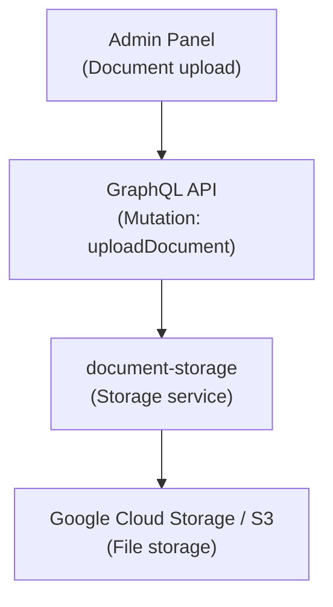
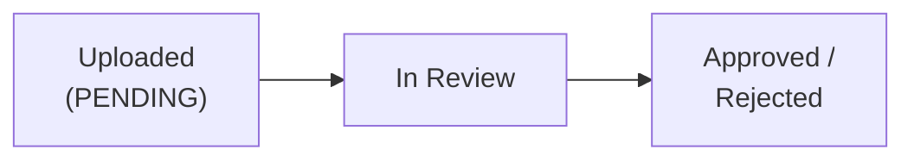

# Customer Document Management

This document describes the document management system for customers, including upload, storage, and retrieval.

## Document Types

### Identity Documents

| Type | Description | Required for KYC |
|------|-------------|------------------|
| Official ID | Passport, driver's license | Yes |
| Selfie | Customer photo | Yes |
| Proof of address | Utility bill | Per configuration |

### Corporate Documents

| Type | Description | Applies to |
|------|-------------|------------|
| Articles of incorporation | Incorporation document | Companies |
| Power of attorney | Legal representation | Companies |
| Financial statements | Financial information | Companies |

## Storage Architecture

## Document Operations

### Upload Document

1. Navigate to customer detail
2. Select **Documents** > **Upload**
3. Select document type
4. Drag or select file
5. Confirm upload

### Supported Formats

| Format | Extension | Max Size |
|--------|-----------|----------|
| PDF | .pdf | 10 MB |
| Image | .jpg, .png | 5 MB |
| Document | .doc, .docx | 10 MB |

## Document Status

| Status | Description |
|--------|-------------|
| PENDING | Uploaded, pending review |
| APPROVED | Document validated |
| REJECTED | Document rejected |
| EXPIRED | Document expired |

## Approval Flow

## Permissions Required

| Operation | Permission |
|-----------|---------|
| Upload document | DOCUMENT_CREATE |
| View document | DOCUMENT_READ |
| Approve document | DOCUMENT_UPDATE |
| Delete document | DOCUMENT_DELETE |

## Security

- Documents encrypted at rest
- Encrypted transmission (TLS)
- Signed URLs with expiration

## Retention Policy

| Type | Retention Period |
|------|-----------------|
| KYC documents | 5 years after account closure |
| Transaction documents | 7 years |
| Correspondence | 3 years |

## Admin Panel Walkthrough: Upload Customer Documents

Document operations in the UI feed the same customer-document domain used for KYC evidence and
compliance audits.

**Step 1.** Navigate to the customer's **Documents** section.

**Step 2.** Upload the required file and verify success state.

After upload, verify the document is visible in the list and that actions (view/delete as allowed
by permissions) are available to the operator role.

