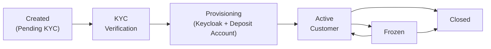

# Customer Management

The Customer Management system is the identity foundation for all financial operations in Lana. Every deposit account, credit facility, and financial transaction ultimately links back to a customer record. The system covers the full customer lifecycle, from initial registration and KYC verification through ongoing relationship management.

## Customer Types

Customer type is assigned at creation and determines several downstream behaviors: which KYC verification level is used (individual vs. business), which ledger account sets the customer's deposit accounts belong to, and how accounting entries are categorized in financial reports.

| Type | Description | KYC Level | Accounting Treatment |
|------|-------------|-----------|---------------------|
| **Individual** | Natural person | Basic KYC (identity verification) | Individual accounts |
| **Government Entity** | Government organization | Basic KYB (business verification) | Government accounts |
| **Private Company** | Private corporation | Basic KYB | Business accounts |
| **Bank** | Banking institution | Basic KYB | Interbank accounts |
| **Financial Institution** | Financial services company | Basic KYB | Institutional accounts |
| **Foreign Agency or Subsidiary** | Foreign agency/subsidiary | Basic KYB | Foreign accounts |
| **Non-Domiciled Company** | Non-domiciled corporation | Basic KYB | Non-resident accounts |

The distinction between KYC and KYB matters because Sumsub applies different verification workflows for each. Individual customers go through identity document verification (passport, selfie), while all other types go through business verification workflows (corporate documents, beneficial ownership).

## Customer Lifecycle

A customer progresses through several states from creation to active operations:

```mermaid
graph LR
    CREATE["Created<br/>(Pending KYC)"] --> KYC["KYC<br/>Verification"]
    KYC --> PROV["Provisioning<br/>(Keycloak + Deposit Account)"]
    PROV --> ACTIVE["Active<br/>Customer"]
    ACTIVE --> FROZEN["Frozen"]
    FROZEN --> ACTIVE
    ACTIVE --> CLOSED["Closed"]
    FROZEN --> CLOSED
```

1. **Creation**: An operator creates the customer record in the admin panel with email, optional Telegram ID, and customer type. The customer starts with KYC verification `Pending`.
2. **KYC verification**: The operator generates a Sumsub verification link. The customer completes identity verification through Sumsub's interface. Sumsub notifies the system via webhook when verification concludes.
3. **Provisioning**: When KYC is approved, the system emits events that trigger downstream provisioning. A Keycloak user account is created so the customer can authenticate, a welcome email is sent with credentials, and a deposit account is created.
4. **Active operations**: The customer can now access the customer portal, receive deposits, and apply for credit facilities.

## Deposit Account Activity

Deposit account activity is managed automatically by a periodic background job. The system derives each deposit account's last activity date from the latest transaction recorded on the account, or falls back to the deposit account creation date when no transactions exist yet. It then applies configurable thresholds to determine whether that account should be considered active, inactive, or escheatable. By default, those thresholds are 365 days for `Inactive` and 3650 days for `Escheatable`, and operators can change them in the admin app through the exposed domain configs `deposit-activity-inactive-threshold-days` and `deposit-activity-escheatable-threshold-days`.

| Status | Condition | Effect |
|--------|-----------|--------|
| **Active** | Activity within the configured inactive threshold (default: 365 days) | Account is shown as recently active |
| **Inactive** | No activity beyond the inactive threshold and below the escheatable threshold (defaults: 365-3650 days) | Account is shown as inactive for operator follow-up |
| **Escheatable** | No activity beyond the configured escheatable threshold (default: 3650 days) | Account is shown as long-dormant and past the escheatment threshold |

This state belongs to the deposit account, not to the customer. Activity is separate from the deposit account's operational `status`, so an inactive or escheatable activity state does not by itself block deposits or withdrawals.

## KYC Verification States

| Status | Description | Next Action |
|--------|-------------|-------------|
| **Pending Verification** | Initial state for all new customers | Generate Sumsub verification link |
| **Verified** | Identity confirmed by Sumsub | Customer can access financial products |
| **Rejected** | Verification failed or a later Sumsub rejection was received | Review rejection reasons in Sumsub |

KYC approval converts the prospect into a customer, but Sumsub callbacks can still change the compliance outcome later. If verification is rejected before conversion, the prospect remains rejected. If Sumsub sends a later rejection after the customer was already verified and converted, Lana freezes the customer so operators can review the case.

When KYC verification requirements are enabled in the system configuration, a customer must be verified before a deposit account can be created or a credit facility can be initiated. This is a configurable policy that the bank can enable or disable.

## Closing a Customer

An operator can close a customer account through the admin panel. Closing is a permanent, irreversible action that requires all of the following preconditions to be met:

- All **credit facilities** must be in `Closed` status
- All **credit facility proposals** must be in a terminal state (`Denied`, `Approved`, or `CustomerDenied`)
- No **pending credit facilities** awaiting collateralization
- All **deposit accounts** must be closed
- No **pending withdrawals** on any deposit account

When a customer is closed, the system disables the associated Keycloak user account, preventing further authentication to the customer portal.

## System Components

| Component | Module | Purpose |
|-----------|--------|---------|
| **Customer Management** | core-customer | Customer entity, profiles, and KYC state |
| **KYC Processing** | core-customer (kyc) | Sumsub API integration, webhook callback handling |
| **Document Storage** | core-document-storage | File upload, cloud storage, download link generation |
| **User Onboarding** | lana-user-onboarding | Keycloak user provisioning on customer creation events |

## Integration with Other Modules

The customer record is referenced by virtually every other module in the system:

- **Deposits**: Each customer has a deposit account (created automatically after KYC approval). The customer type determines which ledger account set the deposit account belongs to.
- **Credit**: Credit facility proposals are linked to a customer. KYC verification can be required before disbursals are permitted.
- **Accounting**: Customer type drives the chart-of-accounts placement for both deposit liabilities and credit receivables.
- **Governance**: Approval processes for withdrawals and credit operations reference the customer indirectly through the associated entities.

## Related Documentation

- [Onboarding Process](onboarding) - Complete onboarding flow with Sumsub KYC
- [Document Management](documents) - Customer document handling
