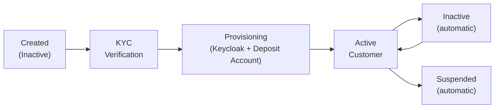

# Customer Management

The Customer Management system is the identity foundation for all financial operations in Lana. Every deposit account, credit facility, and financial transaction ultimately links back to a customer record. The system covers the full customer lifecycle, from initial registration and KYC verification through ongoing relationship management and activity monitoring.

## Customer Types

Customer type is assigned at creation and determines several downstream behaviors: which KYC verification level is used (individual vs. business), which ledger account sets the customer's deposit accounts belong to, and how accounting entries are categorized in financial reports.

| Type | Description | KYC Level | Accounting Treatment |
|------|-------------|-----------|---------------------|
| **Individual** | Natural person | Basic KYC (identity verification) | Individual accounts |
| **Government Entity** | Government organization | Basic KYB (business verification) | Government accounts |
| **Private Company** | Private corporation | Basic KYB | Business accounts |
| **Bank** | Banking institution | Basic KYB | Interbank accounts |
| **Financial Institution** | Financial services company | Basic KYB | Institutional accounts |
| **Foreign Agency or Subsidiary** | Foreign agency/subsidiary | Basic KYB | Foreign accounts |
| **Non-Domiciled Company** | Non-domiciled corporation | Basic KYB | Non-resident accounts |

The distinction between KYC and KYB matters because Sumsub applies different verification workflows for each. Individual customers go through identity document verification (passport, selfie), while all other types go through business verification workflows (corporate documents, beneficial ownership).

## Customer Lifecycle

A customer progresses through several states from creation to active operations:

1. **Creation**: An operator creates the customer record in the admin panel with email, optional Telegram ID, and customer type. The customer starts in `Inactive` status with KYC verification `Pending`.
2. **KYC verification**: The operator generates a Sumsub verification link. The customer completes identity verification through Sumsub's interface. Sumsub notifies the system via webhook when verification concludes.
3. **Provisioning**: When KYC is approved, the system emits events that trigger downstream provisioning. A Keycloak user account is created so the customer can authenticate, a welcome email is sent with credentials, and a deposit account is created.
4. **Active operations**: The customer can now access the customer portal, receive deposits, and apply for credit facilities.

## Activity Status

Customer activity status is managed automatically by a periodic background job. The system tracks each customer's last activity date and applies configurable thresholds to determine whether the customer should be considered active, inactive, or suspended.

| Status | Condition | Effect |
|--------|-----------|--------|
| **Active** | Activity within the last year | Full operational access |
| **Inactive** | No activity for 1-10 years | Account operations paused; deposit accounts become inactive |
| **Suspended** | No activity for over 10 years | Account suspended pending escheatment review |

When a customer's activity status changes, all of their deposit accounts are updated to match. An inactive customer's deposit accounts cannot process new deposits or withdrawals until the customer becomes active again. The activity date is updated whenever the customer performs any financial operation.

## KYC Verification States

| Status | Description | Next Action |
|--------|-------------|-------------|
| **Pending Verification** | Initial state for all new customers | Generate Sumsub verification link |
| **Verified** | Identity confirmed by Sumsub | Customer can access financial products |
| **Rejected** | Verification failed | Review rejection reasons in Sumsub |

KYC verification is a one-way gate: once verified, a customer remains verified. If verification is rejected, the operator can review the rejection reasons in the Sumsub dashboard and potentially request a new verification attempt.

When KYC verification requirements are enabled in the system configuration, a customer must be verified before a deposit account can be created or a credit facility can be initiated. This is a configurable policy that the bank can enable or disable.

## System Components

| Component | Module | Purpose |
|-----------|--------|---------|
| **Customer Management** | core-customer | Customer entity, profiles, KYC state, activity tracking |
| **KYC Processing** | core-customer (kyc) | Sumsub API integration, webhook callback handling |
| **Document Storage** | core-document-storage | File upload, cloud storage, download link generation |
| **User Onboarding** | lana-user-onboarding | Keycloak user provisioning on customer creation events |

## Integration with Other Modules

The customer record is referenced by virtually every other module in the system:

- **Deposits**: Each customer has a deposit account (created automatically after KYC approval). The customer type determines which ledger account set the deposit account belongs to.
- **Credit**: Credit facility proposals are linked to a customer. KYC verification can be required before disbursals are permitted.
- **Accounting**: Customer type drives the chart-of-accounts placement for both deposit liabilities and credit receivables.
- **Governance**: Approval processes for withdrawals and credit operations reference the customer indirectly through the associated entities.

## Related Documentation

- [Onboarding Process](onboarding) - Complete onboarding flow with Sumsub KYC
- [Document Management](documents) - Customer document handling

