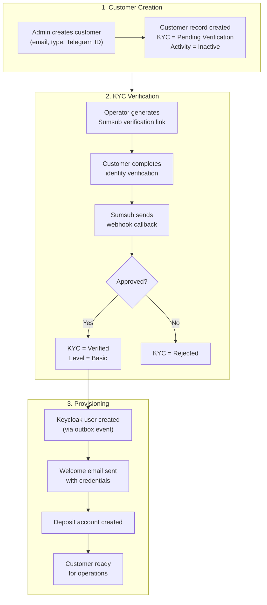

# Customer Onboarding Process

Customer onboarding is a multi-step process that establishes the customer's identity, provisions their system access, and creates the financial accounts needed for operations. The process involves coordination between the admin panel, the Sumsub KYC provider, the Keycloak identity server, and the deposit module.

## Onboarding Flow

## Step 1: Customer Creation

An operator creates the customer by providing:

- **Email address** (required) - Used for Keycloak login and communication. Must be unique.
- **Telegram ID** (optional) - Alternative contact channel.
- **Customer type** (required) - Determines the KYC verification workflow (KYC for individuals, KYB for companies) and the accounting treatment for the customer's accounts.

The new customer starts with:
- KYC verification status: `Pending Verification`
- Activity status: `Inactive`
- KYC level: `Not KYCed`

No financial operations are possible until KYC verification completes. The customer does not yet have a deposit account or portal access.

## Step 2: KYC Verification

### Sumsub Integration

Lana integrates with Sumsub for identity verification. The integration uses two channels:

1. **Outbound API calls** - The system calls Sumsub's REST API to create verification links (permalinks) that customers use to submit their identity documents.
2. **Inbound webhooks** - Sumsub calls the system's webhook endpoint when verification results are available. All callbacks are processed asynchronously through an inbox queue for reliability.

### Verification Levels

The customer type automatically determines which Sumsub verification level is applied:

| Customer Type | Sumsub Level | Verification Scope |
|---------------|-------------|-------------------|
| Individual | Basic KYC | Identity documents, selfie, proof of address |
| All other types | Basic KYB | Corporate documents, beneficial ownership, authorized representatives |

### KYC Status Transitions

| Status | Description | Next Action |
|--------|-------------|-------------|
| **Not Started** | KYC link not yet generated | Operator generates Sumsub link |
| **Pending** | Customer is completing verification in Sumsub | Wait for Sumsub webhook |
| **Approved** | Identity verified successfully | System proceeds to provisioning |
| **Rejected** | Verification failed | Review rejection reasons, optionally retry |
| **Review Needed** | Sumsub flagged for manual review | Review in Sumsub dashboard |

### Webhook Callback Processing

When Sumsub completes a verification, it sends a webhook to the system. The callback handler processes several event types:

- **Applicant Created** - Confirms that Sumsub has registered the customer. Records the Sumsub applicant ID on the customer record.
- **Applicant Reviewed (Green)** - Verification approved. Sets KYC level to `Basic` and verification status to `Verified`. Triggers downstream provisioning events.
- **Applicant Reviewed (Red)** - Verification rejected. Sets verification status to `Rejected`. The rejection includes labels and comments explaining the reason.
- **Applicant Pending** / **Personal Info Changed** - Informational events that are logged but do not change customer state.

Each callback is processed exactly once through an idempotency mechanism that deduplicates based on the callback's correlation ID and timestamp.

### What Happens on KYC Approval

When a Green review arrives from Sumsub, the following chain of events is triggered:

1. The customer entity's KYC level is set to `Basic` and verification status to `Verified`.
2. A `CustomerKycUpdated` event is published to the outbox.
3. Downstream listeners react to the outbox event:
   - The **user onboarding** module creates a Keycloak account so the customer can log into the portal.
   - A **welcome email** with login credentials is sent.
   - A **deposit account** is created, giving the customer a place to receive funds.

This event-driven architecture means provisioning happens asynchronously. If any step fails (e.g., Keycloak is temporarily unavailable), the job system retries automatically until it succeeds.

## Step 3: Automatic Provisioning

When KYC is approved, the system provisions three things:

| Resource | Module | Purpose |
|----------|--------|---------|
| **Keycloak user** | User Onboarding | Enables portal authentication. The user is created in the customer realm. |
| **Welcome email** | SMTP | Delivers initial credentials to the customer. |
| **Deposit account** | Deposit | Creates the USD deposit account with overdraft prevention. Links to the correct ledger account set based on customer type. |

After provisioning completes, the customer can:
- Log into the customer portal
- Receive deposits into their account
- Be considered for credit facility proposals

## Admin Panel Operations

### Customer List

- Filter by status (Active, Inactive, Pending)
- Search by email or public ID
- Sort by creation date

### Available Actions

| Action | Description | Required Permission |
|--------|-------------|---------------------|
| Create customer | New registration | CUSTOMER_CREATE |
| View customer | Query information | CUSTOMER_READ |
| Start KYC | Begin verification | CUSTOMER_UPDATE |
| Deactivate | Suspend account | CUSTOMER_UPDATE |

## Admin Panel Walkthrough: Customer Creation and KYC

This walkthrough reflects the operator flow used in Cypress manuals and aligns with the customer
domain lifecycle (create -> verify -> activate).

### 1) Create and verify customer basics

**Step 1.** Open the customers list.

**Step 2.** Click **Create**.

**Step 3.** The customer creation form opens with the email input field ready.

**Step 4.** Enter a unique customer email.

**Step 5.** Enter a unique Telegram ID (if used by your process).

**Step 6.** Review details before submission.

**Step 7.** Verify the confirmation dialog showing the entered customer details.

**Step 8.** Click **Confirm** to create the customer.

**Step 9.** Confirm the customer detail page and identity fields.

**Step 10.** Verify the customer appears in list views.

### 2) Start and monitor KYC

The system integrates with Sumsub. Operators generate the verification link, then monitor status
changes driven by webhook updates.

**Step 11.** Open customer KYC section and generate verification link.

**Step 12.** Confirm KYC link was created.

**Step 13.** Verify final KYC status update.

