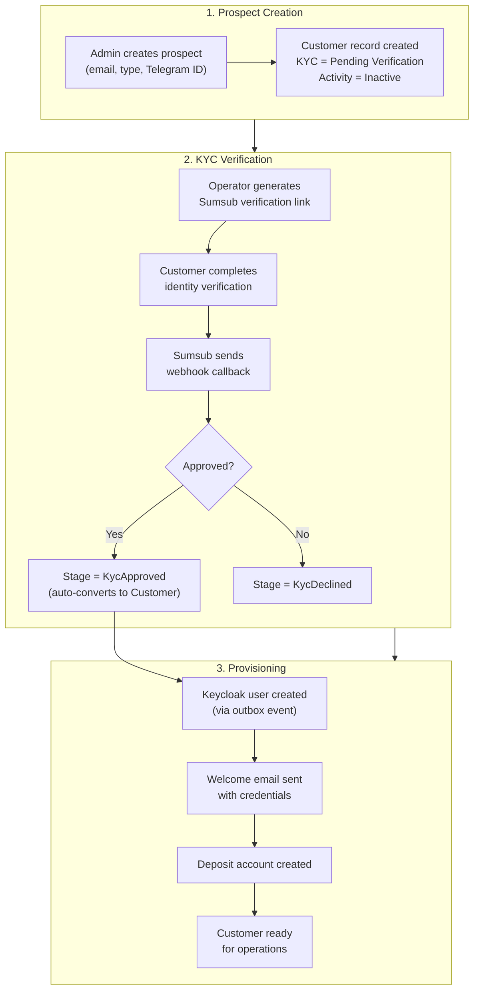

# Customer Onboarding Process

Customer onboarding is a multi-step process that establishes the customer's identity, provisions their system access, and creates the financial accounts needed for operations. The process involves coordination between the admin panel, the Sumsub KYC provider, the Keycloak identity server, and the deposit module.

## Onboarding Flow

```mermaid
graph TD
    subgraph S1["1. Prospect Creation"]
        CREATE["Admin creates prospect<br/>(email, type, Telegram ID)"] --> PENDING["Customer record created<br/>KYC = Pending Verification<br/>Activity = Inactive"]
    end
    subgraph S2["2. KYC Verification"]
        LINK["Operator generates<br/>Sumsub verification link"] --> CUST["Customer completes<br/>identity verification"] --> HOOK["Sumsub sends<br/>webhook callback"]
        HOOK --> RESULT{Approved?}
        RESULT -->|Yes| KYCBASIC["Stage = KycApproved<br/>(auto-converts to Customer)"]
        RESULT -->|No| KYCDECLINED["Stage = KycDeclined"]
    end
    subgraph S3["3. Provisioning"]
        KYCBASIC --> KC["Keycloak user created<br/>(via outbox event)"]
        KC --> EMAIL["Welcome email sent<br/>with credentials"]
        EMAIL --> DEPACC["Deposit account created"]
        DEPACC --> ACTIVE["Customer ready<br/>for operations"]
    end
    S1 --> S2
    S2 --> S3
```

## Step 1: Prospect Creation

An operator creates a prospect by providing:

- **Email address** (required) - Used for Keycloak login and communication. Must be unique.
- **Telegram ID** (optional) - Alternative contact channel.
- **Customer type** (required) - Determines the KYC verification workflow (KYC for individuals, KYB for companies) and the accounting treatment for the customer's accounts.

The new prospect starts with:
- Stage: `New`
- Status: `Open`
- KYC status: `Not Started`

A prospect is not yet a customer and cannot perform financial operations. The prospect becomes a customer only after KYC is approved.

## Step 2: KYC Verification

### Prospect Stages

As the prospect moves through KYC, their stage changes:

| Stage | Description | Next Action |
|-------|-------------|-------------|
| **New** | Prospect created, KYC not started | Operator generates Sumsub link |
| **KycStarted** | Prospect started Sumsub verification | Wait for Sumsub webhook |
| **KycPending** | Sumsub reviewing documents | Wait for final decision |
| **KycDeclined** | KYC verification failed | Review rejection, optionally retry or close prospect |
| **Converted** | KYC approved, prospect became a customer | Provisioning begins automatically |
| **Closed** | Prospect closed without converting | No further action |

### Sumsub Integration

When Sumsub completes a verification, it sends a webhook to the system. The callback handler processes several event types:

- **Applicant Created** - Confirms that Sumsub has registered the customer. Records the Sumsub applicant ID on the customer record.
- **Applicant Reviewed (Green)** - Verification approved. Sets KYC level to `Basic` and verification status to `Verified`. Triggers downstream provisioning events.
- **Applicant Reviewed (Red)** - Verification rejected. Sets verification status to `Rejected`. The rejection includes labels and comments explaining the reason.
- **Applicant Pending** / **Personal Info Changed** - Informational events that are logged but do not change customer state.

Each callback is processed exactly once through an idempotency mechanism that deduplicates based on the callback's correlation ID and timestamp.

### What Happens on KYC Approval

When a Green review arrives from Sumsub, the following chain of events is triggered:

1. The customer entity's KYC level is set to `Basic` and verification status to `Verified`.
2. A `CustomerKycUpdated` event is published to the outbox.
3. Downstream listeners react to the outbox event:
   - The **user onboarding** module creates a Keycloak account so the customer can log into the portal.
   - A **welcome email** with login credentials is sent.
   - A **deposit account** is created, giving the customer a place to receive funds.

This event-driven architecture means provisioning happens asynchronously. If any step fails (e.g., Keycloak is temporarily unavailable), the job system retries automatically until it succeeds.

## Step 3: Automatic Provisioning

When KYC is approved, the system provisions three things:

| Resource | Module | Purpose |
|----------|--------|---------|
| **Keycloak user** | User Onboarding | Enables portal authentication. The user is created in the customer realm. |
| **Welcome email** | SMTP | Delivers initial credentials to the customer. |
| **Deposit account** | Deposit | Creates the USD deposit account with overdraft prevention. Links to the correct ledger account set based on customer type. |

After provisioning completes, the customer can:
- Log into the customer portal
- Receive deposits into their account
- Be considered for credit facility proposals

## Admin Panel Operations

### Prospect List

- Filter by stage (New, KycStarted, KycPending, KycDeclined, Converted, Closed)
- Search by email or public ID
- Sort by creation date

### Available Actions

| Action | Description |
|--------|-------------|
| Create prospect | Register a new prospect for onboarding |
| View prospect | Query prospect information |
| Start KYC | Begin Sumsub verification for a prospect |
| Convert prospect | Manually convert a prospect to a customer (bypasses KYC) |
| Close prospect | Close a prospect without converting |

## Admin Panel Walkthrough: Prospect Creation and KYC

This walkthrough reflects the operator flow used in Cypress manuals and aligns with the customer
domain lifecycle (create prospect -> verify -> convert to customer).

### 1) Create a prospect

**Step 1.** Open the prospects list.

**Step 2.** Click **Create**.

**Step 3.** The prospect creation form opens with the email input field ready.

**Step 4.** Enter a unique prospect email.

**Step 5.** Enter a unique Telegram ID (if used by your process).

**Step 6.** Review details before submission.

**Step 7.** Verify the confirmation dialog showing the entered customer details.

**Step 8.** Click **Confirm** to create the prospect.

**Step 9.** Confirm the prospect detail page and identity fields.

**Step 10.** Verify the prospect appears in list views.

### 2) Start and monitor KYC

The system integrates with Sumsub. Operators generate the verification link, then monitor status
changes driven by webhook updates.

**Step 11.** Open prospect's KYC section and generate verification link.

**Step 12.** Confirm KYC link was created.

**Step 13.** After KYC verification, verify the customer appears in list views.

