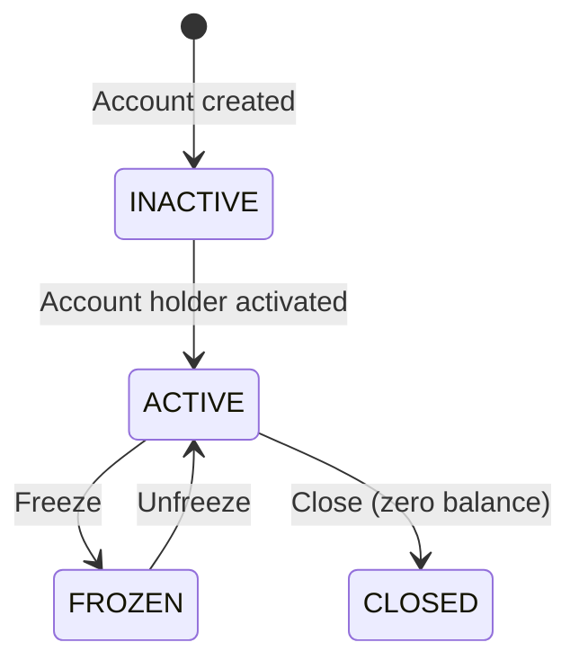

# Deposit and Withdrawal System

The Deposit and Withdrawal System manages customer deposit accounts and facilitates deposit/withdrawal operations within the platform.

## Purpose

The system handles the complete customer funds lifecycle:
- Deposit account creation
- Deposit recording
- Withdrawal processing
- Approval workflows

All financial operations are integrated with Cala Ledger for double-entry accounting.

## Main Entities

### Deposit Account

| Field | Type | Description |
|-------|------|-------------|
| id | UUID | Unique identifier |
| publicId | String | Readable public ID |
| accountHolderId | UUID | Customer ID |
| status | Enum | Account status |
| accountType | Enum | Account type |

### Deposit

| Field | Type | Description |
|-------|------|-------------|
| id | UUID | Unique identifier |
| depositAccountId | UUID | Target account |
| amount | UsdCents | Amount in USD cents |
| reference | String | External reference |
| status | Enum | Deposit status |

### Withdrawal

| Field | Type | Description |
|-------|------|-------------|
| id | UUID | Unique identifier |
| depositAccountId | UUID | Source account |
| amount | UsdCents | Amount in USD cents |
| reference | String | External reference |
| status | Enum | Withdrawal status |

## Account Types

| Type | Description | Usage |
|------|-------------|-------|
| Individual | Personal account | Individual customers |
| GovernmentEntity | Government account | Government entities |
| PrivateCompany | Business account | Private companies |
| Bank | Bank account | Financial institutions |
| FinancialInstitution | Institutional account | Other institutions |
| ForeignAgencyOrSubsidiary | Foreign account | Foreign agencies |
| NonDomiciledCompany | Non-resident account | Non-domiciled companies |

## Account Status

| Status | Description |
|--------|-------------|
| ACTIVE | Operational account — deposits and withdrawals allowed |
| INACTIVE | Deactivated account |
| FROZEN | Frozen account — no new deposits or withdrawals permitted |
| CLOSED | Permanently closed account (requires zero balance) |

## Account Lifecycle Operations

### Freeze Account

Freezing a deposit account prevents all new deposits and withdrawals while keeping the account and its balances visible. This is used for compliance holds or dispute investigations.

- The account transitions from `ACTIVE` to `FROZEN`
- Settled and pending balances remain visible
- A `DepositAccountFrozen` event is emitted
- An `INACTIVE` or `CLOSED` account cannot be frozen

### Unfreeze Account

Unfreezing restores a frozen account to normal operation, re-enabling deposits and withdrawals.

- The account transitions from `FROZEN` to `ACTIVE`
- A `DepositAccountUnfrozen` event is emitted
- The operation is idempotent — unfreezing an already active account has no effect

### Close Account

Closing permanently deactivates a deposit account. This action cannot be reversed.

- **Requires zero balance** — both settled and pending balances must be zero
- A `FROZEN` account cannot be closed directly; unfreeze first
- The corresponding ledger account is locked upon closure
- A `DepositAccountClosed` event is emitted

## Related Documentation

- [Deposit Operations](operations) - Deposits and withdrawals

## Admin Panel Walkthrough: Deposit Account Setup

Deposit accounts are required before transaction operations can start. In onboarding flows, the
operator may need to create one from the customer profile when none exists yet.

**Step 1.** Detect missing deposit account from customer detail banner.

**Step 2.** Open the create deposit account dialog.

**Step 3.** Confirm deposit account creation succeeds.

Operational checks after creation:
- account status is `ACTIVE`,
- customer-to-account association is correct,
- account is available for deposit/withdrawal initiation.

