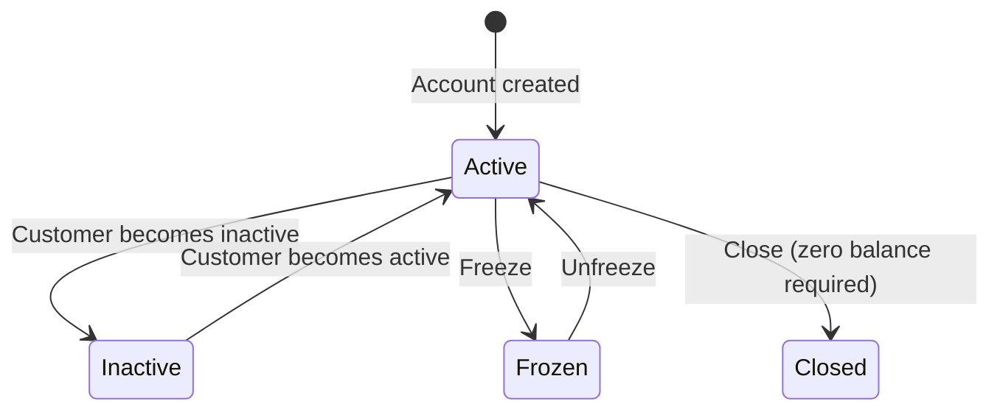

# Deposit and Withdrawal System

The Deposit and Withdrawal System manages customer deposit accounts and facilitates all fund movements within the platform. Every customer has a single USD deposit account that serves as the hub for receiving deposits, processing withdrawals, and receiving credit facility disbursals. The system is fully integrated with the Cala double-entry ledger, ensuring that every fund movement is properly recorded and that accounts cannot go into overdraft.

## Deposit Account Structure

Each deposit account in Lana is backed by **two** ledger accounts in the Cala ledger:

| Ledger Account | Normal Balance | Purpose |
|----------------|---------------|---------|
| **Deposit Account** | Credit (liability) | Tracks the customer's available balance. Represents the bank's obligation to the customer. |
| **Frozen Deposit Account** | Credit (liability) | Holds the customer's balance while the account is frozen. Balances are moved here during a freeze and restored on unfreeze. |

In addition, a single system-wide **Deposit Omnibus Account** (debit-normal, asset) serves as the counterparty for all deposit and withdrawal transactions. It represents the bank's actual cash reserves backing customer deposits.

### Overdraft Prevention

Every deposit account has a velocity control that prevents the settled balance from going below zero. This is enforced at the ledger level, meaning no transaction can make the balance negative regardless of how it is initiated. This provides a hard guarantee against overdrafts without requiring application-level balance checks.

### Balance Model

Deposit account balances are reported as two separate figures:

- **Settled balance**: Confirmed, available funds. Reflects completed deposits minus completed withdrawals.
- **Pending balance**: Funds encumbered by in-flight withdrawals that have been initiated but not yet confirmed or cancelled. The pending amount reduces the effective available balance.

When a withdrawal is initiated, the amount is immediately moved from settled to pending (via a ledger transaction). This ensures the funds are reserved and cannot be double-spent. When the withdrawal is confirmed, the pending balance is cleared. If the withdrawal is cancelled or denied, the pending balance is restored to settled.

## Account Types

Deposit accounts are categorized by the customer type of their holder. Each customer type maps to a separate ledger account set, enabling aggregate balance reporting by customer category:

| Type | Description |
|------|-------------|
| Individual | Personal customer accounts |
| GovernmentEntity | Government organization accounts |
| PrivateCompany | Business accounts |
| Bank | Banking institution accounts |
| FinancialInstitution | Other financial institution accounts |
| NonDomiciledCompany | Non-resident company accounts |

This categorization is used in the chart of accounts to place deposit liabilities under the correct parent nodes for financial reporting.

## Account Status and Lifecycle

| Status | Description | Deposits Allowed | Withdrawals Allowed |
|--------|-------------|:---:|:---:|
| **Active** | Normal operations | Yes | Yes |
| **Inactive** | Customer activity lapsed | No | No |
| **Frozen** | Compliance hold or dispute | No | No |
| **Closed** | Permanently deactivated | No | No |

### Freeze Account

Freezing a deposit account prevents all new deposits and withdrawals while preserving the account balance. This is used for compliance holds, dispute investigations, or regulatory requirements.

When an account is frozen:
1. The settled balance is moved from the main deposit ledger account to the frozen companion account via a ledger transaction.
2. The main deposit ledger account is locked, preventing any further transactions.
3. A `DepositAccountFrozen` event is emitted.

The balance remains visible to operators during the freeze. An `Inactive` or `Closed` account cannot be frozen.

### Unfreeze Account

Unfreezing restores a frozen account to normal operation:
1. The main deposit ledger account is unlocked.
2. The frozen balance is moved back from the frozen companion account to the main deposit account.
3. A `DepositAccountUnfrozen` event is emitted.

The operation is idempotent: unfreezing an already active account has no effect.

### Close Account

Closing permanently deactivates a deposit account. This action cannot be reversed.

- **Requires zero balance**: Both settled and pending balances must be zero before closing.
- A `Frozen` account cannot be closed directly; it must be unfrozen first.
- The corresponding ledger account is locked upon closure, preventing any future transactions.
- A `DepositAccountClosed` event is emitted.

## Relationship to Credit Facilities

Deposit accounts serve as the destination for credit facility disbursals. When a disbursal is confirmed, the disbursed amount is credited to the customer's deposit account. This means the deposit account balance reflects both direct deposits and credit facility proceeds.

Similarly, when a customer makes a payment on a credit facility, the funds are debited from their deposit account and applied to the outstanding obligations.

## Related Documentation

- [Deposit Operations](operations) - Deposits and withdrawals
- [Ledger](ledger) - Overview of account sets and transaction templates

## Admin Panel Walkthrough: Deposit Account Setup

Deposit accounts are required before transaction operations can start. In onboarding flows, the
operator may need to create one from the customer profile when none exists yet.

**Step 1.** Detect missing deposit account from customer detail banner.

**Step 2.** Open the create deposit account dialog.

**Step 3.** Confirm deposit account creation succeeds.

Operational checks after creation:
- account status is `ACTIVE`,
- customer-to-account association is correct,
- account is available for deposit/withdrawal initiation.
