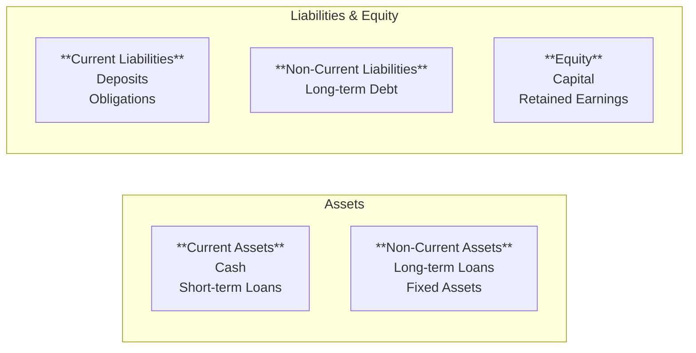

# Financial Reports

This document describes available financial reports, their structure, and how to generate them.

## Trial Balance

Shows balances of all accounting accounts for a given period.

### Structure

| Column | Description |
|--------|-------------|
| Account | Account code and name |
| Debit | Total debit movements |
| Credit | Total credit movements |
| Balance | Resulting balance |

### Generation

Trial balance reports can be generated from the **Reports** section of the admin panel by selecting the desired period.

## Balance Sheet

Presents the institution's financial position at a given date.

### Structure

## Income Statement

Shows revenue, expenses, and profit for a period.

### Sections

| Section | Components |
|---------|------------|
| Revenue | Loan interest, fees |
| Financial Expenses | Interest paid |
| Operating Expenses | Salaries, administration |
| Net Income | Revenue - Expenses |

## Portfolio Reports

### Credit Portfolio

Credit portfolio reports are available from the **Reports** section and show all active facilities with their current status.

### Delinquency Report

Analysis of portfolio by days past due.

| Category | Description |
|----------|-------------|
| Current | No delay |
| 1-30 days | Minor delay |
| 31-60 days | Moderate delay |
| 61-90 days | Significant delay |
| > 90 days | Past due portfolio |

## Report Scheduling

### Configure Automatic Report

Report schedules can be configured from the **Reports** > **Scheduling** section in the admin panel.

### Available Frequencies

| Frequency | Description |
|-----------|-------------|
| DAILY | Every day |
| WEEKLY | Weekly |
| MONTHLY | Monthly |
| QUARTERLY | Quarterly |
| YEARLY | Annual |

## Permissions Required

| Operation | Permission |
|-----------|---------|
| View financial reports | REPORT_FINANCIAL_READ |
| View portfolio reports | REPORT_PORTFOLIO_READ |
| View regulatory reports | REPORT_REGULATORY_READ |
| Export reports | REPORT_EXPORT |
| Schedule reports | REPORT_SCHEDULE |

## Admin Panel Walkthrough: Trial Balance

**Step 1.** Open the trial balance report.

**Step 2.** Switch currency view (example: BTC).

## Admin Panel Walkthrough: Balance Sheet

**Step 1.** Open the balance sheet report.

**Step 2.** Switch currency (USD/BTC).

**Step 3.** Filter by balance layer (example: pending).

## Admin Panel Walkthrough: Profit and Loss

**Step 1.** Open profit and loss report.

**Step 2.** Switch currency view.

**Step 3.** Filter by layer (example: pending).

