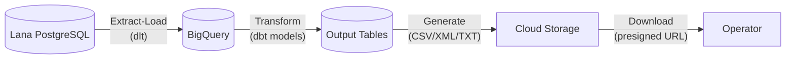
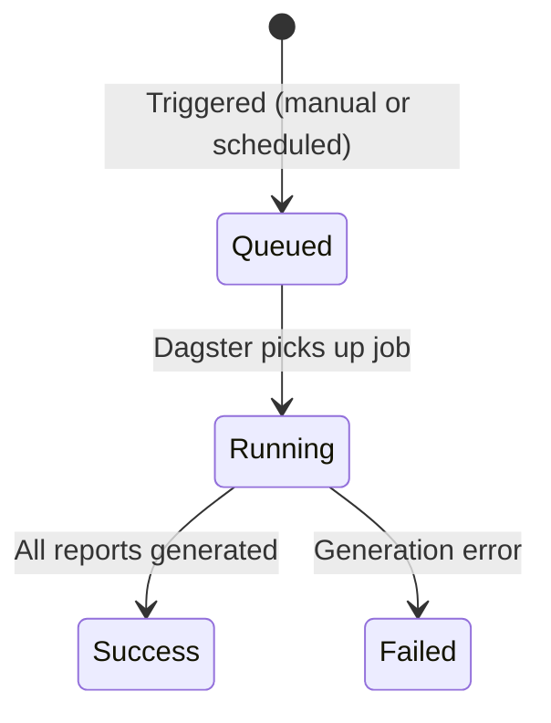

# Financial Reporting System

The reporting system in Lana serves two distinct purposes: **real-time financial statements** for operational management and **file-based regulatory reports** for compliance. These two paths use different data sources and generation mechanisms but share the same underlying accounting data.

## Two Reporting Paths

### Real-Time Financial Statements

The trial balance, balance sheet, and profit and loss statement are generated in real time directly from the Cala double-entry ledger. They are always up-to-date and reflect the current state of all accounts. These are available immediately through the admin panel and GraphQL API without any batch processing.

See [Financial Reports](financial-reports) for details on each statement.

### File-Based Regulatory Reports

Regulatory reports are generated through a data pipeline powered by Dagster and dbt. Raw data is extracted from the Lana database, transformed through business logic models, and formatted into the file formats required by regulators. These reports are generated on schedule (every two hours) or on demand, and the output files are stored in cloud storage for download.

## Regulatory Report Pipeline

The pipeline has three stages:

1. **Extract-Load**: Raw data is replicated from the Lana PostgreSQL database to BigQuery using `dlt` (data load tool). This includes all event tables (credit facilities, customers, deposits, withdrawals, interest accrual cycles), chart of accounts data, and CALA ledger tables (accounts, account sets, balance history). This runs daily.

2. **Transform**: dbt models in BigQuery transform the raw data into report-ready output tables. The models are organized in three tiers:
   - **Staging**: Clean and normalize raw source data.
   - **Intermediate**: Apply business logic, reconstruct entity state from event streams, and calculate regulatory classifications and risk categories.
   - **Output**: Final report tables with the exact columns and formats required by each regulatory norm.

3. **File Generation**: Dagster assets read from the dbt output tables and produce the actual report files (CSV, XML with XSD validation, or fixed-width text). Files are uploaded to Google Cloud Storage at the path `reports/{run_id}/{norm}/{report_name}.{extension}`.

## Report Run Lifecycle

Each report generation execution is tracked as a **Report Run** with its own lifecycle:

| Status | Description |
|--------|-------------|
| **Queued** | Report run triggered, waiting for Dagster to start |
| **Running** | Dagster pipeline is actively generating reports |
| **Success** | All report files generated and uploaded to cloud storage |
| **Failed** | Pipeline encountered an error; check Dagster logs for details |

Report runs can be triggered two ways:
- **Scheduled**: An automatic cron schedule runs every two hours.
- **Manual**: An operator clicks "Generate Report" in the admin panel, which triggers the pipeline immediately.

After a run completes, Dagster notifies Lana via a webhook. Lana then queries Dagster's API to synchronize the run status and discover the generated report files. The admin panel shows real-time status updates via GraphQL subscriptions.

## Regulatory Report Categories

### NRP-41: Credit Reference Information

17 sub-reports covering loan portfolio details for the SSF (Superintendencia del Sistema Financiero). Includes borrower information, credit references, collateral details (various guarantee types), expense references, cancelled references, corporate shareholders, and board of directors data. Output in XML (with XSD validation) and CSV.

### NRP-51: Financial/Accounting Information

8 sub-reports covering account balances and financial positions: account balances, foreign deposits, off-balance-sheet data, foreign securities, guaranteed loans, guaranteed endorsements, subordinated debt, and projected balance. Output in XML and CSV.

### NRSF-03: Deposit Insurance

9 sub-reports for the deposit guarantee fund: customer data, deposits, customer documents, account holders, branches, products, officers and employees, guaranteed deposit summary, and adjustments. Output in CSV and fixed-width text (for SSF submission).

### UIF-07: Financial Intelligence Unit

Daily electronic transactions log for anti-money laundering compliance. Output in CSV.

### Internal/Operational Reports

Non-regulatory reports for internal analysis: net risk calculation, loan account statements, payment history, active loan listing, and loan portfolio reports. Output in CSV.

## Downloading Report Files

After a successful report run:

1. Navigate to the reporting section in the admin panel.
2. Select the completed report run.
3. Click the download link for the desired report file.
4. The system generates a presigned URL from cloud storage, valid for a limited time.
5. The browser downloads the file directly from cloud storage.

## Related Documentation

- [Financial Reports](financial-reports) - Trial balance, balance sheet, and P&L details

## Admin Panel Walkthrough: Regulatory Reports

Regulatory reports are generated asynchronously. After triggering a run, operators should monitor
state transitions (`queued` -> `running` -> `success`/`failed`) and only generate download links
after successful completion.

**Step 1.** Open regulatory reporting and click **Generate Report**.

Verification checklist:
- report run appears in the list,
- status updates are reflected in UI,
- download links are generated only when run state is successful.
