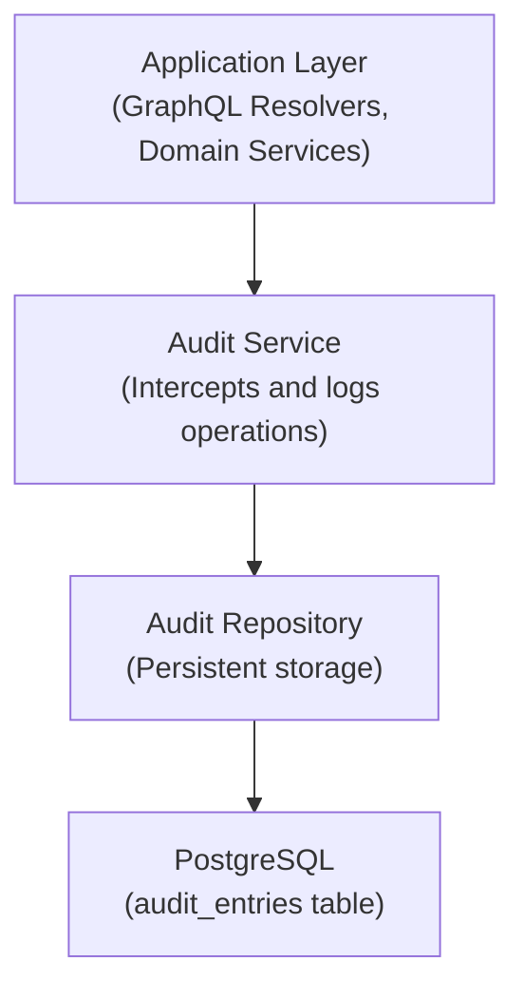

# Sistema de Auditoría y Registro

Este documento describe el sistema de registro de auditoría para cumplimiento y seguridad.

## Descripción General

El sistema de auditoría proporciona:

- Historial completo de operaciones
- Informes de cumplimiento
- Monitoreo de seguridad
- Análisis forense

## Arquitectura



## Estructura de Entrada de Auditoría

```rust
pub struct AuditEntry {
    pub id: AuditEntryId,
    pub timestamp: DateTime<Utc>,
    pub subject: SubjectId,
    pub subject_type: SubjectType,
    pub action: String,
    pub object: String,
    pub object_id: Option<String>,
    pub outcome: AuditOutcome,
    pub ip_address: Option<IpAddr>,
    pub user_agent: Option<String>,
    pub correlation_id: Option<Uuid>,
    pub metadata: serde_json::Value,
}

pub enum SubjectType {
    User,
    System,
    ApiClient,
}

pub enum AuditOutcome {
    Success,
    Failure,
    Denied,
}
```

## Categorías de Auditoría

| Categoría | Descripción | Ejemplos |
|----------|-------------|----------|
| Autenticación | Eventos de inicio/cierre de sesión | Inicio de sesión de usuario, expiración de sesión |
| Autorización | Decisiones de permisos | Acceso denegado, verificación de rol |
| Acceso a Datos | Operaciones de lectura | Ver cliente, exportar informe |
| Modificación de Datos | Operaciones de escritura | Crear instalación, actualizar términos |
| Eventos del Sistema | Procesos en segundo plano | Ejecución de trabajo, sincronización completada |

## Puntos de Integración

### Middleware de GraphQL

```rust
pub struct AuditMiddleware {
    audit_service: Arc<AuditService>,
}

impl Extension for AuditMiddleware {
    async fn execute(&self, ctx: &ExtensionContext<'_>, operation_name: Option<&str>, next: NextExecute<'_>) -> Response {
        let start = Instant::now();
        let subject = ctx.data::<SubjectId>().cloned();

        let response = next.run(ctx, operation_name).await;

        // Log the operation
        if let Some(subject) = subject {
            self.audit_service.log(AuditEntry {
                subject,
                action: operation_name.unwrap_or("unknown").to_string(),
                outcome: if response.is_ok() { AuditOutcome::Success } else { AuditOutcome::Failure },
                ..Default::default()
            }).await.ok();
        }

        response
    }
}
```

### Auditoría de Servicios de Dominio

```rust
impl CreditService {
    pub async fn create_facility(
        &self,
        subject: &SubjectId,
        input: CreateFacilityInput,
    ) -> Result<CreditFacility> {
        let facility = self.do_create_facility(input).await?;

        // Audit the operation
        self.audit.log(AuditEntry {
            subject: subject.clone(),
            action: "create_facility".to_string(),
            object: "credit_facility".to_string(),
            object_id: Some(facility.id.to_string()),
            outcome: AuditOutcome::Success,
            metadata: json!({
                "amount": facility.amount,
                "customer_id": facility.customer_id,
            }),
            ..Default::default()
        }).await?;

        Ok(facility)
    }
}
```

## API de Consultas

### Consulta GraphQL

```graphql
query GetAuditLogs($filter: AuditFilter!, $first: Int, $after: String) {
  auditEntries(filter: $filter, first: $first, after: $after) {
    edges {
      node {
        id
        timestamp
        subject
        action
        object
        objectId
        outcome
        metadata
      }
    }
    pageInfo {
      hasNextPage
      endCursor
    }
  }
}
```

### Opciones de Filtro

```graphql
input AuditFilter {
  subjectId: ID
  action: String
  object: String
  outcome: AuditOutcome
  startDate: DateTime
  endDate: DateTime
}
```

## Política de Retención

| Tipo de Datos | Período de Retención |
|-----------|------------------|
| Registros de autenticación | 2 años |
| Registros de autorización | 2 años |
| Registros de transacciones | 7 años |
| Registros del sistema | 1 año |

## Informes de Cumplimiento

### Informe de Actividad del Usuario

```graphql
query UserActivityReport($userId: ID!, $period: DateRange!) {
  userActivityReport(userId: $userId, period: $period) {
    totalActions
    actionsByType {
      action
      count
    }
    timeline {
      date
      actions
    }
  }
}
```

### Informe de Acceso

```graphql
query AccessReport($objectType: String!, $period: DateRange!) {
  accessReport(objectType: $objectType, period: $period) {
    totalAccesses
    uniqueUsers
    byAction {
      action
      count
    }
  }
}
```

## Monitoreo de Seguridad

### Detección de Anomalías

Monitorear patrones inusuales:

- Múltiples intentos fallidos de inicio de sesión
- Acceso fuera del horario habitual
- Exportaciones masivas de datos
- Intentos de escalada de privilegios

### Alertas

```rust
pub struct AuditAlertService {
    audit_repo: AuditRepo,
    notification_service: NotificationService,
}

impl AuditAlertService {
    pub async fn check_for_anomalies(&self) -> Result<()> {
        // Check for suspicious patterns
        let failed_logins = self.audit_repo
            .count_failed_logins_last_hour()
            .await?;

        if failed_logins > 10 {
            self.notification_service
                .send_security_alert("High number of failed logins detected")
                .await?;
        }

        Ok(())
    }
}
```
