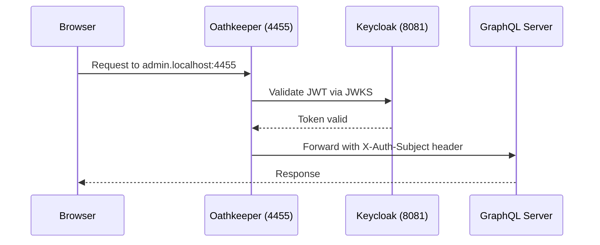

# Autenticación para Desarrollo Local

Esta guía cubre cómo funciona la autenticación en el entorno de desarrollo local, incluyendo la configuración de Keycloak y los procedimientos de inicio de sesión.

## Configuración de Keycloak

Keycloak se ejecuta en **http://localhost:8081** y se configura automáticamente con importaciones de realm cuando ejecutas `make start-deps`.

### Consola de Administración de Keycloak

- **URL**: http://localhost:8081
- **Nombre de usuario**: `admin`
- **Contraseña**: `admin`

### Realms

| Realm | Propósito | Utilizado por |
|-------|---------|---------|
| `internal` | Usuarios administrativos | Panel de Administración |
| `customer` | Clientes del banco | Portal del Cliente |

Las definiciones de realm se almacenan en `dev/keycloak/` y se importan automáticamente al inicio.

## Inicio de Sesión en el Panel de Administración

1. Navega a http://admin.localhost:4455
2. Serás redirigido a Keycloak
3. Inicia sesión con: **admin@galoy.io**
4. El panel de administración utiliza el realm `internal` de Keycloak con OIDC Code Flow

## Inicio de Sesión en el Portal del Cliente

1. Primero, crea un cliente a través del Panel de Administración
2. Abre http://app.localhost:4455 en un navegador separado o ventana de incógnito
3. Ingresa la dirección de correo electrónico del cliente
4. Recupera el código de inicio de sesión:

```bash
make get-customer-login-code EMAIL=customer@example.com
```

5. Ingresa el código para completar el inicio de sesión

El Portal del Cliente utiliza NextAuth con el proveedor Keycloak para autenticación OIDC.

## Flujo de Autenticación



### Cómo Funciona Oathkeeper

Oathkeeper se encuentra en el puerto 4455 y maneja toda la autenticación:

1. Recibe solicitudes entrantes con tokens JWT Bearer
2. Valida la firma JWT contra el endpoint JWKS de Keycloak
3. Emite un JWT interno con audiencia específica de ruta y sujeto de usuario
4. Redirige la solicitud al servicio upstream apropiado (admin-server o customer-server)

Los servidores backend solo aceptan JWT internos de Oathkeeper — verifican usando el JWKS de Oathkeeper y comprueban la declaración de audiencia.

## Duración de Tokens (Desarrollo)

| Token | Duración |
|-------|----------|
| Token de acceso | 5 minutos |
| Token de actualización | 30 minutos |
| Sesión | 8 horas |
