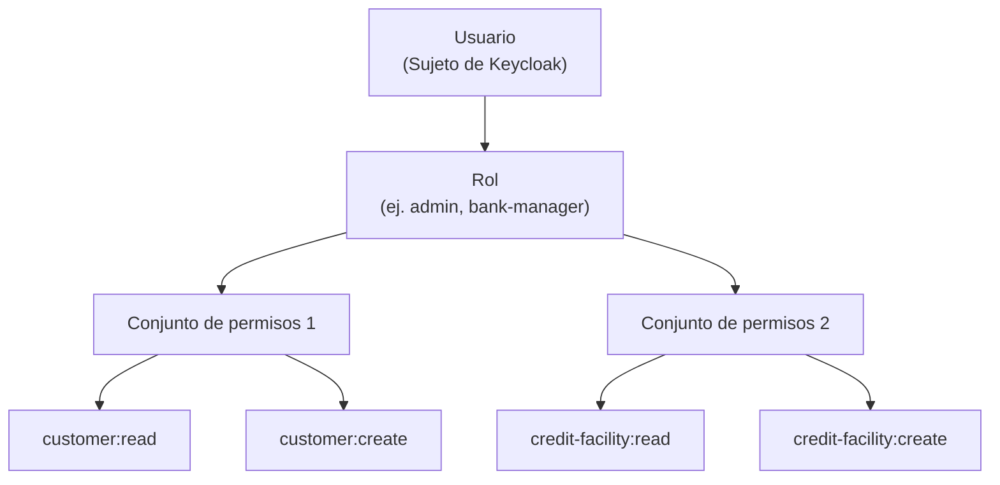

# Autorización y RBAC

Lana utiliza [Casbin](https://casbin.org/) para el control de acceso basado en roles (RBAC). Las políticas se almacenan en PostgreSQL y se evalúan en tiempo de ejecución para cada operación de API.

## Modelo RBAC

El modelo de autorización sigue una estructura de tres niveles:

```
Usuario → Rol → Conjunto de permisos → Permisos (Objeto + Acción)
```



## Roles predefinidos

| Rol | Descripción | Permisos clave |
|------|-------------|-----------------|
| **Superusuario** | Acceso completo al sistema | Todos los conjuntos de permisos |
| **Administrador** | Acceso operativo completo | Todos excepto nivel de sistema |
| **Gerente bancario** | Gestión de operaciones | Cliente, crédito, depósitos, informes (sin acceso a gestión o custodia) |
| **Contador** | Operaciones financieras | Funciones de contabilidad y visualización |

Los permisos efectivos de un usuario son la **unión** de los permisos de todos los roles asignados.

## Conjuntos de permisos

Cada módulo de dominio define sus propios conjuntos de permisos, siguiendo típicamente un patrón de **visualizador/escritor**:

- `PERMISSION_SET_CUSTOMER_VIEWER` — acceso de solo lectura a datos de clientes
- `PERMISSION_SET_CUSTOMER_WRITER` — crear/actualizar datos de clientes
- `PERMISSION_SET_CREDIT_VIEWER` — leer facilidades de crédito
- `PERMISSION_SET_CREDIT_WRITER` — gestionar facilidades de crédito
- `PERMISSION_SET_EXPOSED_CONFIG_VIEWER` — leer configuración del sistema
- `PERMISSION_SET_EXPOSED_CONFIG_WRITER` — modificar configuración del sistema

## Modelo de política de Casbin

```
[request_definition]
r = sub, obj, act

[policy_definition]
p = sub, obj, act

[role_definition]
g = _, _

[policy_effect]
e = some(where (p.eft == allow))

[matchers]
m = g(r.sub, p.sub) && r.obj == p.obj && r.act == p.act
```

## Cómo funciona la autorización en el código

Cada resolver de GraphQL aplica permisos a través de la función `Authorization::enforce_permission`:

1. El contexto de la solicitud contiene el sujeto autenticado (de Oathkeeper)
2. El resolver llama a `enforce_permission(subject, object, action)`
3. Casbin evalúa la política contra los roles del sujeto
4. Si se deniega, se devuelve un error de autorización
5. Cada decisión (permitir y denegar) se registra en el registro de auditoría

## Integración de auditoría

Las decisiones de autorización se registran automáticamente con:

- **Subject**: Quién intentó la acción
- **Object**: Qué objetivo tenía la acción
- **Action**: El tipo de operación (por ejemplo, `customer:read`, `credit-facility:create`)
- **Authorized**: Si fue permitida o denegada

Tanto los intentos de acceso exitosos como los fallidos se registran, proporcionando un rastro de auditoría completo para el cumplimiento normativo.
