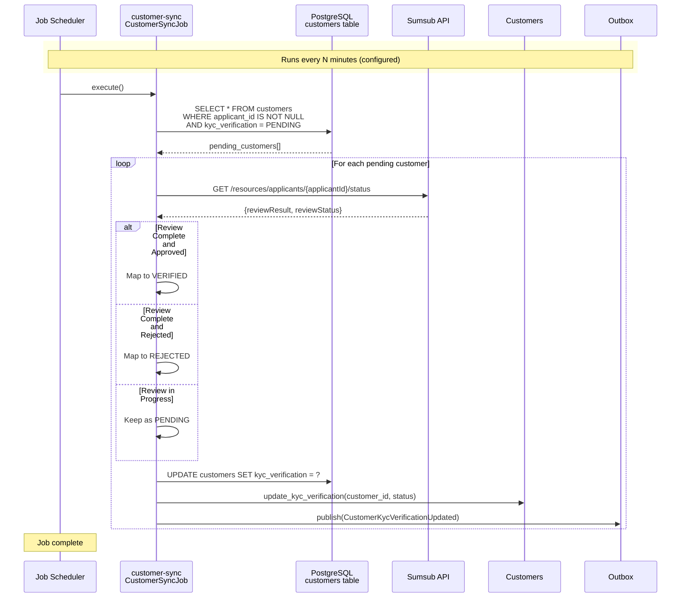
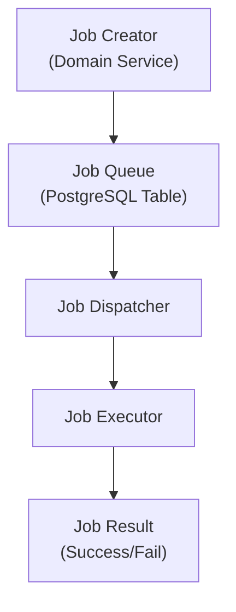

# Sistema de Trabajos en Segundo Plano

Este documento describe el sistema de procesamiento de trabajos en segundo plano utilizado para operaciones asíncronas.



## Descripción General

Lana utiliza un sistema de trabajos para:

- Procesamiento asíncrono
- Tareas programadas
- Operaciones con reintentos
- Coordinación entre servicios

## Arquitectura



## Tipos de Trabajos

| Tipo de Trabajo | Propósito | Ejemplo |
|----------|---------|---------|
| Procesamiento de Aprobaciones | Ejecutar decisiones de gobernanza | Aprobar desembolso |
| Acumulación de Intereses | Calcular intereses periódicos | Interés diario |
| Notificaciones | Enviar alertas y correos electrónicos | Recordatorio de pago |
| Sincronización | Sincronización de sistemas externos | Valoración de cartera |

## Definición de Trabajo

```rust
#[derive(Debug, Serialize, Deserialize)]
pub struct Job {
    id: JobId,
    job_type: JobType,
    payload: serde_json::Value,
    status: JobStatus,
    attempts: u32,
    max_attempts: u32,
    scheduled_at: DateTime<Utc>,
    started_at: Option<DateTime<Utc>>,
    completed_at: Option<DateTime<Utc>>,
}

pub enum JobStatus {
    Pending,
    Running,
    Completed,
    Failed,
    Retrying,
}
```

## Ejecución de Trabajos

### Rastreador de Trabajos

Gestiona el ciclo de vida de los trabajos:

```rust
pub struct JobTracker {
    pool: PgPool,
}

impl JobTracker {
    pub async fn enqueue(&self, job: NewJob) -> Result<JobId> {
        // Insert job into queue
    }

    pub async fn fetch_ready(&self, limit: u32) -> Result<Vec<Job>> {
        // Get jobs ready for execution
    }

    pub async fn mark_completed(&self, id: JobId) -> Result<()> {
        // Mark job as completed
    }

    pub async fn mark_failed(&self, id: JobId, error: String) -> Result<()> {
        // Mark job as failed, possibly schedule retry
    }
}
```

### Despachador de Trabajos

Ejecuta trabajos según su tipo:

```rust
pub struct JobDispatcher {
    executors: HashMap<JobType, Box<dyn JobExecutor>>,
}

impl JobDispatcher {
    pub async fn dispatch(&self, job: Job) -> Result<JobResult> {
        let executor = self.executors
            .get(&job.job_type)
            .ok_or(Error::UnknownJobType)?;

        executor.execute(job.payload).await
    }
}
```

## Lógica de Reintentos

Los trabajos fallidos se reintentan con retroceso exponencial:

```rust
impl Job {
    pub fn calculate_next_retry(&self) -> DateTime<Utc> {
        let delay_seconds = 2u64.pow(self.attempts) * 60;
        Utc::now() + Duration::seconds(delay_seconds as i64)
    }

    pub fn should_retry(&self) -> bool {
        self.attempts < self.max_attempts
    }
}
```

### Configuración de Reintentos

| Intento | Retraso |
|---------|-------|
| 1 | 2 minutos |
| 2 | 4 minutos |
| 3 | 8 minutos |
| 4 | 16 minutos |
| 5 | 32 minutos (máx.) |

## Trabajos Programados

Los trabajos pueden programarse para ejecución futura:

```rust
// Schedule interest accrual for midnight
let job = NewJob {
    job_type: JobType::InterestAccrual,
    payload: json!({}),
    scheduled_at: next_midnight(),
};

tracker.enqueue(job).await?;
```

## Ejemplos de Trabajos

### Trabajo de Procesamiento de Aprobaciones

```rust
pub struct ApprovalProcessingExecutor {
    governance: GovernanceService,
}

impl JobExecutor for ApprovalProcessingExecutor {
    async fn execute(&self, payload: Value) -> Result<JobResult> {
        let input: ApprovalInput = serde_json::from_value(payload)?;

        self.governance
            .process_approval(input.process_id)
            .await?;

        Ok(JobResult::Success)
    }
}
```

### Trabajo de Acumulación de Intereses

```rust
pub struct InterestAccrualExecutor {
    credit_service: CreditService,
}

impl JobExecutor for InterestAccrualExecutor {
    async fn execute(&self, payload: Value) -> Result<JobResult> {
        let facilities = self.credit_service
            .get_active_facilities()
            .await?;

        for facility in facilities {
            self.credit_service
                .accrue_interest(facility.id)
                .await?;
        }

        Ok(JobResult::Success)
    }
}
```

## Monitoreo

### Métricas

- Trabajos encolados por minuto
- Tiempo de ejecución del trabajo
- Tasas de éxito/fallo
- Profundidad de la cola

### Alertas

- Alta tasa de fallos
- Trabajos de larga duración
- Acumulación en la cola
