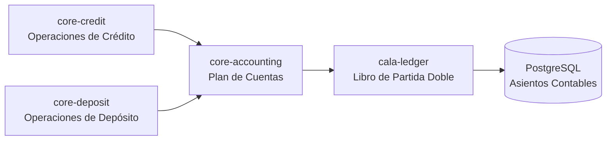

# Integración con Cala Ledger

Este documento describe cómo Lana Bank se integra con Cala Ledger, un sistema externo de contabilidad por partida doble, para mantener los registros financieros.



## Propósito y Alcance

Cala Ledger es una biblioteca independiente de contabilidad por partida doble que Lana Bank utiliza para registrar todas las operaciones financieras. Esta integración garantiza:

- **Contabilidad por partida doble atómica**: cada transacción debita y acredita cuentas en equilibrio
- **Trazabilidad de auditoría**: historial completo de todos los asientos con marcas de tiempo
- **Seguimiento de saldos**: consultas de saldos en tiempo real e históricos
- **Soporte de divisas**: saldos multidivisa (USD y BTC) por cuenta

## Arquitectura de Integración

```
┌─────────────────────────────────────────────────────────────────┐
│                    Servicios de Dominio                         │
│  ┌─────────────────┐  ┌─────────────────┐                      │
│  │   core-credit   │  │   core-deposit  │                      │
│  └────────┬────────┘  └────────┬────────┘                      │
│           │                    │                               │
│           └────────────────────┘                               │
│                       │                                        │
│                       ▼                                        │
│           ┌───────────────────────┐                            │
│           │    core-accounting    │                            │
│           │    (Capa Adaptador)   │                            │
│           └───────────┬───────────┘                            │
└───────────────────────┼───────────────────────────────────────-┘
                        │
                        ▼
┌─────────────────────────────────────────────────────────────────┐
│                     cala-ledger                                 │
│  ┌─────────────────────────────────────────────────────────┐   │
│  │                    CalaLedger                            │   │
│  │     accounts()  account_sets()  transactions()           │   │
│  │     entries()   balances()      tx_templates()           │   │
│  └─────────────────────────────────────────────────────────┘   │
└─────────────────────────────────────────────────────────────────┘
                        │
                        ▼
┌─────────────────────────────────────────────────────────────────┐
│                     PostgreSQL                                  │
│          (Tablas cala_* para datos del libro mayor)             │
└─────────────────────────────────────────────────────────────────┘
```

## Primitivas de Cala Ledger

### Alias de Tipos y Conversiones

| Tipo Lana | Tipo Cala | Propósito |
|-----------|-----------|-----------|
| LedgerAccountId | CalaAccountId / CalaAccountSetId | Identificador unificado para cuentas |
| LedgerTransactionId | CalaTxId | Identificador de transacción |
| TransactionTemplateId | CalaTxTemplateId | Identificador de plantilla |
| ChartId | CalaAccountSetId | Conjunto de cuentas raíz del plan |

```rust
// core/accounting/src/primitives.rs
pub type LedgerAccountId = cala_ledger::AccountId;
pub type LedgerTransactionId = cala_ledger::TxId;
pub type TransactionTemplateId = cala_ledger::TxTemplateId;

pub enum LedgerAccountIdType {
    Account(cala_ledger::AccountId),
    AccountSet(cala_ledger::AccountSetId),
}
```

## Inicialización y Configuración

### Configuración de CalaLedger

```rust
// lana/app/src/lib.rs
impl LanaApp {
    pub async fn init(config: AppConfig) -> Result<Self, Error> {
        let pool = db::init_pool(&config.database_url).await?;

        // Inicializar Cala Ledger
        let cala = CalaLedger::init(
            CalaLedgerConfig::builder()
                .pool(pool.clone())
                .exec_migrations(true)
                .build()?,
        ).await?;

        // Inicializar módulo de contabilidad con Cala
        let accounting = CoreAccounting::init(cala.clone()).await?;

        Ok(Self { accounting, cala, /* ... */ })
    }
}
```

### Integración de CoreAccounting

```rust
// core/accounting/src/lib.rs
pub struct CoreAccounting {
    cala: CalaLedger,
    charts: Charts,
    ledger_accounts: LedgerAccounts,
    manual_transactions: ManualTransactions,
}

impl CoreAccounting {
    pub async fn init(cala: CalaLedger) -> Result<Self, Error> {
        Ok(Self {
            cala: cala.clone(),
            charts: Charts::new(cala.clone()),
            ledger_accounts: LedgerAccounts::new(cala.clone()),
            manual_transactions: ManualTransactions::new(cala),
        })
    }
}
```

## Jerarquía de Cuentas

### Estrategia de Mapeo

El plan de cuentas de Lana se mapea a la estructura de Cala:

```
Plan de Cuentas (ChartOfAccounts)
├── AccountSet: "1000 - Activos"          (Contenedor)
│   ├── AccountSet: "1100 - Activos Corrientes"
│   │   ├── Account: "1110 - Caja"        (Hoja)
│   │   └── Account: "1120 - Bancos"      (Hoja)
│   └── AccountSet: "1200 - Préstamos"
│       └── Account: "1210 - Por Cobrar"  (Hoja)
├── AccountSet: "2000 - Pasivos"
│   └── Account: "2100 - Depósitos"       (Hoja)
└── AccountSet: "3000 - Capital"
    └── Account: "3100 - Capital Social"  (Hoja)
```

### Creación de Conjuntos de Cuentas

```rust
pub async fn create_account_set(
    &self,
    parent_id: Option<LedgerAccountId>,
    name: &str,
    code: &str,
) -> Result<LedgerAccountId, Error> {
    let account_set_id = AccountSetId::new();

    let mut builder = NewAccountSet::builder()
        .id(account_set_id)
        .name(name)
        .normal_balance_type(self.infer_balance_type(code));

    if let Some(parent) = parent_id {
        builder = builder.member_of(parent);
    }

    self.cala.account_sets().create(builder.build()?).await?;

    Ok(LedgerAccountId::AccountSet(account_set_id))
}
```

### Creación de Cuentas Hoja

```rust
pub async fn create_account(
    &self,
    parent_set_id: AccountSetId,
    name: &str,
    code: &str,
) -> Result<LedgerAccountId, Error> {
    let account_id = AccountId::new();

    let account = NewAccount::builder()
        .id(account_id)
        .name(name)
        .code(code)
        .normal_balance_type(self.infer_balance_type(code))
        .build()?;

    self.cala.accounts().create(account).await?;

    // Agregar al conjunto padre
    self.cala.account_sets()
        .add_member(parent_set_id, AccountSetMemberId::Account(account_id))
        .await?;

    Ok(LedgerAccountId::Account(account_id))
}
```

## Flujo de Transacciones

### Ejecución de Transacción Manual

```rust
pub async fn record_manual_transaction(
    &self,
    entries: Vec<ManualEntry>,
    description: &str,
    effective_date: NaiveDate,
    db_op: &mut DbOp<'_>,
) -> Result<LedgerTransactionId, Error> {
    let tx_id = TxId::new();

    // Construir asientos
    let mut tx_builder = NewTx::builder()
        .id(tx_id)
        .journal_id(self.journal_id)
        .effective(effective_date);

    for entry in entries {
        match entry.entry_type {
            EntryType::Debit => {
                tx_builder = tx_builder.debit(
                    entry.account_id,
                    entry.amount,
                    entry.currency,
                );
            }
            EntryType::Credit => {
                tx_builder = tx_builder.credit(
                    entry.account_id,
                    entry.amount,
                    entry.currency,
                );
            }
        }
    }

    // Ejecutar transacción
    let tx = tx_builder.build()?;
    self.cala.transactions()
        .create_in_op(tx, db_op)
        .await?;

    Ok(tx_id)
}
```

### Uso de Plantillas de Transacción

```rust
// Plantilla predefinida para desembolsos
pub async fn execute_disbursal_template(
    &self,
    facility_id: CreditFacilityId,
    amount: Money,
    db_op: &mut DbOp<'_>,
) -> Result<LedgerTransactionId, Error> {
    let template_id = self.templates.disbursal_template_id;

    let params = DisbursalTemplateParams {
        facility_id: facility_id.to_string(),
        amount: amount.to_decimal(),
        currency: amount.currency().to_string(),
    };

    self.cala.transactions()
        .execute_template_in_op(template_id, params, db_op)
        .await
}
```

## Seguimiento de Saldos

### Estructura de Saldos

```rust
pub struct AccountBalance {
    pub account_id: LedgerAccountId,
    pub currency: Currency,
    pub settled: Decimal,      // Saldo asentado
    pub pending: Decimal,      // Saldo pendiente
    pub encumbered: Decimal,   // Saldo comprometido
    pub available: Decimal,    // Saldo disponible
}
```

### Agregación de Saldos
