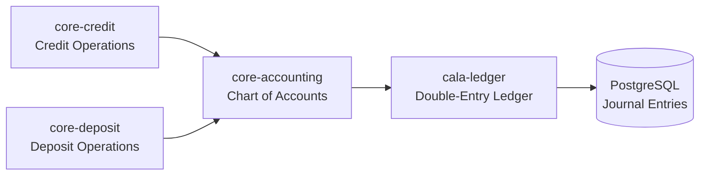
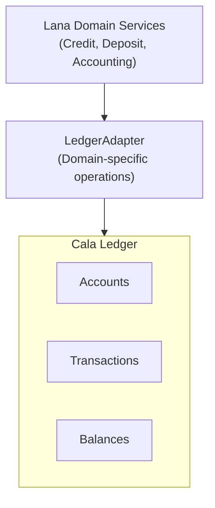
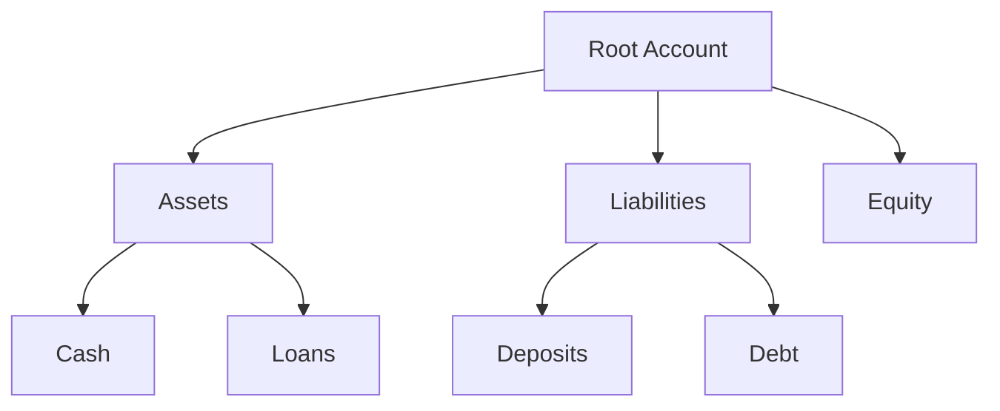

# Integración con Cala Ledger

Este documento describe la integración con Cala Ledger para contabilidad por partida doble.



## Descripción general

Cala Ledger proporciona:

- Contabilidad por partida doble
- Gestión de jerarquía de cuentas
- Cálculo de saldos
- Plantillas de transacciones

## Arquitectura



## Jerarquía de cuentas



## Tipos de cuentas

| Cuenta | Tipo | Propósito |
|---------|------|---------|
| Efectivo | Activo | Efectivo del banco |
| Préstamos por cobrar | Activo | Principal de préstamos pendientes |
| Depósitos de clientes | Pasivo | Saldos de depósitos de clientes |
| Ingresos por intereses | Ingresos | Intereses ganados |
| Gastos por intereses | Gastos | Intereses pagados |

## Plantillas de transacciones

### Registro de depósito

```
DÉBITO:  Efectivo (Activo)              $1,000
CRÉDITO: Depósito de cliente (Pasivo)   $1,000
```

### Desembolso de préstamo

```
DÉBITO:  Préstamos por cobrar (Activo)  $10,000
CRÉDITO: Efectivo (Activo)              $10,000
```

### Devengo de intereses

```
DÉBITO:  Intereses por cobrar (Activo)  $100
CRÉDITO: Ingresos por intereses (Ingresos)    $100
```

### Pago de préstamo

```
DÉBITO:  Efectivo (Activo)                    $500
CRÉDITO: Préstamos por cobrar (Activo)        $400
CRÉDITO: Intereses por cobrar (Activo)        $100
```

## Adaptador de libro mayor

```rust
pub struct DepositLedger {
    cala: CalaClient,
}

impl DepositLedger {
    pub async fn record_deposit(
        &self,
        account_id: AccountId,
        amount: UsdCents,
    ) -> Result<TransactionId> {
        let entries = vec![
            Entry::debit(self.cash_account, amount),
            Entry::credit(account_id, amount),
        ];

        self.cala.post_transaction(entries).await
    }

    pub async fn process_withdrawal(
        &self,
        account_id: AccountId,
        amount: UsdCents,
    ) -> Result<TransactionId> {
        let entries = vec![
            Entry::debit(account_id, amount),
            Entry::credit(self.cash_account, amount),
        ];

        self.cala.post_transaction(entries).await
    }
}
```

## Consultas de Saldo

### Saldo de Cuenta

```rust
pub async fn get_balance(&self, account_id: AccountId) -> Result<Balance> {
    self.cala.get_balance(account_id).await
}

pub struct Balance {
    pub settled: UsdCents,
    pub pending: UsdCents,
    pub available: UsdCents,
}
```

### Balance de Comprobación

```rust
pub async fn trial_balance(&self, as_of: DateTime<Utc>) -> Result<TrialBalance> {
    self.cala.trial_balance(as_of).await
}
```

## Registro de Transacciones

Todas las transacciones se registran con:

- ID de transacción único
- Marca de tiempo
- ID de correlación (para rastreo)
- Descripción
- Detalles de entrada

## Garantías de Consistencia

- Transacciones atómicas (todo o nada)
- Entradas balanceadas (débitos = créditos)
- Historial de transacciones inmutable
- Pista de auditoría para todos los cambios
