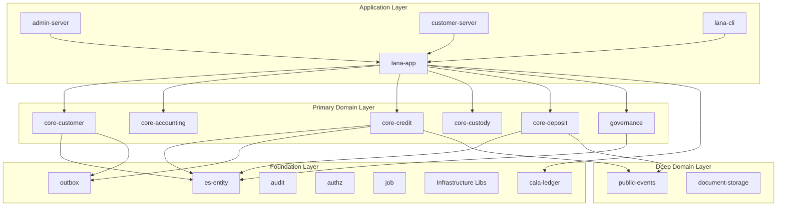
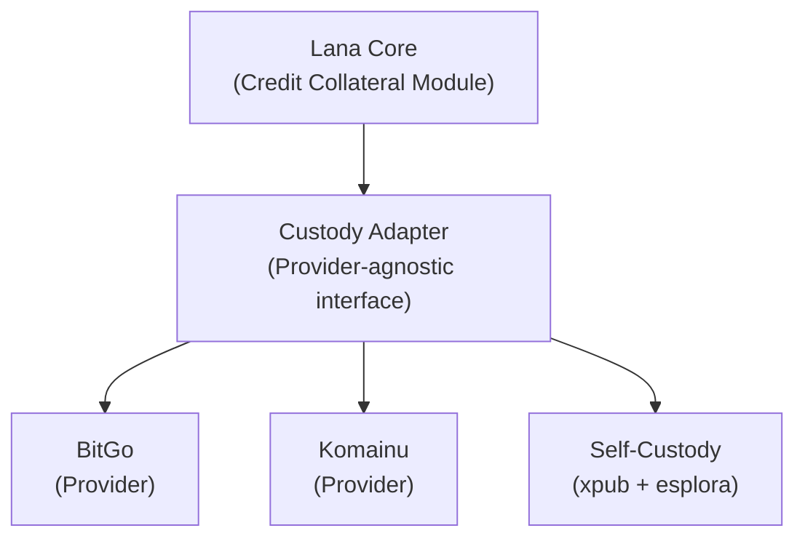
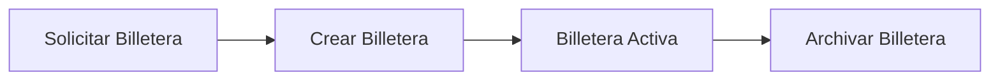
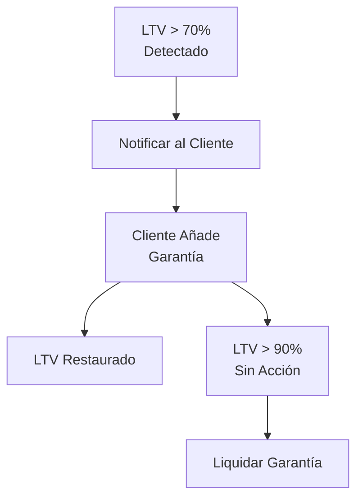

# Custodia y Gestión de Portafolio

Este documento describe la integración con proveedores de custodia y sistemas de gestión de portafolio.



## Descripción General

Lana se integra con proveedores de custodia de criptomonedas:

- **BitGo**: Proveedor principal de custodia
- **Komainu**: Proveedor alternativo de custodia
- **Autocustodia**: Derivación de direcciones basada en xpub con sondeo de saldo mediante esplora

## Arquitectura



La autocustodia difiere de los custodios alojados en un aspecto importante: el backend almacena únicamente un `xpub` de cuenta. Los operadores generan la `xpriv` de cuenta correspondiente localmente con `lana-cli genxpriv` y la mantienen fuera del backend. El endpoint de esplora se carga al inicio desde `app.custody.custody_providers.self_custody_directory` en `lana.yml`, con una URL separada por red compatible. Este flujo admite claves de cuenta para mainnet, testnet3, testnet4 y signet. Para cada nuevo préstamo, Lana deriva una nueva dirección de recepción del `xpub` almacenado, luego sondea esplora en busca de cambios de saldo confirmados en lugar de depender de webhooks.

Para un tutorial local de Signet, incluyendo configuración de billetera, inspección de descriptores y financiamiento de una facilidad pendiente desde `bitcoin-cli`, consulte [Prueba de Autocustodia en Signet](self-custody-signet).

## Interfaz del Proveedor de Custodia

```rust
#[async_trait]
pub trait CustodyProvider {
    async fn create_wallet(&self, params: WalletParams) -> Result<Wallet>;
    async fn get_address(&self, wallet_id: WalletId) -> Result<Address>;
    async fn get_balance(&self, wallet_id: WalletId) -> Result<Balance>;
    async fn initiate_transfer(&self, transfer: TransferRequest) -> Result<TransferId>;
    async fn get_transfer_status(&self, transfer_id: TransferId) -> Result<TransferStatus>;
}
```

## Gestión de Billeteras

### Tipos de Billeteras

| Tipo | Propósito |
|------|---------|
| Billetera Activa | Liquidez operativa |
| Billetera Fría | Almacenamiento a largo plazo |
| Billetera de Garantía | Garantía del cliente |

### Ciclo de Vida de la Billetera



## Gestión de Garantías

### Depositar Garantía

```rust
pub async fn post_collateral(
    &self,
    facility_id: CreditFacilityId,
    amount: Satoshis,
) -> Result<CollateralRecord> {
    // Generate deposit address
    let address = self.custody.get_address(collateral_wallet).await?;

    // Create pending collateral record
    let record = CollateralRecord::pending(facility_id, amount, address);

    self.repo.save(record).await
}
```

### Monitoreo de Depósitos

Un trabajo en segundo plano monitorea los depósitos entrantes:

```rust
pub async fn check_deposits(&self) -> Result<()> {
    let pending = self.repo.get_pending_collateral().await?;

    for record in pending {
        let balance = self.custody.get_balance(record.wallet_id).await?;

        if balance >= record.expected_amount {
            self.confirm_collateral(record.id).await?;
        }
    }

    Ok(())
}
```

## Valoración de Cartera

### Fuentes de Precios

```rust
pub struct PriceOracle {
    providers: Vec<Box<dyn PriceProvider>>,
}

impl PriceOracle {
    pub async fn get_btc_usd_price(&self) -> Result<Decimal> {
        // Aggregate from multiple providers
        let prices: Vec<Decimal> = futures::future::join_all(
            self.providers.iter().map(|p| p.get_price("BTC", "USD"))
        ).await.into_iter().filter_map(Result::ok).collect();

        // Return median price
        Ok(median(&prices))
    }
}
```

### Cálculo de LTV

```rust
pub async fn calculate_ltv(&self, facility_id: CreditFacilityId) -> Result<Decimal> {
    let facility = self.facility_repo.find_by_id(facility_id).await?;
    let collateral = self.collateral_repo.get_for_facility(facility_id).await?;

    let btc_price = self.oracle.get_btc_usd_price().await?;
    let collateral_value = collateral.amount * btc_price;

    let ltv = facility.outstanding / collateral_value;
    Ok(ltv)
}
```

## Llamadas de Margen

### Umbrales de LTV

| Umbral | Acción |
|-----------|--------|
| 60% | Requisito de margen inicial |
| 70% | Notificación de advertencia |
| 80% | Llamada de margen emitida |
| 90% | Liquidación iniciada |

### Proceso de Llamada de Margen



## Seguridad

### Gestión de Claves

- Billeteras multifirma
- Módulos de seguridad de hardware (HSM)
- Procedimientos de ceremonia de claves

### Controles de Acceso

- Permisos basados en roles
- Autorización dual para transferencias grandes
- Registro de auditoría
