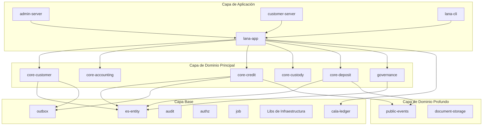
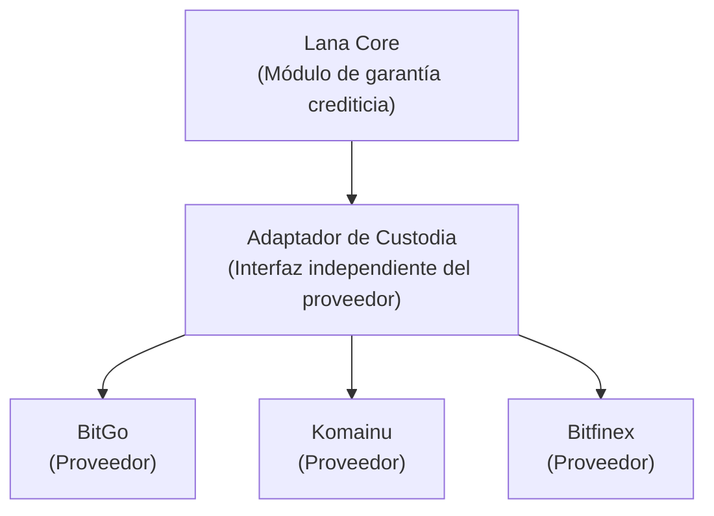
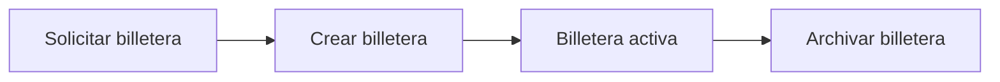

# Custodia y Gestión de Carteras

El módulo `core-custody` gestiona operaciones de custodia de Bitcoin mediante integración con proveedores de custodia externos (BitGo y Komainu).



## Propósito y Alcance

Lana se integra con proveedores de custodia de criptomonedas:

- **BitGo**: Proveedor principal de custodia
- **Komainu**: Proveedor alternativo de custodia
- **Bitfinex**: Proveedor de direcciones de depósito de Bitcoin para la creación de billeteras en custodia

## Arquitectura del Sistema



## Capacidades de los Proveedores

| Proveedor | Creación de billetera | Sincronización de saldo |
|-----------|----------------------|-----------------------|
| BitGo | Crea una billetera dedicada y dirección de recepción | Basado en webhook |
| Komainu | Usa una configuración de billetera preaprovisionada | Basado en webhook |
| Bitfinex | Solicita una nueva dirección de depósito de Bitcoin de la billetera Bitfinex configurada | Integración manual o futura mediante sondeos |

El soporte de Bitfinex está optimizado para la generación de direcciones de colateral en Bitcoin. Cada vez que se crea una billetera de Lana se solicita una nueva dirección de depósito de Bitcoin desde la billetera configurada en Bitfinex, por lo que las facilidades no comparten direcciones. Debido a que Bitfinex limita la frecuencia de renovación de direcciones de depósito, los operadores deben evitar crear billeteras innecesariamente durante pruebas.

## Interfaz del Proveedor de Custodia

```rust
#[async_trait]
pub trait CustodyProvider {
    async fn create_wallet(&self, params: WalletParams) -> Result<Wallet>;
    async fn get_address(&self, wallet_id: WalletId) -> Result<Address>;
    async fn get_balance(&self, wallet_id: WalletId) -> Result<Balance>;
    async fn initiate_transfer(&self, transfer: TransferRequest) -> Result<TransferId>;
    async fn get_transfer_status(&self, transfer_id: TransferId) -> Result<TransferStatus>;
}
```

## Gestión de Billeteras

### Tipos de Billetera

| Tipo | Propósito |
|------|-----------|
| Billetera caliente | Liquidez operativa |
| Billetera fría | Almacenamiento a largo plazo |
| Billetera de colateral | Colateral del cliente |

### Ciclo de Vida de la Billetera



## Gestión de Colaterales

### Depósito de Colateral

```rust
pub async fn post_collateral(
    &self,
    facility_id: CreditFacilityId,
    amount: Satoshis,
) -> Result<CollateralRecord> {
    // Generar dirección de depósito
    let address = self.custody.get_address(collateral_wallet).await?;

    // Crear registro de garantía pendiente
    let record = CollateralRecord::pending(facility_id, amount, address);

    self.repo.save(record).await
}
```

### Monitoreo de Depósitos

Un trabajo en segundo plano monitoriza los depósitos entrantes:

```rust
pub async fn check_deposits(&self) -> Result<()> {
    let pending = self.repo.get_pending_collateral().await?;

    for record in pending {
        let balance = self.custody.get_balance(record.wallet_id).await?;

        if balance >= record.expected_amount {
            self.confirm_collateral(record.id).await?;
        }
    }

    Ok(())
}
```

## Valoración de la Cartera

### Fuentes de Precios

```rust
pub struct PriceOracle {
    providers: Vec<Box<dyn PriceProvider>>,
}

impl PriceOracle {
    pub async fn get_btc_usd_price(&self) -> Result<Decimal> {
        // Agregar de múltiples proveedores
        let prices: Vec<Decimal> = futures::future::join_all(
            self.providers.iter().map(|p| p.get_price("BTC", "USD"))
        ).await.into_iter().filter_map(Result::ok).collect();

        // Devolver el precio mediano
        Ok(median(&prices))
    }
}
```

### Cálculo del LTV

```rust
pub async fn calculate_ltv(&self, facility_id: CreditFacilityId) -> Result<Decimal> {
    let facility = self.facility_repo.find_by_id(facility_id).await?;
    let collateral = self.collateral_repo.get_for_facility(facility_id).await?;

    let btc_price = self.oracle.get_btc_usd_price().await?;
    let collateral_value = collateral.amount * btc_price;

    let ltv = facility.outstanding / collateral_value;
    Ok(ltv)
}
```

## Llamadas de Margen

### Umbrales de LTV

| Umbral | Acción |
|--------|---------|
| 60% | Requisito de margen inicial |
| 70% | Notificación de advertencia |
| 80% | Emisión de llamada de margen |
| 90% | Inicio de liquidación |

### Proceso de Llamada de Margen


## Seguridad

### Gestión de Claves

- Carteras multifirma
- Módulos de seguridad de hardware (HSM)
- Procedimientos de ceremonia de llaves

### Controles de acceso

- Permisos basados en roles
- Doble autorización para transferencias grandes
- Registro de auditoría
