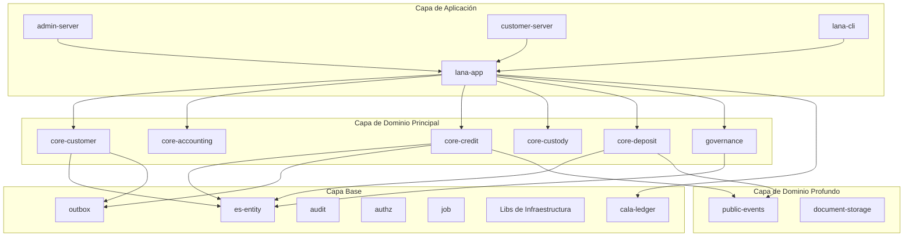
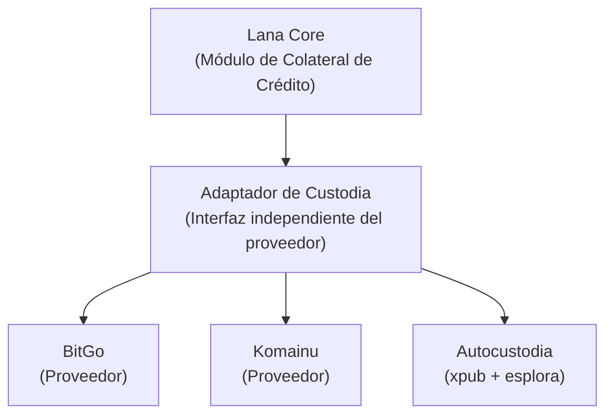

# Custodia y Gestión de Carteras

El módulo `core-custody` gestiona operaciones de custodia de Bitcoin mediante integración con proveedores de custodia externos (BitGo y Komainu).



## Propósito y Alcance

Lana se integra con proveedores de custodia de criptomonedas:

- **BitGo**: Proveedor principal de custodia
- **Komainu**: Proveedor alternativo de custodia
- **Custodia propia**: Derivación de direcciones basada en xpub con sondeo de saldo a través de esplora

## Arquitectura del Sistema



La autocustodia se diferencia de los custodios alojados en un aspecto clave: el backend almacena únicamente una `xpub` de cuenta. Los operadores generan la `xpriv` correspondiente localmente con `lana-cli genxpriv` y la mantienen fuera del backend. El endpoint de esplora se carga al inicio desde `app.custody.custody_providers.self_custody_directory` en `lana.yml`, con una URL distinta para cada red soportada. Este flujo es compatible con claves de cuenta para mainnet, testnet3, testnet4 y signet. Para cada nuevo préstamo, Lana deriva una nueva dirección de recepción a partir de la `xpub` almacenada y consulta esplora para detectar cambios confirmados de saldo, en lugar de depender de webhooks.

## Tipos de Datos Principales

### Entidades de Dominio

| Entidad | Propósito | Campos Clave |
|---------|-----------|--------------|
| Custodian | Configuración del proveedor de custodia | id, name, provider_type, config |
| Wallet | Cartera de Bitcoin en un custodio | id, custodian_id, external_id, name |
| WalletAddress | Dirección de depósito de Bitcoin | id, wallet_id, address, created_at |
| WalletBalance | Saldo actual de la cartera | wallet_id, balance, last_synced_at |

### Alias de Tipos Clave

```rust
pub type CustodianId = EntityId<Custodian>;
pub type WalletId = EntityId<Wallet>;
pub type WalletAddressId = EntityId<WalletAddress>;
```

## Integración con Proveedores de Custodia

### Arquitectura del Proveedor

```rust
#[async_trait]
pub trait CustodyProvider: Send + Sync {
    async fn create_wallet(&self, name: &str) -> Result<ExternalWallet, CustodyError>;
    async fn generate_address(&self, wallet_id: &str) -> Result<String, CustodyError>;
    async fn get_balance(&self, wallet_id: &str) -> Result<Satoshis, CustodyError>;
}
```

### Integración con BitGo

```rust
pub struct BitGoProvider {
    client: BitGoClient,
    enterprise_id: String,
    coin: String, // "tbtc" para testnet, "btc" para mainnet
}

impl BitGoProvider {
    pub fn new(config: BitGoConfig) -> Self {
        let client = BitGoClient::new(&config.api_url, &config.access_token);
        Self {
            client,
            enterprise_id: config.enterprise_id,
            coin: config.coin,
        }
    }
}
```

### Integración con Komainu

```rust
pub struct KomainuProvider {
    client: KomainuClient,
    vault_id: String,
}

impl KomainuProvider {
    pub fn new(config: KomainuConfig) -> Self {
        let client = KomainuClient::new(
            &config.api_url,
            &config.api_key,
            &config.api_secret,
        );
        Self {
            client,
            vault_id: config.vault_id,
        }
    }
}
```

### Custodio Simulado (Mock)

Para pruebas, se proporciona un custodio simulado:

```rust
#[cfg(feature = "mock-custodian")]
pub struct MockCustodyProvider {
    wallets: Arc<RwLock<HashMap<String, MockWallet>>>,
}

impl MockCustodyProvider {
    pub fn new() -> Self {
        Self {
            wallets: Arc::new(RwLock::new(HashMap::new())),
        }
    }

    pub fn set_balance(&self, wallet_id: &str, balance: Satoshis) {
        let mut wallets = self.wallets.write().unwrap();
        if let Some(wallet) = wallets.get_mut(wallet_id) {
            wallet.balance = balance;
        }
    }
}
```

## Ciclo de Vida de la Cartera

### Creación de Cartera

```rust
impl CoreCustody {
    pub async fn create_wallet_in_op(
        &self,
        custodian_id: CustodianId,
        name: String,
        db_op: &mut DbOp<'_>,
    ) -> Result<Wallet, CustodyError> {
        // 1. Cargar custodio
        let custodian = self.custodians.find(&custodian_id, db_op).await?;

        // 2. Crear cartera en el proveedor externo
        let provider = self.get_provider(&custodian)?;
        let external_wallet = provider.create_wallet(&name).await?;

        // 3. Persistir cartera localmente
        let wallet = Wallet::new(custodian_id, external_wallet.id, name);
        self.wallets.create_in_op(&wallet, db_op).await?;

        Ok(wallet)
    }
}
```

### Generación de Direcciones

```rust
pub async fn generate_wallet_address_in_op(
    &self,
    wallet_id: WalletId,
    db_op: &mut DbOp<'_>,
) -> Result<WalletAddress, CustodyError> {
    // 1. Cargar cartera y custodio
    let wallet = self.wallets.find(&wallet_id, db_op).await?;
    let custodian = self.custodians.find(&wallet.custodian_id, db_op).await?;

    // 2. Generar dirección en el proveedor
    let provider = self.get_provider(&custodian)?;
    let address = provider.generate_address(&wallet.external_id).await?;

    // 3. Persistir dirección
    let wallet_address = WalletAddress::new(wallet_id, address);
    self.wallet_addresses.create_in_op(&wallet_address, db_op).await?;

    // 4. Publicar evento
    self.publisher.publish(
        WalletEvent::AddressGenerated { wallet_id, address: wallet_address.address.clone() },
        db_op
    ).await?;

    Ok(wallet_address)
}
```

### Sincronización de Saldos

```rust
pub async fn sync_balance(&self, wallet_id: WalletId) -> Result<WalletBalance, CustodyError> {
    let wallet = self.wallets.find(&wallet_id).await?;
    let custodian = self.custodians.find(&wallet.custodian_id).await?;

    let provider = self.get_provider(&custodian)?;
    let balance = provider.get_balance(&wallet.external_id).await?;

    let wallet_balance = WalletBalance {
        wallet_id,
        balance,
        last_synced_at: Utc::now(),
    };

    self.wallet_balances.upsert(&wallet_balance).await?;

    // Publicar evento para actualizar colateral
    self.publisher.publish(
        WalletEvent::BalanceUpdated { wallet_id, balance }
    ).await?;

    Ok(wallet_balance)
}
```

## Sincronización de Colateral

### Arquitectura de Sincronización

El sistema sincroniza automáticamente los saldos de carteras y actualiza los valores de colateral:

```
┌─────────────────┐    ┌─────────────────┐    ┌─────────────────┐
│ CollateralSync  │───▶│   CoreCustody   │───▶│ CustodyProvider │
│      Job        │    │   sync_balance  │    │                 │
└─────────────────┘    └─────────────────┘    └─────────────────┘
         │
         ▼
┌─────────────────┐    ┌─────────────────┐
│  PriceService   │───▶│   Collaterals   │
│ get_btc_price() │    │ update_value()  │
└─────────────────┘    └─────────────────┘
```

### Tipos de Eventos de Colateral

| Evento | Propósito |
|--------|-----------|
| WalletBalanceUpdated | Saldo de cartera actualizado |
| CollateralValueUpdated | Valor en USD del colateral recalculado |
| CollateralRatioChanged | Ratio de colateralización cambió |

## Integración con Facilidades de Crédito
