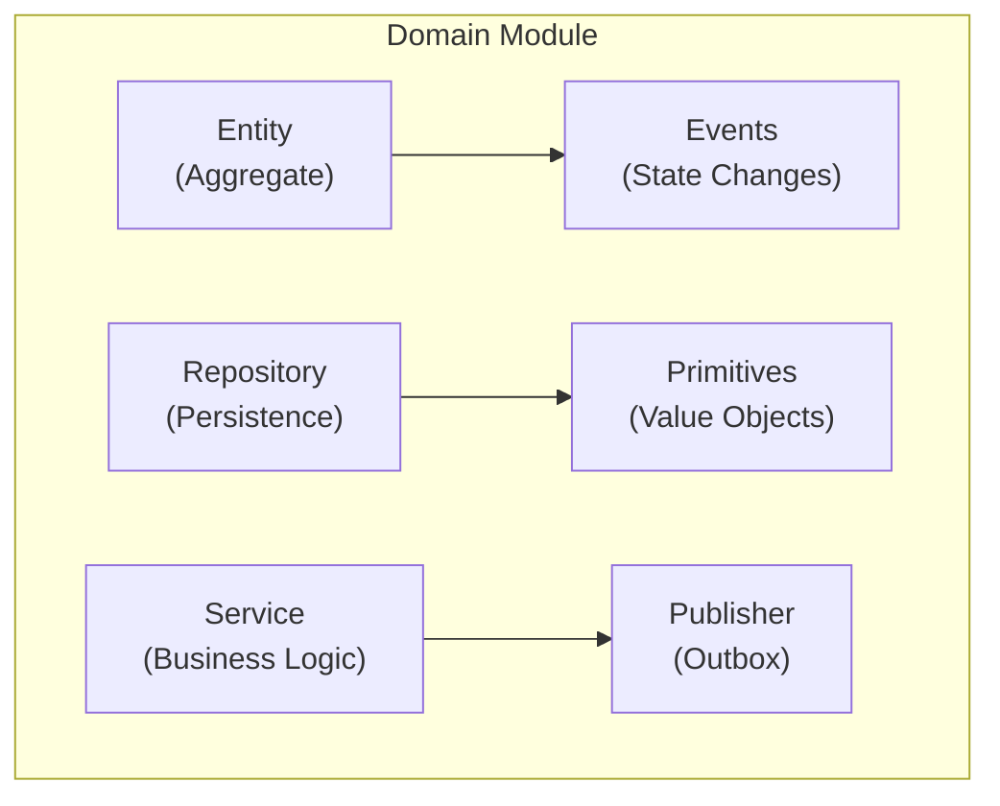
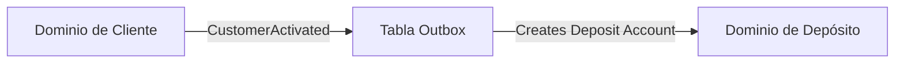

# Servicios de Dominio

Este documento describe la implementación del Diseño Orientado al Dominio en Lana, incluyendo patrones, estructuras y mejores prácticas.

## Descripción General del Diseño Orientado al Dominio

Lana implementa los principios de DDD:

- **Contextos Delimitados**: Cada módulo de dominio tiene límites claros
- **Agregados**: Entidades agrupadas por invariantes de negocio
- **Eventos de Dominio**: Comunicación entre contextos
- **Repositorios**: Abstracción de persistencia

## Estructura del Dominio



## Organización de Archivos

Cada módulo de dominio sigue una estructura consistente:

```
core/<domain>/
├── mod.rs              # Interfaz del módulo
├── entity.rs           # Definición de entidad con eventos
├── repo.rs             # Implementación del repositorio
├── error.rs            # Errores específicos del dominio
├── primitives.rs       # Objetos de valor y tipos
├── publisher.rs        # Publicador de eventos (outbox)
├── job.rs              # Trabajos en segundo plano
└── public/             # Eventos públicos para otros dominios
    └── events.rs
```

## Patrón de Entidad con es-entity

Lana utiliza la crate `es-entity` para entidades basadas en eventos:

```rust
use es_entity::*;

#[derive(EsEntity)]
pub struct CreditFacility {
    events: EntityEvents<CreditFacilityEvent>,
    id: CreditFacilityId,
    customer_id: CustomerId,
    amount: UsdCents,
    status: FacilityStatus,
}

#[derive(EsEvent)]
pub enum CreditFacilityEvent {
    Initialized {
        id: CreditFacilityId,
        customer_id: CustomerId,
        amount: UsdCents,
    },
    Activated {
        activated_at: DateTime<Utc>,
    },
    DisbursalInitiated {
        disbursal_id: DisbursalId,
        amount: UsdCents,
    },
}
```

## Patrón de Repositorio

Los repositorios manejan la persistencia con event sourcing:

```rust
pub struct CreditFacilityRepo {
    pool: PgPool,
    outbox: Outbox,
}

impl CreditFacilityRepo {
    pub async fn create(&self, facility: CreditFacility) -> Result<CreditFacility, Error> {
        let mut tx = self.pool.begin().await?;

        // Persist events
        facility.persist(&mut tx).await?;

        // Publish to outbox
        self.outbox.publish(&mut tx, facility.events()).await?;

        tx.commit().await?;
        Ok(facility)
    }

    pub async fn find_by_id(&self, id: CreditFacilityId) -> Result<CreditFacility, Error> {
        CreditFacility::load(&self.pool, id).await
    }
}
```

## Eventos de Dominio

### Eventos de Entidad (Privados)

Cambios de estado internos dentro de un agregado:

```rust
#[derive(EsEvent)]
pub enum CustomerEvent {
    Initialized { id: CustomerId, email: String },
    KycApproved { approved_at: DateTime<Utc> },
    StatusChanged { new_status: CustomerStatus },
}
```

### Eventos Públicos

Eventos publicados para que otros dominios los consuman:

```rust
// public/events.rs
pub enum CustomerPublicEvent {
    CustomerCreated {
        customer_id: CustomerId,
        email: String,
    },
    CustomerActivated {
        customer_id: CustomerId,
    },
}
```

## Servicios de Dominio

Los servicios implementan operaciones de negocio:

```rust
pub struct CreditService {
    facility_repo: CreditFacilityRepo,
    customer_repo: CustomerRepo,
    ledger: DepositLedger,
    governance: GovernanceService,
}

impl CreditService {
    pub async fn create_facility(
        &self,
        customer_id: CustomerId,
        terms: FacilityTerms,
    ) -> Result<CreditFacility, CreditError> {
        // Validate customer
        let customer = self.customer_repo.find_by_id(customer_id).await?;
        customer.validate_for_credit()?;

        // Create facility
        let facility = CreditFacility::new(customer_id, terms)?;

        // Persist
        self.facility_repo.create(facility).await
    }
}
```

## Manejo de Errores

Cada dominio define errores específicos:

```rust
// error.rs
#[derive(Debug, thiserror::Error)]
pub enum CreditError {
    #[error("Customer not found: {0}")]
    CustomerNotFound(CustomerId),

    #[error("Insufficient collateral")]
    InsufficientCollateral,

    #[error("Facility already active")]
    FacilityAlreadyActive,
}
```

## Objetos de Valor (Primitivos)

Conceptos de dominio fuertemente tipados:

```rust
// primitives.rs
#[derive(Debug, Clone, Copy, Serialize, Deserialize)]
pub struct UsdCents(i64);

impl UsdCents {
    pub fn new(cents: i64) -> Self {
        Self(cents)
    }

    pub fn as_dollars(&self) -> f64 {
        self.0 as f64 / 100.0
    }
}

#[derive(Debug, Clone, Copy, Serialize, Deserialize)]
pub struct InterestRate(Decimal);
```

## Comunicación entre Dominios

Los dominios se comunican a través de eventos y el patrón outbox:



## Patrones de Prueba

### Pruebas Unitarias

```rust
#[tokio::test]
async fn test_create_facility() {
    let facility = CreditFacility::new(
        CustomerId::new(),
        FacilityTerms::default(),
    ).unwrap();

    assert_eq!(facility.status(), FacilityStatus::PendingCollateral);
}
```

### Pruebas de Integración

```rust
#[tokio::test]
async fn test_full_credit_flow() {
    let app = TestApp::new().await;

    // Create customer
    let customer = app.create_customer().await;

    // Create facility
    let facility = app.create_facility(customer.id).await;

    // Verify state
    assert!(facility.is_active());
}
```
