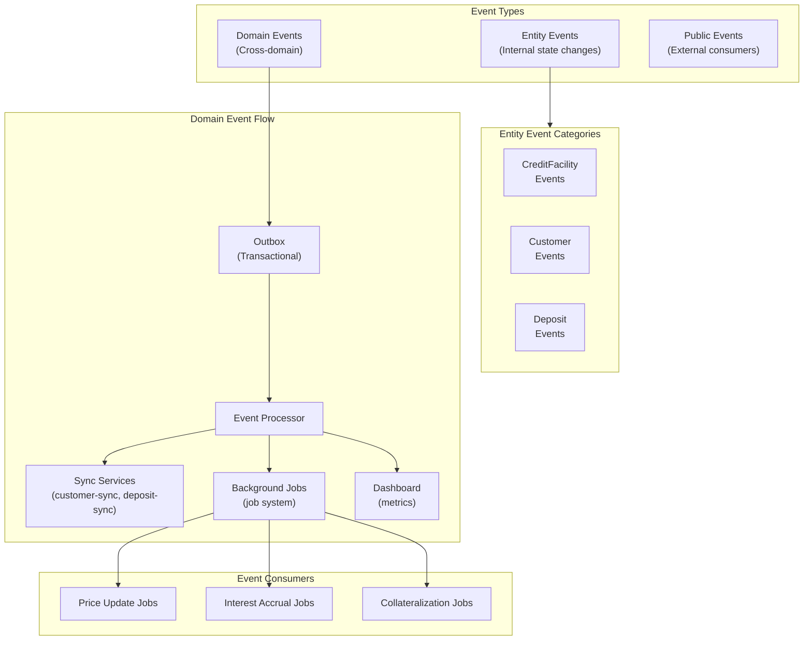
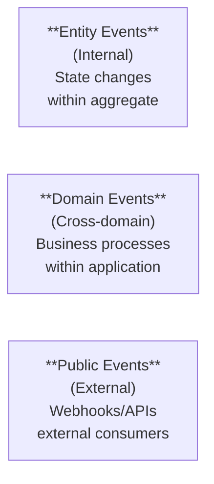
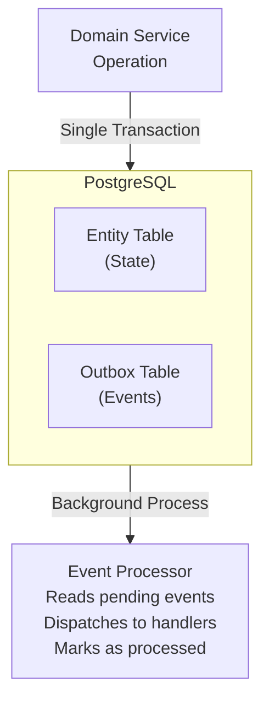
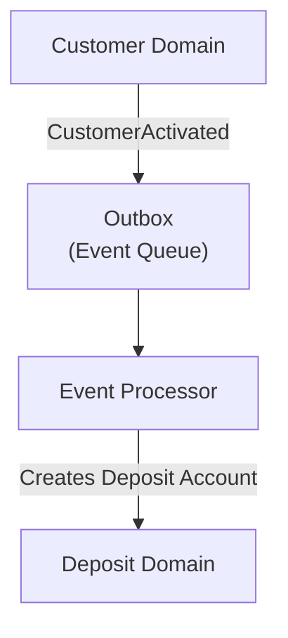

# Sistema de Eventos y Patrón Outbox

Este documento describe el sistema de eventos de Lana, incluyendo event sourcing, el patrón outbox y la comunicación entre dominios.



## Descripción General

Lana utiliza una arquitectura orientada a eventos con:

- **Event Sourcing**: Los cambios de estado se capturan como eventos
- **Patrón Outbox**: Publicación confiable de eventos
- **Eventos de Dominio**: Comunicación entre contextos

## Tipos de Eventos



## Eventos de Entidad

Cambios de estado internos dentro de un agregado:

```rust
#[derive(EsEvent)]
pub enum CreditFacilityEvent {
    Initialized {
        id: CreditFacilityId,
        customer_id: CustomerId,
        amount: UsdCents,
    },
    CollateralPosted {
        collateral_id: CollateralId,
        amount: Satoshis,
    },
    Activated {
        activated_at: DateTime<Utc>,
    },
    DisbursalInitiated {
        disbursal_id: DisbursalId,
        amount: UsdCents,
    },
}
```

## Patrón Outbox

El outbox garantiza la entrega confiable de eventos:



### Estructura de la Tabla Outbox

```sql
CREATE TABLE outbox (
    id UUID PRIMARY KEY,
    aggregate_type VARCHAR NOT NULL,
    aggregate_id UUID NOT NULL,
    event_type VARCHAR NOT NULL,
    payload JSONB NOT NULL,
    created_at TIMESTAMP NOT NULL,
    processed_at TIMESTAMP,
    correlation_id UUID
);
```

### Publicación de Eventos

```rust
impl CreditFacilityRepo {
    pub async fn create(&self, facility: CreditFacility) -> Result<CreditFacility> {
        let mut tx = self.pool.begin().await?;

        // Save entity
        facility.persist(&mut tx).await?;

        // Publish to outbox (same transaction)
        for event in facility.events() {
            self.outbox.publish(&mut tx, event).await?;
        }

        tx.commit().await?;
        Ok(facility)
    }
}
```

## Procesamiento de Eventos

### Procesador de Eventos

```rust
pub struct EventProcessor {
    handlers: Vec<Box<dyn EventHandler>>,
}

impl EventProcessor {
    pub async fn process_pending(&self) -> Result<()> {
        let events = self.outbox.fetch_pending(100).await?;

        for event in events {
            for handler in &self.handlers {
                if handler.can_handle(&event) {
                    handler.handle(&event).await?;
                }
            }
            self.outbox.mark_processed(event.id).await?;
        }

        Ok(())
    }
}
```

### Manejadores de Eventos

```rust
pub struct CustomerActivationHandler {
    deposit_service: DepositService,
}

#[async_trait]
impl EventHandler for CustomerActivationHandler {
    fn can_handle(&self, event: &OutboxEvent) -> bool {
        event.event_type == "CustomerActivated"
    }

    async fn handle(&self, event: &OutboxEvent) -> Result<()> {
        let payload: CustomerActivatedEvent = serde_json::from_value(event.payload)?;

        // Create deposit account for new customer
        self.deposit_service
            .create_account(payload.customer_id)
            .await?;

        Ok(())
    }
}
```

## Comunicación entre Dominios



## Correlación de Eventos

Los eventos pueden correlacionarse para el rastreo:

```rust
pub struct CorrelationContext {
    correlation_id: Uuid,
    causation_id: Option<Uuid>,
    trace_id: String,
}

impl Outbox {
    pub async fn publish_with_context(
        &self,
        tx: &mut Transaction,
        event: impl Event,
        context: CorrelationContext,
    ) -> Result<()> {
        // Include correlation data in outbox record
    }
}
```

## Idempotencia

Los manejadores de eventos deben ser idempotentes:

```rust
impl DepositAccountCreationHandler {
    async fn handle(&self, event: &CustomerActivatedEvent) -> Result<()> {
        // Check if already processed
        if self.repo.exists_for_customer(event.customer_id).await? {
            return Ok(()); // Already created
        }

        // Create new account
        self.repo.create_account(event.customer_id).await
    }
}
```

## Reproducción de Eventos

Los eventos se pueden reproducir para recuperación o pruebas:

```rust
pub async fn replay_events(
    from: DateTime<Utc>,
    to: DateTime<Utc>,
) -> Result<()> {
    let events = outbox.fetch_range(from, to).await?;

    for event in events {
        processor.process(event).await?;
    }

    Ok(())
}
```

## Monitoreo

### Métricas

- Eventos publicados por segundo
- Latencia de procesamiento de eventos
- Cantidad de eventos pendientes
- Tasas de éxito/fallo de manejadores

### Alertas

- Cantidad alta de eventos pendientes
- Fallos de procesamiento
- Manejadores lentos
