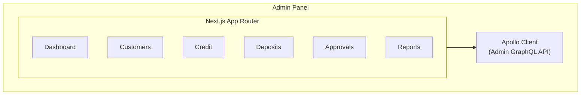

# Panel de Administración

Este documento describe la arquitectura y el desarrollo del Panel de Administración.

## Propósito

El Panel de Administración es la interfaz principal para el personal del banco:

- Gestión de clientes
- Administración de créditos
- Operaciones de depósito y retiro
- Aprobaciones y gobernanza
- Informes financieros

## Arquitectura



## Estructura del Proyecto

```
apps/admin-panel/
├── app/
│   ├── layout.tsx           # Main layout
│   ├── page.tsx             # Dashboard
│   ├── customers/           # Customer module
│   ├── credit/              # Credit module
│   ├── deposits/            # Deposit module
│   ├── approvals/           # Approval module
│   └── reports/             # Reports module
├── components/
│   ├── layout/              # Layout components
│   ├── customers/           # Customer components
│   ├── credit/              # Credit components
│   └── shared/              # Shared components
└── lib/
    ├── apollo.ts            # Apollo configuration
    └── keycloak.ts          # Keycloak configuration
```

## Autenticación

### Configuración de Keycloak

```typescript
import Keycloak from 'keycloak-js';

export const keycloak = new Keycloak({
  url: process.env.NEXT_PUBLIC_KEYCLOAK_URL,
  realm: 'admin',
  clientId: 'admin-panel',
});
```

### Protección de Rutas

```typescript
export function ProtectedRoute({ children, requiredRole }) {
  const { isAuthenticated, hasRole } = useAuth();

  if (!isAuthenticated) {
    return <LoginRedirect />;
  }

  if (requiredRole && !hasRole(requiredRole)) {
    return <AccessDenied />;
  }

  return children;
}
```

## Desarrollo

### Comandos

```bash

# Development

pnpm dev

# Production build

pnpm build

# Lint

pnpm lint

# Generate GraphQL types

pnpm codegen
```

### Variables de Entorno

```env
NEXT_PUBLIC_GRAPHQL_URL=http://admin.localhost:4455/graphql
NEXT_PUBLIC_KEYCLOAK_URL=http://localhost:8081
NEXT_PUBLIC_KEYCLOAK_REALM=admin
NEXT_PUBLIC_KEYCLOAK_CLIENT_ID=admin-panel
```
