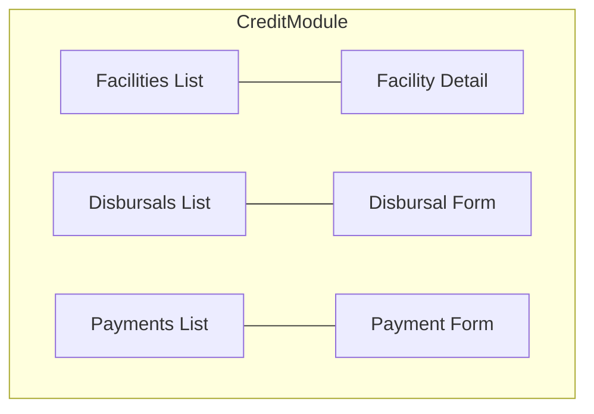
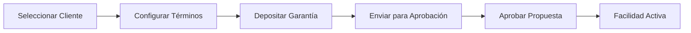

# Interfaz de Gestión de Líneas de Crédito

Este documento describe los componentes de la interfaz y los flujos para la gestión de líneas de crédito.

## Descripción General

La interfaz de crédito permite:

- Crear y gestionar líneas de crédito
- Procesar desembolsos
- Registrar pagos
- Ver el estado de la cartera

## Arquitectura de Componentes



## Lista de Líneas de Crédito

```typescript
export function FacilitiesList({ filter, onSelect }: FacilitiesListProps) {
  const { data, loading } = useCreditFacilitiesQuery({
    variables: { first: 20, filter },
  });

  const columns: ColumnDef<CreditFacility>[] = [
    { accessorKey: 'publicId', header: 'ID' },
    { accessorKey: 'customer.name', header: 'Customer' },
    {
      accessorKey: 'amount',
      header: 'Amount',
      cell: ({ row }) => formatCurrency(row.original.amount),
    },
    {
      accessorKey: 'status',
      header: 'Status',
      cell: ({ row }) => <FacilityStatusBadge status={row.original.status} />,
    },
  ];

  return (
    <DataTable
      columns={columns}
      data={data?.creditFacilities?.edges?.map(e => e.node) ?? []}
      onRowClick={onSelect}
    />
  );
}
```

## Detalle de Línea de Crédito

```typescript
export function FacilityDetail({ facilityId }: FacilityDetailProps) {
  const { data } = useCreditFacilityQuery({
    variables: { id: facilityId },
  });

  const facility = data?.creditFacility;

  return (
    <div className="space-y-6">
      <div className="grid grid-cols-4 gap-4">
        <StatCard label="Approved Amount" value={formatCurrency(facility.amount)} />
        <StatCard label="Outstanding Balance" value={formatCurrency(facility.outstanding)} />
        <StatCard label="Interest Rate" value={`${facility.interestRate}%`} />
        <StatCard label="Next Payment" value={formatDate(facility.nextPaymentDate)} />
      </div>

      <Tabs defaultValue="overview">
        <TabsList>
          <TabsTrigger value="overview">Overview</TabsTrigger>
          <TabsTrigger value="disbursals">Disbursals</TabsTrigger>
          <TabsTrigger value="payments">Payments</TabsTrigger>
          <TabsTrigger value="schedule">Schedule</TabsTrigger>
        </TabsList>
        <TabsContent value="overview">
          <FacilityOverview facility={facility} />
        </TabsContent>
        {/* ... other tabs */}
      </Tabs>
    </div>
  );
}
```

## Formulario de Desembolso

```typescript
const disbursalSchema = z.object({
  amount: z.number().positive('Amount must be positive'),
  reference: z.string().optional(),
});

export function DisbursalForm({ facilityId, maxAmount, onSuccess }: DisbursalFormProps) {
  const [initiateDisbursal] = useInitiateDisbursalMutation();
  const form = useForm({
    resolver: zodResolver(disbursalSchema),
  });

  const onSubmit = async (data) => {
    await initiateDisbursal({
      variables: {
        input: {
          creditFacilityId: facilityId,
          amount: data.amount * 100,
          reference: data.reference,
        },
      },
    });
    toast.success('Disbursement initiated');
    onSuccess?.();
  };

  return (
    <Form {...form}>
      <form onSubmit={form.handleSubmit(onSubmit)}>
        <FormField name="amount" label="Amount" />
        <FormField name="reference" label="Reference (optional)" />
        <Button type="submit">Initiate Disbursement</Button>
      </form>
    </Form>
  );
}
```

## Insignia de Estado

```typescript
const statusConfig = {
  PENDING_COLLATERAL: { label: 'Pending Collateral', variant: 'warning' },
  PENDING_APPROVAL: { label: 'Pending Approval', variant: 'warning' },
  ACTIVE: { label: 'Active', variant: 'success' },
  MATURED: { label: 'Matured', variant: 'default' },
  CLOSED: { label: 'Closed', variant: 'secondary' },
};

export function FacilityStatusBadge({ status }: FacilityStatusBadgeProps) {
  const config = statusConfig[status];
  return <Badge variant={config.variant}>{config.label}</Badge>;
}
```

## Flujos de Usuario

### Creación de Facilidad


