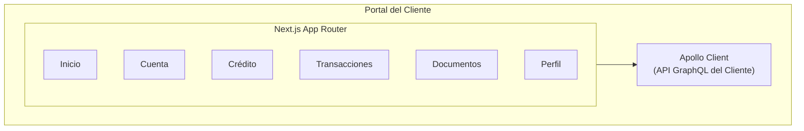
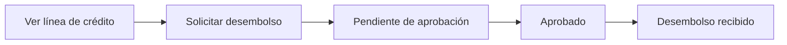

# Portal del Cliente

Este documento describe la arquitectura y el desarrollo del Portal del Cliente.

## Propósito

El Portal del Cliente permite a los clientes bancarios:

- Ver el estado de la cuenta
- Solicitar líneas de crédito
- Consultar saldos y transacciones
- Solicitar retiros
- Descargar documentos y estados de cuenta

## Arquitectura



## Estructura del Proyecto

```
apps/customer-portal/
├── app/
│   ├── layout.tsx           # Diseño principal
│   ├── page.tsx             # Página de inicio
│   ├── account/             # Resumen de cuenta
│   ├── transactions/        # Historial de transacciones
│   ├── credit/              # Solicitudes de crédito
│   ├── documents/           # Documentos
│   └── profile/             # Perfil del cliente
├── components/
│   ├── layout/              # Componentes de diseño
│   ├── account/             # Componentes de cuenta
│   └── shared/              # Componentes compartidos
└── lib/
    ├── apollo.ts            # Configuración de Apollo
    └── keycloak.ts          # Configuración de Keycloak
```

## Flujos de Usuario

### Solicitud de Desembolso



## Autenticación

### Configuración de Keycloak

```typescript
export const keycloak = new Keycloak({
  url: process.env.NEXT_PUBLIC_KEYCLOAK_URL,
  realm: 'customer',
  clientId: 'customer-portal',
});
```

## Desarrollo

### Comandos

```bash

# Desarrollo

pnpm dev

# Compilación de producción

pnpm build

# Linter

pnpm lint
```

### Variables de Entorno

```env
NEXT_PUBLIC_GRAPHQL_URL=http://app.localhost:4455/graphql
NEXT_PUBLIC_KEYCLOAK_URL=http://localhost:8081
NEXT_PUBLIC_KEYCLOAK_REALM=customer
NEXT_PUBLIC_KEYCLOAK_CLIENT_ID=customer-portal
```
