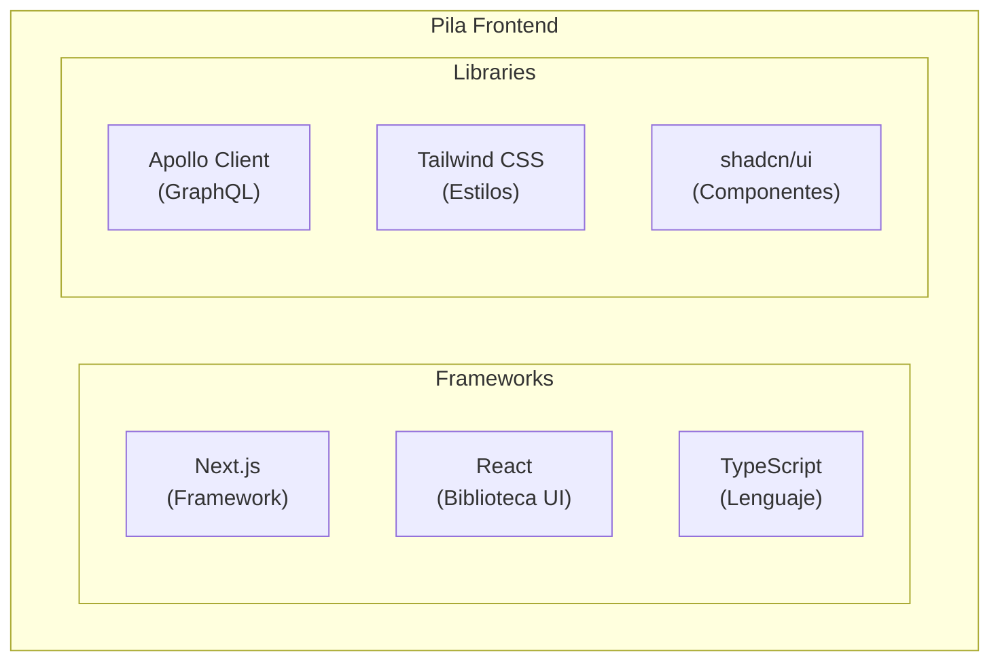

# Aplicaciones Frontend

Este documento describe las aplicaciones frontend de Lana, su arquitectura y patrones de desarrollo.

## Descripción General

Lana incluye dos aplicaciones frontend principales:

| Aplicación | Propósito | Usuarios |
|------------|-----------|----------|
| Panel de Administración | Gestión bancaria | Personal administrativo |
| Portal del Cliente | Autoservicio | Clientes del banco |

## Pila Tecnológica



## Estructura de Directorios

```
apps/
├── admin-panel/           # Panel de Administración
│   ├── app/               # Next.js App Router
│   ├── components/        # Componentes React
│   ├── lib/               # Utilidades y configuración
│   └── generated/         # Código generado (GraphQL)
│
├── customer-portal/       # Portal del Cliente
│   ├── app/               # Next.js App Router
│   ├── components/        # Componentes React
│   └── generated/         # Código generado (GraphQL)
│
└── shared/                # Código compartido
    ├── ui/                # Componentes UI
    └── utils/             # Utilidades comunes
```

## Patrones de Desarrollo

### Componentes de Servidor vs Componentes de Cliente

```typescript
// Componente de Servidor (predeterminado)
export default async function CustomersPage() {
  const customers = await fetchCustomers();
  return <CustomerList customers={customers} />;
}

// Componente de Cliente (interactivo)
'use client';

export function CustomerForm() {
  const [name, setName] = useState('');
  // ...
}
```

### Gestión de Estado

- **Apollo Client**: Estado del servidor (datos GraphQL)
- **React Context**: Estado global de la UI
- **useState/useReducer**: Estado local del componente

## Desarrollo Local

### Iniciar Aplicaciones

```bash

# Panel de Administración

cd apps/admin-panel
pnpm dev

# Portal del Cliente

cd apps/customer-portal
pnpm dev
```

### URLs de Desarrollo

| Aplicación | URL |
|------------|-----|
| Panel de Administración | http://admin.localhost:4455 |
| Portal del Cliente | http://app.localhost:4455 |

## Documentación relacionada

- [Admin Panel](admin-panel) - Documentación del panel de administración
- [Customer Portal](customer-portal) - Documentación del portal del cliente
- [Shared Components](shared-components) - Biblioteca de interfaz de usuario
- [Credit UI](credit-ui) - Gestión de facilidades de crédito
