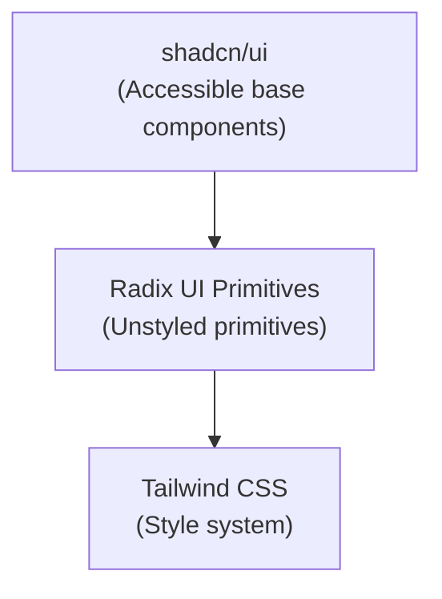

# Componentes y Utilidades Compartidos

Este documento describe los componentes de interfaz de usuario y utilidades compartidos utilizados en las aplicaciones frontend de Lana.

## Pila de Componentes



## Componentes Base

### Botón

```typescript
const buttonVariants = cva(
  'inline-flex items-center justify-center rounded-md text-sm font-medium',
  {
    variants: {
      variant: {
        default: 'bg-primary text-primary-foreground hover:bg-primary/90',
        destructive: 'bg-destructive text-destructive-foreground',
        outline: 'border border-input bg-background hover:bg-accent',
        secondary: 'bg-secondary text-secondary-foreground',
        ghost: 'hover:bg-accent hover:text-accent-foreground',
        link: 'text-primary underline-offset-4 hover:underline',
      },
      size: {
        default: 'h-10 px-4 py-2',
        sm: 'h-9 rounded-md px-3',
        lg: 'h-11 rounded-md px-8',
        icon: 'h-10 w-10',
      },
    },
  }
);
```

### Tarjeta

```typescript
export const Card = ({ className, ...props }) => (
  <div
    className={cn('rounded-lg border bg-card shadow-sm', className)}
    {...props}
  />
);

export const CardHeader = ({ className, ...props }) => (
  <div className={cn('flex flex-col space-y-1.5 p-6', className)} {...props} />
);

export const CardContent = ({ className, ...props }) => (
  <div className={cn('p-6 pt-0', className)} {...props} />
);
```

## Componentes de Datos

### DataTable

```typescript
interface DataTableProps<TData, TValue> {
  columns: ColumnDef<TData, TValue>[];
  data: TData[];
  onRowClick?: (row: TData) => void;
}

export function DataTable<TData, TValue>({
  columns,
  data,
  onRowClick,
}: DataTableProps<TData, TValue>) {
  const table = useReactTable({
    data,
    columns,
    getCoreRowModel: getCoreRowModel(),
    getPaginationRowModel: getPaginationRowModel(),
  });

  return (
    <Table>
      <TableHeader>...</TableHeader>
      <TableBody>...</TableBody>
    </Table>
  );
}
```

## Hooks Personalizados

### useDebounce

```typescript
export function useDebounce<T>(value: T, delay: number): T {
  const [debouncedValue, setDebouncedValue] = useState<T>(value);

  useEffect(() => {
    const handler = setTimeout(() => {
      setDebouncedValue(value);
    }, delay);

    return () => clearTimeout(handler);
  }, [value, delay]);

  return debouncedValue;
}
```

### useLocalStorage

```typescript
export function useLocalStorage<T>(key: string, initialValue: T) {
  const [storedValue, setStoredValue] = useState<T>(() => {
    try {
      const item = window.localStorage.getItem(key);
      return item ? JSON.parse(item) : initialValue;
    } catch {
      return initialValue;
    }
  });

  const setValue = (value: T) => {
    setStoredValue(value);
    window.localStorage.setItem(key, JSON.stringify(value));
  };

  return [storedValue, setValue] as const;
}
```

## Utilidades

### Formato de Moneda

```typescript
export function formatCurrency(
  amount: number,
  currency = 'USD',
  locale = 'en-US'
): string {
  return new Intl.NumberFormat(locale, {
    style: 'currency',
    currency,
  }).format(amount / 100); // Assumes amount is in cents
}
```

### Formato de Fecha

```typescript
export function formatDate(
  date: string | Date,
  options: Intl.DateTimeFormatOptions = {
    year: 'numeric',
    month: 'long',
    day: 'numeric',
  }
): string {
  return new Intl.DateTimeFormat('en-US', options).format(new Date(date));
}
```

### Utilidad cn

```typescript
import { clsx, type ClassValue } from 'clsx';
import { twMerge } from 'tailwind-merge';

export function cn(...inputs: ClassValue[]) {
  return twMerge(clsx(inputs));
}
```
