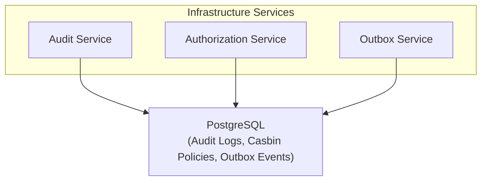

# Servicios de Infraestructura

Este documento describe los servicios de infraestructura transversales utilizados en toda la plataforma Lana.

## Descripción General

Los servicios de infraestructura proporcionan:

- Registro de auditoría
- Autorización
- Publicación de eventos (Outbox)
- Procesamiento de trabajos en segundo plano

## Arquitectura de Servicios



## Servicio de Auditoría

Registra todas las operaciones del sistema para cumplimiento normativo:

```rust
pub struct AuditService {
    repo: AuditRepo,
}

impl AuditService {
    pub async fn log(&self, entry: AuditEntry) -> Result<()> {
        self.repo.insert(entry).await
    }
}

pub struct AuditEntry {
    pub timestamp: DateTime<Utc>,
    pub subject: SubjectId,
    pub action: String,
    pub object: String,
    pub object_id: Option<String>,
    pub outcome: AuditOutcome,
    pub metadata: serde_json::Value,
}
```

### Tipos de Entradas de Auditoría

| Tipo | Descripción |
|------|-------------|
| Autenticación | Eventos de inicio/cierre de sesión |
| Autorización | Verificaciones de permisos |
| AccesoDatos | Operaciones de lectura |
| ModificaciónDatos | Operaciones de escritura |
| EventoSistema | Procesos en segundo plano |

## Servicio de Autorización

Implementa RBAC utilizando Casbin:

```rust
pub struct AuthorizationService {
    enforcer: Arc<RwLock<Enforcer>>,
    audit: AuditService,
}

impl AuthorizationService {
    pub async fn check(
        &self,
        subject: &SubjectId,
        object: &str,
        action: &str,
    ) -> Result<bool> {
        let enforcer = self.enforcer.read().await;
        let result = enforcer.enforce((subject.as_str(), object, action))?;

        // Log authorization decision
        self.audit.log(AuditEntry {
            subject: subject.clone(),
            action: action.to_string(),
            object: object.to_string(),
            outcome: if result { AuditOutcome::Allowed } else { AuditOutcome::Denied },
            ..Default::default()
        }).await?;

        Ok(result)
    }
}
```

## Servicio Outbox

Publicación confiable de eventos:

```rust
pub struct OutboxService {
    pool: PgPool,
}

impl OutboxService {
    pub async fn publish(
        &self,
        tx: &mut Transaction<'_, Postgres>,
        event: impl Event,
    ) -> Result<OutboxEventId> {
        let entry = OutboxEntry {
            id: Uuid::new_v4(),
            aggregate_type: event.aggregate_type(),
            aggregate_id: event.aggregate_id(),
            event_type: event.event_type(),
            payload: serde_json::to_value(&event)?,
            created_at: Utc::now(),
        };

        sqlx::query(/* insert */)
            .bind(&entry)
            .execute(&mut **tx)
            .await?;

        Ok(entry.id)
    }
}
```

## Servicio de Trabajos

Gestión de tareas en segundo plano:

```rust
pub struct JobService {
    pool: PgPool,
    executors: HashMap<JobType, Box<dyn JobExecutor>>,
}

impl JobService {
    pub async fn enqueue(&self, job: NewJob) -> Result<JobId> {
        // Insert job into queue
    }

    pub async fn process_pending(&self) -> Result<u32> {
        let jobs = self.fetch_ready_jobs().await?;
        let mut processed = 0;

        for job in jobs {
            if let Some(executor) = self.executors.get(&job.job_type) {
                match executor.execute(job.payload).await {
                    Ok(_) => self.mark_completed(job.id).await?,
                    Err(e) => self.mark_failed(job.id, e).await?,
                }
                processed += 1;
            }
        }

        Ok(processed)
    }
}
```

## Servicio de Configuración

Gestiona la configuración de la aplicación:

```rust
pub struct ConfigService {
    repo: ConfigRepo,
    cache: Cache<String, ConfigValue>,
}

impl ConfigService {
    pub async fn get<T: DeserializeOwned>(&self, key: &str) -> Result<T> {
        if let Some(cached) = self.cache.get(key) {
            return Ok(serde_json::from_value(cached)?);
        }

        let value = self.repo.get(key).await?;
        self.cache.insert(key.to_string(), value.clone());
        Ok(serde_json::from_value(value)?)
    }

    pub async fn set<T: Serialize>(&self, key: &str, value: T) -> Result<()> {
        let json = serde_json::to_value(&value)?;
        self.repo.set(key, json.clone()).await?;
        self.cache.insert(key.to_string(), json);
        Ok(())
    }
}
```

## Comprobaciones de Estado

Monitoreo del estado del sistema:

```rust
pub struct HealthService {
    checks: Vec<Box<dyn HealthCheck>>,
}

impl HealthService {
    pub async fn check(&self) -> HealthStatus {
        let mut results = Vec::new();

        for check in &self.checks {
            let result = check.run().await;
            results.push(result);
        }

        HealthStatus::aggregate(results)
    }
}

pub struct HealthStatus {
    pub status: Status,
    pub components: Vec<ComponentHealth>,
}

pub enum Status {
    Healthy,
    Degraded,
    Unhealthy,
}
```
