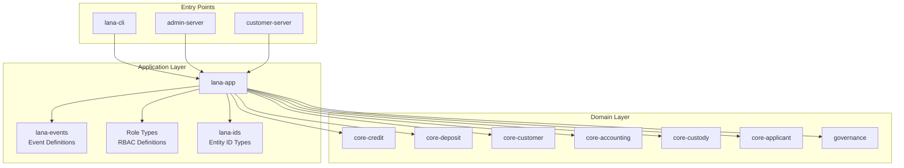
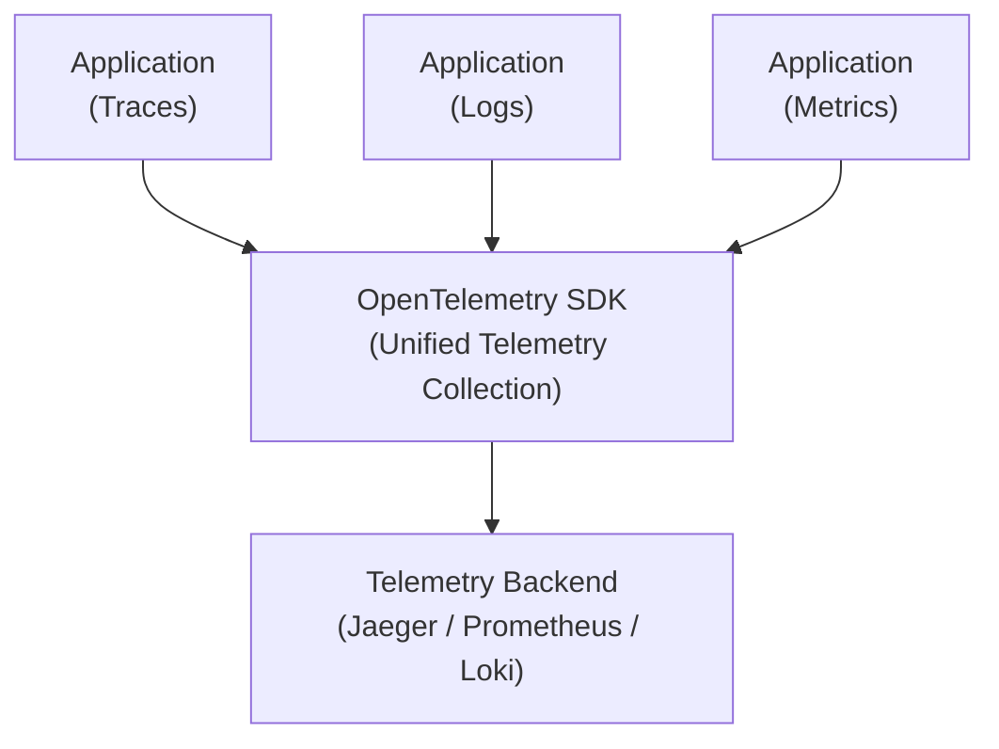

# Trazabilidad y Observabilidad

Este documento describe la infraestructura de observabilidad de Lana, incluyendo el rastreo distribuido con OpenTelemetry.



## Descripción General

Lana implementa observabilidad integral mediante:

- **Rastreo Distribuido**: Integración con OpenTelemetry
- **Registro Estructurado**: Entradas de registro contextuales
- **Métricas**: Métricas de rendimiento y negocio
- **Correlación**: Rastreo de solicitudes entre servicios

## Arquitectura



## Integración con OpenTelemetry

### Configuración

```rust
use opentelemetry::global;
use opentelemetry_otlp::WithExportConfig;
use tracing_subscriber::prelude::*;

pub fn init_telemetry() -> Result<()> {
    let tracer = opentelemetry_otlp::new_pipeline()
        .tracing()
        .with_exporter(
            opentelemetry_otlp::new_exporter()
                .tonic()
                .with_endpoint("http://localhost:4317")
        )
        .install_batch(opentelemetry::runtime::Tokio)?;

    let telemetry = tracing_opentelemetry::layer()
        .with_tracer(tracer);

    tracing_subscriber::registry()
        .with(telemetry)
        .with(tracing_subscriber::fmt::layer())
        .init();

    Ok(())
}
```

### Instrumentación

```rust
use tracing::{instrument, info, span, Level};

#[instrument(skip(self), fields(facility_id = %facility_id))]
pub async fn process_disbursal(
    &self,
    facility_id: CreditFacilityId,
) -> Result<Disbursal> {
    info!("Processing disbursal");

    let facility = self.repo.find_by_id(facility_id).await?;

    // Nested span for ledger operation
    let ledger_span = span!(Level::INFO, "ledger_transfer");
    let _guard = ledger_span.enter();

    self.ledger.transfer(facility.amount).await?;

    info!("Disbursal completed");
    Ok(disbursal)
}
```

## Propagación de Contexto

### Cabeceras HTTP

El contexto de rastreo se propaga a través de cabeceras HTTP:

```
traceparent: 00-0af7651916cd43dd8448eb211c80319c-b7ad6b7169203331-01
tracestate: lana=value
```

### Contexto de GraphQL

```rust
pub struct GraphQLContext {
    trace_id: TraceId,
    span_id: SpanId,
    subject: SubjectId,
}

impl GraphQLContext {
    pub fn from_request(req: &Request) -> Self {
        let trace_context = extract_trace_context(req);
        Self {
            trace_id: trace_context.trace_id,
            span_id: trace_context.span_id,
            subject: extract_subject(req),
        }
    }
}
```

## Registro Estructurado

### Formato de Registro

```rust
use tracing::{info, warn, error};

// Structured log with context
info!(
    customer_id = %customer.id,
    email = %customer.email,
    "Customer created"
);

// Error with context
error!(
    error = %e,
    facility_id = %facility_id,
    "Failed to process disbursal"
);
```

### Niveles de Registro

| Nivel | Uso |
|-------|-------|
| ERROR | Fallos del sistema, requiere atención |
| WARN | Condiciones inesperadas pero recuperables |
| INFO | Operaciones de negocio, eventos de auditoría |
| DEBUG | Información detallada de depuración |
| TRACE | Rastreo muy detallado |

## Métricas

### Métricas de Negocio

```rust
use metrics::{counter, gauge, histogram};

// Count operations
counter!("disbursals_processed_total").increment(1);

// Track current values
gauge!("active_facilities").set(count as f64);

// Measure durations
histogram!("disbursal_processing_seconds").record(duration);
```

### Métricas del Sistema

- Latencia de solicitudes
- Tasas de error
- Pool de conexiones a la base de datos
- Uso de memoria

## IDs de Correlación

Todas las solicitudes llevan contexto de correlación:

```rust
#[derive(Debug, Clone)]
pub struct CorrelationContext {
    pub trace_id: String,
    pub span_id: String,
    pub request_id: Uuid,
    pub subject_id: Option<SubjectId>,
}

impl CorrelationContext {
    pub fn new() -> Self {
        Self {
            trace_id: Span::current().context().trace_id().to_string(),
            span_id: Span::current().context().span_id().to_string(),
            request_id: Uuid::new_v4(),
            subject_id: None,
        }
    }
}
```

## Paneles

### Panel de Operaciones

- Volumen y latencia de solicitudes
- Tasas de error por endpoint
- Usuarios activos
- Estado del sistema

### Panel de Negocio

- Creaciones de instalaciones por día
- Volumen de desembolsos
- Procesamiento de pagos
- Incorporación de clientes

## Alertas

### Alertas Críticas

- Servicio no disponible
- Tasa de error alta (>5%)
- Fallas de conexión a la base de datos
- Tiempos de espera agotados en servicios externos

### Alertas de Advertencia

- Latencia elevada
- Profundidad de cola alta
- Presión de memoria
- Espacio en disco bajo
