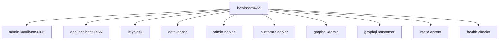
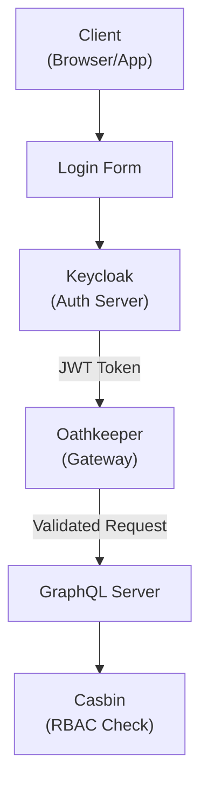
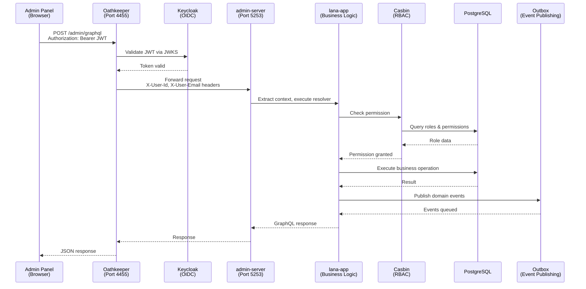
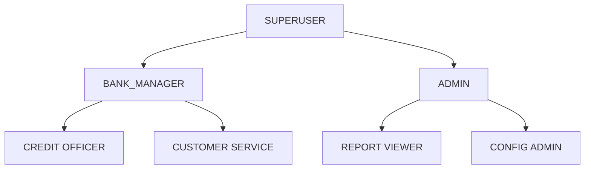

# Arquitectura de Autenticación y Autorización

Este documento describe el sistema de autenticación y autorización de Lana, incluyendo la integración con Keycloak, flujos OAuth 2.0 e implementación de RBAC.



## Resumen

La arquitectura de seguridad de Lana consta de:

- **Keycloak**: Proveedor de identidad y emisor de tokens
- **Oathkeeper**: Puerta de enlace API para validación de JWT
- **Casbin**: Motor de control de acceso basado en roles
- **Sistema de Auditoría**: Registro de decisiones de autorización

## Arquitectura



## Configuración de Keycloak

### Realms

| Realm | Propósito | Usuarios |
|-------|---------|-------|
| admin | Acceso administrativo | Empleados del banco |
| customer | Acceso de clientes | Clientes del banco |

### Clientes

Cada realm tiene clientes configurados:

- **admin-panel**: Aplicación web para administradores
- **customer-portal**: Aplicación web para clientes
- **api-client**: Para acceso programático a la API

### Configuración de Tokens

Los tokens JWT incluyen:
- ID de usuario (`sub`)
- Roles del realm
- Roles del cliente
- Expiración del token

## Puerta de Enlace Oathkeeper

Oathkeeper valida las solicitudes entrantes en el puerto 4455:

### Configuración de Reglas

```yaml

# Admin API rule

- id: admin-api
  upstream:
    url: http://admin-server:5253
  match:
    url: http://admin.localhost:4455/graphql
    methods: [POST]
  authenticators:
    - handler: jwt
      config:
        jwks_urls:
          - http://keycloak:8081/realms/admin/protocol/openid-connect/certs
  authorizer:
    handler: allow
```

### Mutación de Solicitudes



Las solicitudes validadas incluyen:
- `X-Auth-Subject`: ID de usuario
- `X-Auth-Roles`: Roles de usuario

## Control de Acceso Basado en Roles

### Modelo Casbin

```ini
[request_definition]
r = sub, obj, act

[policy_definition]
p = sub, obj, act

[role_definition]
g = _, _

[policy_effect]
e = some(where (p.eft == allow))

[matchers]
m = g(r.sub, p.sub) && r.obj == p.obj && r.act == p.act
```

### Estructura de Permisos

| Rol | Permisos |
|------|-------------|
| SUPERUSER | Todos los permisos |
| BANK_MANAGER | Gestión de clientes, créditos e informes |
| CREDIT_OFFICER | Operaciones de facilidades crediticias |
| TELLER | Operaciones básicas de depósito/retiro |

### Autorización GraphQL

```rust
#[derive(SimpleObject)]
pub struct Query;

#[Object]
impl Query {
    #[graphql(guard = "RoleGuard::new(Permission::CustomerRead)")]
    async fn customer(&self, ctx: &Context<'_>, id: ID) -> Result<Customer> {
        // Implementation
    }
}
```

## Jerarquía de Permisos



## Registro de Auditoría

Todas las decisiones de autorización se registran:

```rust
pub struct AuthorizationAudit {
    timestamp: DateTime<Utc>,
    subject: SubjectId,
    object: String,
    action: String,
    decision: Decision,
    reason: Option<String>,
}
```

### Consulta de Auditoría

```graphql
query GetAuthorizationAudits($filter: AuditFilter!) {
  authorizationAudits(filter: $filter) {
    edges {
      node {
        timestamp
        subject
        action
        decision
      }
    }
  }
}
```

## Gestión de Sesiones

### Renovación de Tokens

Los tokens tienen tiempos de vida configurables:
- Token de acceso: 5 minutos
- Token de renovación: 30 minutos
- Sesión: 8 horas

### Cierre de Sesión

```typescript
// Client-side logout
keycloak.logout({
  redirectUri: window.location.origin,
});
```

## Mejores Prácticas de Seguridad

### Almacenamiento de Tokens

- Almacenar tokens en memoria (no en localStorage)
- Usar cookies httpOnly para tokens de renovación
- Limpiar tokens al cerrar sesión

### Configuración de CORS

- Restringir los orígenes permitidos
- Validar los encabezados Referer
- Usar verificación estricta de Content-Type

### Limitación de velocidad

- Implementar límites de velocidad por usuario
- Monitorear patrones inusuales
- Bloquear después de intentos fallidos de autenticación
