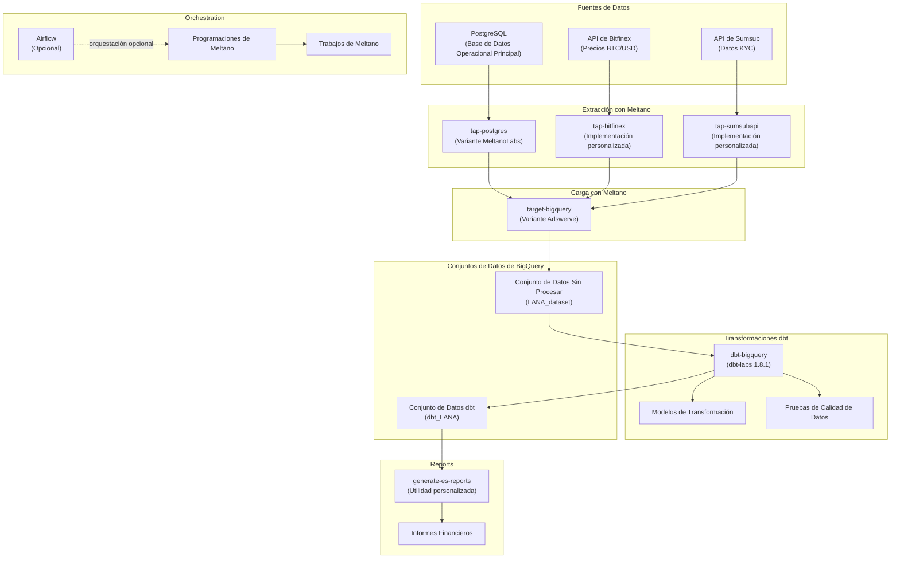
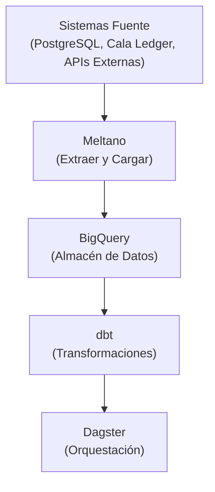

# Pipelines de Datos

Este documento describe la arquitectura del pipeline de datos utilizando Meltano, dbt y BigQuery.



## Descripción General

El pipeline de datos proporciona:

- Extracción de datos desde sistemas operacionales
- Transformación para análisis
- Almacén de datos para informes
- Orquestación con Dagster

## Arquitectura



## Configuración de Meltano

### Extractores

```yaml

# meltano.yml

plugins:
  extractors:
    - name: tap-postgres
      variant: meltanolabs
      config:
        host: ${POSTGRES_HOST}
        port: 5432
        user: ${POSTGRES_USER}
        password: ${POSTGRES_PASSWORD}
        database: lana
```

### Cargadores

```yaml
plugins:
  loaders:
    - name: target-bigquery
      variant: adswerve
      config:
        project_id: ${GCP_PROJECT_ID}
        dataset_id: lana_raw
        location: US
```

## Transformaciones dbt

### Estructura del Modelo

```
dagster/dbt/
├── models/
│   ├── staging/          # Limpiar datos sin procesar
│   │   ├── stg_customers.sql
│   │   ├── stg_facilities.sql
│   │   └── stg_transactions.sql
│   ├── intermediate/     # Lógica de negocio
│   │   ├── int_customer_metrics.sql
│   │   └── int_facility_performance.sql
│   └── marts/            # Informes finales
│       ├── fct_disbursals.sql
│       ├── fct_payments.sql
│       └── dim_customers.sql
└── dbt_project.yml
```

### Modelo de Ejemplo

```sql
-- models/staging/stg_customers.sql
{{ config(materialized='view') }}

select
    id as customer_id,
    email,
    status,
    customer_type,
    created_at,
    updated_at
from {{ source('lana_raw', 'customers') }}
where _sdc_deleted_at is null
```

### Modelo Intermedio

```sql
-- models/intermediate/int_customer_metrics.sql
{{ config(materialized='table') }}

select
    c.customer_id,
    count(distinct f.facility_id) as total_facilities,
    sum(f.principal_amount) as total_principal,
    sum(f.outstanding_balance) as total_outstanding,
    max(f.created_at) as last_facility_date
from {{ ref('stg_customers') }} c
left join {{ ref('stg_facilities') }} f
    on c.customer_id = f.customer_id
group by 1
```

## Orquestación con Dagster

### Definición de Asset

```python

# dagster/assets.py

from dagster import asset
from dagster_dbt import dbt_assets

@dbt_assets(manifest_path=DBT_MANIFEST_PATH)
def dbt_models(context):
    yield from build_dbt_assets(context)

@asset(deps=[dbt_models])
def customer_report():
    """Generar informe diario de clientes."""
    query = """
    SELECT * FROM `project.dataset.dim_customers`
    """
    df = bigquery_client.query(query).to_dataframe()
    return df
```

### Programación

```python
from dagster import ScheduleDefinition

daily_pipeline = ScheduleDefinition(
    job=etl_job,
    cron_schedule="0 2 * * *",  # 2 AM daily
)
```

## Calidad de Datos

### Pruebas de dbt

```yaml

# models/schema.yml

version: 2

models:
  - name: stg_customers
    columns:
      - name: customer_id
        tests:
          - unique
          - not_null
      - name: email
        tests:
          - not_null
          - unique
      - name: status
        tests:
          - accepted_values:
              values: ['ACTIVE', 'INACTIVE', 'ESCHEATABLE']
```

### Pruebas Personalizadas

```sql
-- tests/assert_positive_balances.sql
select
    facility_id,
    outstanding_balance
from {{ ref('fct_facilities') }}
where outstanding_balance < 0
```

## Vistas de Informes

### Resumen Financiero

```sql
-- models/marts/financial_summary.sql
select
    date_trunc('month', transaction_date) as month,
    sum(case when type = 'DEPOSIT' then amount end) as deposits,
    sum(case when type = 'WITHDRAWAL' then amount end) as withdrawals,
    sum(case when type = 'DISBURSAL' then amount end) as disbursals,
    sum(case when type = 'PAYMENT' then amount end) as payments
from {{ ref('fct_transactions') }}
group by 1
order by 1
```

## Control de Acceso

### Permisos de BigQuery

| Rol | Nivel de Acceso |
|------|--------------|
| Ingeniero de Datos | Acceso completo |
| Analista | Solo lectura de marts |
| Reportes | Lectura de vistas específicas |
