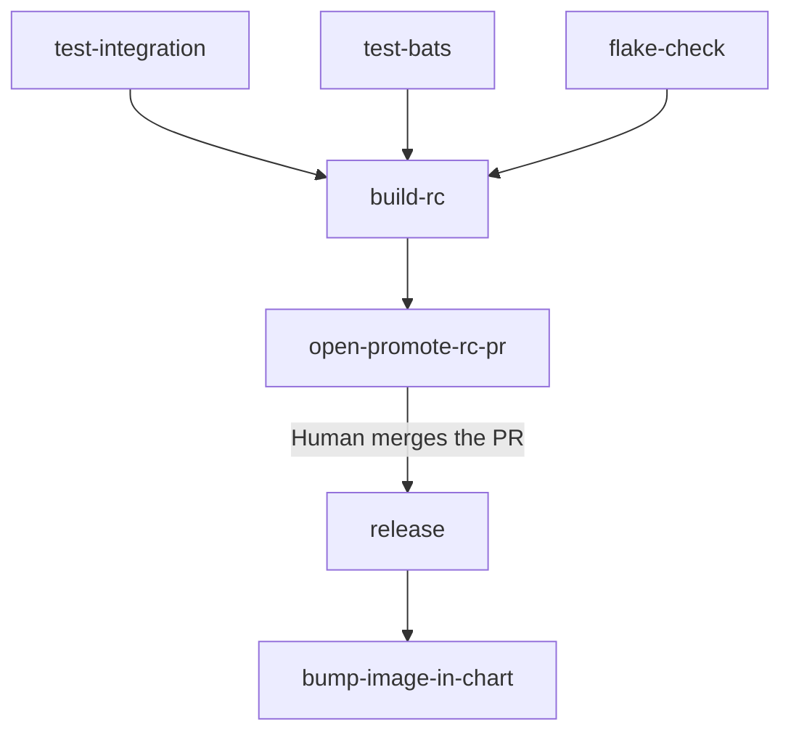

```mermaid
graph LR
    subgraph GH["GitHub Actions (PR Checks)"]
        A1["nextest"]
        A2["bats"]
        A3["cypress"]
        A4["check-code-apps"]
        A5["flake-check"]
        A6["codeql + pnpm audit"]
    end
    subgraph CONC_REL["Concourse: lana-bank pipeline"]
        B1["test-integration"]
        B2["test-bats"]
        B3["flake-check"]
        B4["build-rc"]
        B5["release"]
        B6["bump-image-in-chart"]
    end
    subgraph CONC_CHARTS["Concourse: galoy-private-charts"]
        C1["testflight"]
        C2["bump-in-deployments"]
    end
    subgraph DEPLOY["galoy-deployments + Cepler"]
        D1["staging"]
        D2["qa"]
        D3["production"]
    end
    GH -->|"merge to main"| CONC_REL
    CONC_REL -->|"image digests"| CONC_CHARTS
    CONC_CHARTS -->|"vendir sync"| DEPLOY
```

# CI/CD e Ingeniería de Releases

Esta página recorre el camino completo de un cambio de código, desde el momento en que un desarrollador abre un pull request hasta llegar a producción. Hay tres sistemas principales involucrados:

- **GitHub Actions** valida el código en cada pull request.
- **Concourse** construye releases, prueba Helm charts y despliega en los entornos.
- **Cepler** controla qué entornos se actualizan y en qué orden.

La filosofía de diseño es simple: cada paso debe completarse exitosamente antes de que comience el siguiente, y hay puntos de control humanos en los momentos más importantes. Nada llega a producción por accidente.

## Visión General de Alto Nivel



Ahora veamos cada paso en detalle.

---

## Paso 1: Verificaciones de Pull Request (GitHub Actions)

Cuando un desarrollador abre un pull request contra `main`, GitHub Actions lanza un conjunto de verificaciones que se ejecutan en paralelo. Todas y cada una deben pasar antes de que el PR pueda ser fusionado; no hay excepciones.

### Qué se verifica

| Workflow | Qué hace | Por qué importa |
|----------|----------|------------------|
| **nextest** | Ejecuta todas las pruebas unitarias y de integración de Rust mediante `nix run .#nextest` | Detecta errores lógicos y regresiones en el backend |
| **bats** | Levanta la pila completa de la aplicación y ejecuta pruebas BATS de extremo a extremo | Verifica que todo el sistema funcione en conjunto, no solo piezas individuales |
| **cypress** | Ejecuta pruebas de navegador Cypress contra el panel de administración y el portal del cliente | Asegura que la interfaz realmente funcione; también genera capturas de pantalla para manuales regulatorios |
| **check-code-apps** | Ejecuta lint, verificación de tipos y compilación de ambos frontends Next.js | Detecta errores de TypeScript, violaciones de lint y compilaciones rotas en el frontend |
| **flake-check** | Ejecuta `nix flake check` para validar el Nix flake | Asegura que el sistema de compilación esté saludable |
| **codeql** | Análisis estático CodeQL de GitHub para JS/TS y Rust | Encuentra posibles vulnerabilidades de seguridad mediante análisis estático |
| **pnpm-audit** | Audita las dependencias npm en busca de vulnerabilidades conocidas | Bloquea PRs que introduzcan dependencias con CVEs de alta severidad |
| **data-pipeline** | Aprovisiona un entorno desechable de BigQuery, ejecuta las pruebas del pipeline de datos y luego lo destruye | Valida que el pipeline de datos Dagster/dbt siga funcionando con los cambios de esquema |
| **cocogitto** | Verifica que los mensajes de commit sigan el formato de conventional commits | Necesario porque el número de versión y el changelog se generan automáticamente a partir de los mensajes de commit |
| **spelling** | Ejecuta la herramienta `typos` para detectar errores ortográficos comunes | Simple pero detecta errores tipográficos embarazosos en código y documentación |
| **lana-bank-docs** | Compila el sitio completo de documentación (documentación de API, documentación versionada, validación de capturas de pantalla) | Detecta compilaciones rotas de documentación, descripciones de API faltantes y configuraciones inválidas del sitio de documentación |

### Cómo Nix caching lo hace rápido

Compilar el código Rust desde cero toma mucho tiempo. Para evitar hacerlo en cada PR, todos los workflows de GitHub Actions descargan binarios pre-compilados de un caché binario compartido de **Cachix** llamado `galoymoney`.

Este es el patrón que verás en cada archivo de workflow:

```yaml
- uses: DeterminateSystems/nix-installer-action@v16
- uses: cachix/cachix-action@v15
  with:
    name: galoymoney
    authToken: ${{ secrets.CACHIX_AUTH_TOKEN }}
    skipPush: true
```

La parte `skipPush: true` es clave: GitHub Actions solo **lee** del caché, nunca escribe en él. El caché se llena mediante un pipeline separado de Concourse (descrito en la sección [Pipeline de Caché Nix](#pipeline-de-caché-nix) más abajo). Esta separación existe porque Concourse tiene workers de caché potentes con almacenamiento persistente, mientras que los runners de GitHub Actions son efímeros y producirían cargas redundantes.

La mayoría de los workflows también recuperan 10-20 GB de espacio en disco al inicio eliminando software preinstalado (imágenes Docker, Android SDK, etc.) con el que vienen los runners de GitHub. Las compilaciones grandes de Rust necesitan ese margen.

### Qué sucede cuando una verificación falla

Si alguna verificación falla, el PR queda bloqueado para fusión. El desarrollador corrige el problema, hace push nuevamente y las verificaciones se re-ejecutan. No hay forma de evadir una verificación fallida.

---

## Paso 2: Construcción de un Release (Concourse, repositorio lana-bank)

Una vez que un PR se fusiona en `main`, el pipeline de release de Concourse toma el control. Este pipeline reside en el directorio `ci/release/` del repositorio lana-bank y está escrito usando plantillas [YTT](https://carvel.dev/ytt/).

El pipeline tiene una cadena de dependencias clara:



### 2a. Re-ejecución de pruebas en main

Podrías preguntarte: ya ejecutamos pruebas en GitHub Actions en el PR, entonces, ¿por qué ejecutarlas de nuevo? Porque el PR fue probado contra una versión potencialmente desactualizada de `main`. Entre el momento en que se abrió el PR y el momento en que se fusionó, otros PRs pueden haber sido incorporados. Ejecutar pruebas nuevamente sobre el commit fusionado real detecta problemas de integración que solo aparecen cuando múltiples cambios se combinan.

Tres jobs se ejecutan en paralelo:

- **test-integration** ejecuta `cargo nextest` — la misma suite de pruebas Rust de las verificaciones del PR.
- **test-bats** ejecuta las pruebas BATS de extremo a extremo (con hasta 2 intentos, ya que las pruebas E2E pueden ser inestables).
- **flake-check** valida el Nix flake.

Los tres deben pasar antes de que se construya algo.

### 2b. Construcción del Release Candidate (`build-rc`)

Una vez que pasan las pruebas, el pipeline construye un release candidate (RC). La idea detrás de los RCs es que puedes construir y probar múltiples candidatos antes de comprometerte con un release final. Esto es lo que sucede:

1. **Determinar el número de versión.** Un script de Nix llamado `next-version` usa [cocogitto](https://docs.cocogitto.io/) para escanear los mensajes de conventional commits desde el último release y determinar la siguiente versión semántica. Por ejemplo, si el último release fue `0.41.0` y ha habido un commit `feat:`, la siguiente versión se convierte en `0.42.0-rc.1`. Si ya se construyó otro RC para esta versión, se incrementa a `rc.2`, `rc.3`, y así sucesivamente.

2. **Inyectar la versión en las aplicaciones frontend.** El script `prep-release-apps.sh` escribe `NEXT_PUBLIC_APP_VERSION=0.42.0-rc.1` en los archivos `.env` tanto del panel de administración como del portal del cliente, para que la interfaz pueda mostrar qué versión está ejecutándose.

3. **Compilar el binario Rust.** `nix build --impure .#lana-cli-release` produce el binario `lana-cli`. La flag `--impure` es necesaria porque la compilación lee variables de entorno como `VERSION` y `COMMITHASH` que fueron establecidas por el pipeline de CI.

4. **Construir cuatro imágenes Docker** y subirlas a Google Artifact Registry (`gcr.io/galoyorg`):
   - **`lana-bank`** — el servidor principal (construido desde `Dockerfile.rc`, que copia el binario pre-compilado en una imagen base distroless)
   - **`lana-bank-admin-panel`** — el frontend del panel de administración
   - **`lana-bank-customer-portal`** — el frontend del portal del cliente
   - **`dagster-code-location-lana-dw`** — el código del pipeline de datos de Dagster

5. **Etiquetar las imágenes.** Cada imagen recibe tanto una etiqueta `edge` (que significa "último RC") como una etiqueta específica de versión como `0.42.0-rc.1`.

### 2c. Apertura del PR de Promoción de RC (`open-promote-rc-pr`)

Después de que las imágenes RC son construidas, el pipeline abre automáticamente un pull request de vuelta en el repositorio lana-bank. Este PR hace varias cosas:

- Genera una entrada de **CHANGELOG** usando [git-cliff](https://git-cliff.org/), que lee los mensajes de conventional commits y los agrupa en categorías (características, correcciones de errores, etc.).
- Regenera la **documentación de API** y los **esquemas de eventos**, y crea una instantánea versionada del sitio de documentación.
- Sube todo a una rama llamada `bot-promote-rc` y abre un **PR borrador** etiquetado como `promote-rc`.

Este PR es la **puerta humana** en el pipeline. Un ingeniero revisa el changelog para asegurarse de que se vea correcto, verifica que el RC se vea bien en cualquier prueba ad-hoc, y luego fusiona el PR cuando está listo para cortar un release. Nada sucede automáticamente desde aquí — el release solo procede cuando un humano dice "adelante".

También hay una verificación de seguridad: la GitHub Action `promote-rc-file-check` verifica que este PR solo modifique archivos `CHANGELOG.md` y `docs-site/**`. Si el bot incluyó accidentalmente otros cambios, la verificación falla y bloquea la fusión.

### 2d. Corte del Release Final (`release`)

Cuando alguien fusiona el PR de promote-rc, el job `release` se activa. Hace tres cosas:

1. **Construye las imágenes Docker finales.** Estas son las mismas cuatro imágenes que el RC, pero ahora etiquetadas con el número de versión limpio (por ejemplo, `0.42.0`) y también `latest`. Las imágenes de release usan `Dockerfile.release` en lugar de `Dockerfile.rc` — la diferencia es que el Dockerfile de release descarga el binario desde los artefactos del GitHub Release en lugar de copiarlo desde un paso de compilación.

2. **Crea un GitHub Release.** Esto incluye el binario `lana-cli` como artefacto descargable y el changelog como notas del release. El release se etiqueta con el número de versión.

3. **Actualiza el contador de versión.** El pipeline almacena la versión actual en una rama git dedicada llamada `version` (solo un archivo de texto con el número de versión). Esta se incrementa para que el próximo RC comience desde la base correcta.

### 2e. Actualización del Helm Chart (`bump-image-in-chart`)

Inmediatamente después del release, el pipeline necesita informar al Helm chart sobre las nuevas imágenes. Lo hace abriendo un PR en el repositorio **galoy-private-charts**:

1. Obtiene el **digest SHA256** de cada imagen Docker recién construida. Se usan digests en lugar de etiquetas porque son inmutables — una etiqueta como `latest` puede apuntar a una imagen diferente después, pero un digest siempre se refiere exactamente a los mismos bytes. Esto es importante para la seguridad en producción.

2. Actualiza `values.yaml` en el Helm chart con los nuevos digests y versión:
   ```yaml
   lanaBank:
     image:
       digest: "sha256:0a858023..." # METADATA:: repository=https://github.com/GaloyMoney/lana-bank;commit_ref=e348f09;app=lana-bank;
     adminPanel:
       image:
         digest: "sha256:acdb373d..."
     customerPortal:
       image:
         digest: "sha256:5d98584b..."
   ```
   Observa el comentario `METADATA` junto a cada digest. Esta es una pista que vincula la imagen con el commit fuente exacto desde el que fue construida. Es invaluable al depurar problemas en producción — puedes mirar el digest de la imagen en ejecución, encontrar este comentario en el chart y rastrearlo hasta el código fuente.

3. También copia módulos de Terraform (`tf/bq-setup` y `tf/honeycomb`) del repositorio fuente al chart, para que el chart siempre incluya la configuración de infraestructura correspondiente.

4. Abre un PR en galoy-private-charts con un cuerpo que incluye un enlace al diff del código (por ejemplo, "comparar old_ref...new_ref en GitHub"). Esto facilita ver exactamente qué cambios de código están incluidos en esta actualización del chart.

5. Este PR se **fusiona automáticamente** mediante un workflow de GitHub (`bot-automerge-lana.yml`) que vigila PRs con las etiquetas `galoybot` y `lana-bank`. No se necesita intervención humana aquí — el testflight (descrito a continuación) es lo que valida el chart.

### Cómo funcionan los números de versión

Las versiones siguen [Versionado Semántico](https://semver.org/) y se derivan automáticamente de los mensajes de conventional commits usando [cocogitto](https://docs.cocogitto.io/):

- Commits `feat:` producen un incremento **minor** (por ejemplo, 0.41.0 -> 0.42.0)
- Commits `fix:` producen un incremento **patch** (por ejemplo, 0.42.0 -> 0.42.1)
- `feat!:` o `BREAKING CHANGE` producen un incremento **major** (por ejemplo, 0.42.0 -> 1.0.0)

Por esto la GitHub Action `cocogitto` impone el formato de conventional commits en cada PR — si los mensajes de commit no siguen la convención, la versión no puede calcularse automáticamente.

La versión actual se almacena en una rama git llamada `version` como un archivo de texto plano. Es gestionada por el [semver resource](https://github.com/concourse/semver-resource) de Concourse.

---

## Paso 3: Pruebas del Helm Chart (galoy-private-charts)

El repositorio **galoy-private-charts** contiene el Helm chart que agrupa lana-bank y todos los servicios que necesita para ejecutarse. Piensa en el Helm chart como una "receta de despliegue" — describe no solo el servidor lana-bank, sino también la base de datos, el proveedor de identidad, el API gateway, el pipeline de datos y todo lo demás.

### Qué incluye el chart

| Componente | Qué es | Imagen |
|------------|--------|--------|
| Servidor lana-bank | La aplicación bancaria central | `gcr.io/galoyorg/lana-bank` |
| Admin Panel | Frontend Next.js para operadores del banco | `gcr.io/galoyorg/lana-bank-admin-panel` |
| Customer Portal | Frontend Next.js para clientes del banco | `gcr.io/galoyorg/lana-bank-customer-portal` |
| Dagster | Orquestación del pipeline de datos | `us.gcr.io/galoyorg/dagster-code-location-lana-dw` |
| PostgreSQL | Base de datos (subchart de Bitnami) | Bitnami PostgreSQL |
| Keycloak | Proveedor de identidad con realms de administrador y cliente (subchart de Codecentric) | Keycloak |
| Oathkeeper | API gateway que valida JWTs y enruta solicitudes (subchart de Ory) | Ory Oathkeeper |
| OAuth2 Proxy | Proxy de autenticación OAuth2 | OAuth2 Proxy |
| Gotenberg | Generación de PDF/documentos | Gotenberg |

Todas las imágenes de aplicación están fijadas por **digest SHA256** en lugar de etiqueta. Esto garantiza que lo que fue probado es exactamente lo que se despliega — no hay posibilidad de que una etiqueta sea silenciosamente redirigida a una imagen diferente.

### El testflight: un despliegue desechable

Cuando el chart cambia (es decir, después de que el PR de actualización de imágenes del Paso 2e es auto-fusionado), el pipeline de Concourse en este repositorio ejecuta un job llamado **testflight**. El nombre viene de la idea de un "vuelo de prueba" — despliegas el chart en un entorno temporal y aislado para ver si realmente funciona, y luego destruyes el entorno.

Esto es lo que sucede durante un testflight:

1. **Terraform crea un namespace nuevo** en el clúster GKE de staging, nombrado algo como `lana-bank-testflight-e348f09`. Aprovisiona secretos de prueba (credenciales de base de datos, claves de API, etc.) copiándolos del entorno de staging.

2. **Helm instala el chart completo** en este namespace, con un timeout de 15 minutos. Esto despliega el servidor lana-bank, ambos frontends, PostgreSQL, Keycloak, Oathkeeper, Dagster — toda la pila.

3. **Se ejecuta un smoketest** contra los servicios desplegados. Esto verifica que los endpoints principales estén activos y respondiendo.

4. **Terraform destruye el namespace**, limpiando todos los recursos. Ya sea que la prueba haya pasado o fallado, el namespace se elimina.

Si el smoketest falla, el pipeline se detiene aquí. El chart no se promueve hacia adelante, y alguien necesita investigar qué salió mal.

### Publicación del chart en galoy-deployments

Si el testflight pasa, se ejecuta un segundo job: **bump-lana-bank-in-deployments**. Este es el puente entre el repositorio del chart y el repositorio de despliegue.

Hace checkout del repositorio **galoy-deployments**, ejecuta `make bump-vendored-ref DEP=lana-bank REF=<git_ref>` para apuntar la configuración de vendir al nuevo commit del chart, luego ejecuta `vendir sync` para realmente traer los nuevos archivos del chart al directorio vendor. Finalmente, hace commit y push de este cambio a `galoy-deployments/main`.

En este punto, el repositorio de despliegue conoce la nueva versión del chart. El siguiente paso es que Cepler lo recoja y comience a desplegar en los entornos.

---

## Paso 4: Despliegue en Entornos (galoy-deployments + Cepler)

El repositorio **galoy-deployments** es donde la teoría se encuentra con la práctica. Contiene configuraciones de Terraform para cada entorno (staging, QA, producción), el Helm chart incluido como vendor, y la configuración de Cepler que controla la progresión entre entornos.

### Qué es Cepler y por qué lo necesitamos

[Cepler](https://github.com/bodymindarts/cepler) es una herramienta de promoción de despliegues. El problema que resuelve es directo: cuando tienes múltiples entornos (staging, QA, producción), no quieres que un cambio llegue a producción hasta que haya sido validado en los entornos anteriores primero.

Cepler rastrea qué archivos han cambiado y qué entornos han desplegado exitosamente esos cambios. Impone reglas como "QA solo puede desplegar cambios que ya se han desplegado exitosamente en staging". Esto previene el error clásico de desplegar accidentalmente código no probado en producción.

Cepler tiene algunos conceptos centrales:

- **Deployment**: Una unidad de trabajo con nombre (por ejemplo, `lana-bank`). Cada deployment tiene su propio archivo de configuración y su propio conjunto de entornos.
- **Environment**: Un destino de despliegue como `gcp-galoy-staging` o `gcp-volcano-qa`. Cada entorno define qué patrones de archivos vigila para detectar cambios.
- **`latest`**: Una lista de patrones glob. Cuando archivos que coinciden con estos patrones cambian, Cepler considera que este entorno está "desactualizado" y dispara un despliegue.
- **`passed`**: El nombre de otro entorno que debe haber desplegado exitosamente los mismos cambios primero. Así es como se crea una cadena de promoción (staging -> QA -> producción).
- **`propagated`**: Archivos que deben heredarse del entorno `passed` en lugar de rastrearse independientemente. Así es como el código de módulos compartidos fluye de staging a QA sin que QA necesite rastrear esos archivos de forma independiente.
- **Archivos de estado**: Cepler mantiene archivos de estado en el directorio `.cepler/` que registran exactamente qué commit y versiones de archivos se han desplegado en cada entorno.

### Configuración de Cepler en la práctica

Aquí hay una versión simplificada de la configuración de Cepler para lana-bank:

```yaml
# cepler/lana-bank.yml
deployment: lana-bank
environments:
  gcp-galoy-staging:
    latest:
      - modules/lana-bank/**
      - modules/lana-bank-gcp-pg/**
      - modules/infra/vendor/tf/postgresql/**
      - gcp/galoy-staging/shared/*
      - gcp/galoy-staging/lana-bank/*

  gcp-volcano-qa:
    passed: gcp-galoy-staging
    propagated:
      - modules/lana-bank/**
      - modules/lana-bank-gcp-pg/**
      - modules/infra/vendor/tf/postgresql/**
    latest:
      - gcp/volcano-qa/shared/*
      - gcp/volcano-qa/lana-bank/*

  azure-volcano-staging:
    latest:
      - modules/lana-bank/**
      - modules/lana-bank-azure-pg/**
      - modules/infra/vendor/tf/postgresql/**
      - azure/volcano-staging/lana-bank/*
```

Leyendo de arriba hacia abajo:

- **Staging** (`gcp-galoy-staging`) vigila el módulo lana-bank, el módulo PostgreSQL de GCP y su propia configuración específica de entorno. Cada vez que alguno de esos archivos cambia, staging recibe un nuevo despliegue.

- **QA** (`gcp-volcano-qa`) tiene `passed: gcp-galoy-staging`, lo que significa que solo desplegará cambios que ya se hayan desplegado exitosamente en staging. La sección `propagated` lista los módulos compartidos — Cepler hereda las versiones probadas en staging de estos archivos en lugar de rastrearlos independientemente. QA también vigila su propia configuración específica de entorno en `latest`, por lo que los cambios a configuraciones solo de QA se despliegan inmediatamente sin esperar a staging.

- **Azure staging** (`azure-volcano-staging`) es una pista independiente. Usa un módulo de base de datos diferente (`lana-bank-azure-pg` en lugar de `lana-bank-gcp-pg`) y tiene sus propios patrones de archivos. No depende del entorno de staging de GCP — es una nube separada.

### Cómo funciona Cepler con Concourse

El pipeline de Concourse de galoy-deployments usa dos tipos de recursos personalizados para integrarse con Cepler:

1. **`cepler-in`** es un recurso de Concourse que verifica periódicamente la rama git `cepler-gates`. Cuando detecta que hay cambios pendientes para un entorno dado (basándose en las reglas de la configuración de cepler), dispara un job de despliegue.

2. El job de despliegue luego hace el trabajo real: ejecuta Terraform para aprovisionar bases de datos y configurar secretos, despliega el Helm chart en Kubernetes y ejecuta cualquier verificación post-despliegue.

3. **`cepler-out`** se llama después de un despliegue exitoso. Actualiza el archivo de estado de cepler, registrando que este entorno ahora está en la nueva versión. Esto es lo que desbloquea los entornos posteriores — cuando el estado de staging se actualiza, Cepler sabe que QA ahora puede proceder.

Si un despliegue falla, el estado no se actualiza y los entornos posteriores permanecen bloqueados. Esta es la red de seguridad que previene que código roto se propague a través de los entornos.

### Estructura del repositorio

```
galoy-deployments/
├── modules/
│   ├── lana-bank/                   # Módulo base de despliegue
│   │   ├── main.tf                  # Terraform: despliega el Helm release
│   │   ├── variables.tf             # Variables de entrada (dominio, flags, etc.)
│   │   ├── lana-bank-values.yml.tmpl  # Plantilla de valores Helm
│   │   └── vendor/lana-bank/        # Chart incluido desde galoy-private-charts
│   ├── lana-bank-gcp-pg/           # Aprovisiona 3 instancias PostgreSQL en GCP
│   └── lana-bank-azure-pg/         # Aprovisiona PostgreSQL en Azure
├── gcp/
│   ├── galoy-staging/
│   │   ├── shared/                  # Configuración de proyecto GCP compartida por todos los módulos
│   │   └── lana-bank/main.tf       # Sobrecargas específicas de staging
│   └── volcano-qa/
│       └── lana-bank/main.tf       # Sobrecargas específicas de QA
├── azure/
│   └── volcano-staging/
│       └── lana-bank/main.tf       # Sobrecargas de Azure staging
├── cepler/
│   ├── lana-bank.yml               # Reglas de progresión de entornos
│   └── .cepler/lana-bank/          # Archivos de estado (uno por entorno)
└── vendir.yml                       # Configuración de Vendir para sincronización de charts
```

### Sobrecargas de módulos

El módulo base en `modules/lana-bank/` define la lógica común de despliegue. Cada entorno luego instancia este módulo con su propia configuración. Así es como puedes tener el mismo código de aplicación ejecutándose en diferentes configuraciones a través de los entornos.

Por ejemplo, staging habilita el tiempo artificial (útil para probar características dependientes del tiempo como el devengo de intereses) y apunta a un dominio de staging:

```hcl
# gcp/galoy-staging/lana-bank/main.tf
module "lana-bank" {
  source                 = "../../../modules/lana-bank/"
  lana_domain            = "staging.lana.galoy.io"
  enable_artificial_time = true
  additional_bq_owners   = ["dev-team@galoy.io"]
}
```

Mientras que producción deshabilita el tiempo artificial y usa el dominio real:

```hcl
# gcp/volcano-production/lana-bank/main.tf
module "lana-bank" {
  source                 = "../../../modules/lana-bank/"
  lana_domain            = "app.lana.galoy.io"
  enable_artificial_time = false
}
```

El módulo de base de datos (`lana-bank-gcp-pg`) aprovisiona tres instancias PostgreSQL separadas para el servidor lana-bank, Dagster y Keycloak respectivamente. Cada entorno puede configurarlas de manera diferente (por ejemplo, habilitando alta disponibilidad y replicación para producción, pero no para staging).

### Cómo Vendir sincroniza el chart

[Vendir](https://carvel.dev/vendir/) es una herramienta del proyecto Carvel que "vendor" (copia) dependencias externas en un repositorio. En galoy-deployments, se usa para traer el Helm chart de lana-bank desde galoy-private-charts a un directorio local `vendor/`.

La configuración se ve así:

```yaml
# vendir.yml (simplified)
directories:
  - path: modules/lana-bank/vendor/lana-bank
    contents:
      - path: chart
        git:
          url: git@github.com:GaloyMoney/galoy-private-charts.git
          ref: c81465e06a81725560919ef746d0e1a0e4f8a2ac
        includePaths:
          - charts/lana-bank/**/*
        newRootPath: charts/lana-bank
```

Cuando el job `bump-lana-bank-in-deployments` se ejecuta (del Paso 3b), actualiza el campo `ref` para apuntar al nuevo commit del chart y ejecuta `vendir sync`. Vendir entonces clona el repositorio galoy-private-charts en ese commit exacto, extrae los archivos del chart y los copia en el directorio vendor. De esta manera, galoy-deployments siempre tiene una copia completa y autocontenida del chart — nunca consulta otro repositorio en tiempo de despliegue.

---

## Paso 5: Promoción a Producción

Los despliegues a producción siguen el mismo patrón impulsado por Cepler que staging y QA, pero con una capa adicional de supervisión humana.

1. **Los cambios deben pasar staging primero.** El campo `passed:` de la configuración de cepler asegura que cualquier cambio dirigido a producción ya haya sido desplegado exitosamente en staging (y potencialmente QA). Si staging está roto, producción ni siquiera se intentará.

2. **La rama `cepler-gates` añade una puerta manual.** Incluso después de que staging tiene éxito, producción no se despliega automáticamente. El repositorio galoy-deployments tiene una rama git especial llamada `cepler-gates` que contiene controles de promoción. Cepler verifica esta rama para determinar si un despliegue a producción está "permitido".

3. **Un humano aprueba la promoción.** Para hacer release a producción, un ingeniero actualiza la rama `cepler-gates` para indicar que la versión actual de staging está aprobada para producción. Esta es una acción explícita y auditable.

4. **Cepler detecta que la puerta está abierta** y el pipeline de Concourse despliega a producción usando Terraform y Helm, igual que lo hace para staging. Después de un despliegue exitoso, el estado de cepler se actualiza.

Este diseño significa que siempre sabes exactamente qué está ejecutándose en producción, y siempre puedes rastrearlo de vuelta a través de QA, staging, el Helm chart, las imágenes Docker, hasta llegar al commit fuente.

---

## Pipeline de Caché Nix

Junto al pipeline de release, hay un pipeline separado de Concourse dedicado a mantener caliente el **caché binario de Cachix**. Este pipeline está definido en `ci/nix-cache/pipeline.yml` en el repositorio lana-bank.

### ¿Por qué existe esto?

Compilar Rust desde cero es lento. El código base de lana-bank tiene muchas dependencias, y una compilación en frío puede tomar mucho tiempo. El pipeline de caché Nix se asegura de que los binarios pre-compilados estén siempre disponibles, para que tanto desarrolladores como sistemas de CI puedan saltarse el paso de compilación y simplemente descargar el resultado.

El caché está alojado en [Cachix](https://app.cachix.org/) bajo el nombre `galoymoney`.

### Cómo funciona en la práctica

Hay una división intencional de responsabilidades entre Concourse y GitHub Actions:

- **Concourse** hace el trabajo pesado: compila derivaciones de Nix y las **sube** al caché de Cachix. Los workers de Concourse tienen almacenamiento persistente y pueden ejecutar compilaciones largas eficientemente.
- **GitHub Actions** es un consumidor: **lee** del caché (con `skipPush: true`) pero nunca escribe en él. Los runners de GitHub Actions son efímeros, y que subieran al caché produciría muchas cargas redundantes.

Esta división mantiene las cosas eficientes y evita la contaminación del caché por ejecuciones paralelas de GitHub Actions.

### Jobs del pipeline de caché

| Job | Cuándo se ejecuta | Qué hace |
|-----|-------------------|----------|
| **build-release-main** | En cada push a `main` | Compila el binario de release y sube todas las derivaciones a Cachix. Esto mantiene el caché fresco para la ruta de compilación más común. |
| **cache-dev-profile** | Cuando se abre o actualiza un PR | Almacena en caché el shell `nix develop` y los scripts de utilidad de CI. Esto significa que `nix develop` es rápido para desarrolladores que usan Cachix localmente. |
| **populate-nix-cache-pr** | Cuando se abre o actualiza un PR | El caballo de batalla principal. Compila derivaciones en etapas: primero `lana-deps` (el árbol de dependencias Rust), luego `nextest`, `simulation`, `lana-cli-debug` y `bats` en paralelo, y finalmente `nix flake check` y la compilación completa de release. Cada derivación se sube a Cachix tan pronto como se completa. |
| **rebuild-nix-cache** | Activación manual | Recorre todos los PRs abiertos y re-dispara las compilaciones de caché para ellos. Útil cuando el caché se ha vuelto obsoleto o una dependencia ha cambiado. |

### La experiencia del desarrollador

Cuando todo funciona bien, esto es lo que ve un desarrollador:

1. Abre un PR.
2. En segundo plano, el job de Concourse `populate-nix-cache-pr` comienza a compilar derivaciones para el código de ese PR.
3. GitHub Actions también comienza a ejecutarse — pero muchas de las derivaciones de Nix que necesita ya están en el caché del paso 2 (o de una compilación anterior de `main`), por lo que descarga binarios pre-compilados en lugar de compilarlos.
4. Si la compilación del caché de Concourse termina antes de que GitHub Actions necesite una derivación particular, el job de GitHub Actions obtiene un acierto de caché y procede rápidamente. Si no, el job puede compilarla desde cero, pero la próxima ejecución será más rápida.

El script de utilidad `wait-cachix-paths` está disponible para casos donde un paso de CI necesita esperar a que el caché esté poblado antes de continuar. Consulta la API de Cachix hasta que la derivación solicitada esté disponible.

Los desarrolladores también pueden usar el caché localmente ejecutando `cachix use galoymoney`. Después de eso, `nix develop` y `nix build` descargarán artefactos pre-compilados siempre que sea posible.

---

## Uniendo Todo

Aquí está el viaje completo una vez más, pero ahora deberías entender qué está pasando en cada paso y por qué:

1. **El desarrollador abre un PR.** GitHub Actions ejecuta más de 10 verificaciones en paralelo (pruebas, lint, escaneos de seguridad). Mientras tanto, Concourse comienza a pre-compilar derivaciones de Nix y a subirlas a Cachix.

2. **El PR se fusiona a `main`.** Concourse re-ejecuta las pruebas contra el commit fusionado real para detectar problemas de integración. Si tiene éxito, construye un release candidate — cuatro imágenes Docker etiquetadas con una versión RC.

3. **El pipeline abre un PR de promote-rc.** Este PR contiene el CHANGELOG generado y la documentación actualizada. Un ingeniero lo revisa y lo fusiona cuando está listo para hacer release. Este es el primer punto de control humano.

4. **El job de release se ejecuta.** Construye las imágenes Docker finales, crea un GitHub Release y actualiza los digests de imágenes en el Helm chart de galoy-private-charts.

5. **El PR del chart se auto-fusiona en galoy-private-charts.** Concourse despliega el chart en un namespace desechable de testflight, ejecuta un smoketest y lo destruye. Si pasa, la referencia del chart se envía a galoy-deployments.

6. **Cepler recoge el cambio en galoy-deployments.** Despliega primero en staging. Solo después de que staging tiene éxito, QA se vuelve elegible.

7. **Un ingeniero aprueba la puerta de producción.** Actualiza la rama `cepler-gates`, Cepler detecta el cambio, y Concourse despliega a producción. Este es el segundo punto de control humano.

En cualquier momento, puedes rastrear lo que está ejecutándose en un entorno hasta llegar al commit fuente — a través del estado de cepler, la configuración de vendir, los comentarios de metadatos en el values.yaml del chart, el digest de la imagen Docker y el GitHub Release.

---

## Referencia Rápida

| Herramienta | Qué hace | Dónde se configura |
|-------------|----------|-------------------|
| **GitHub Actions** | Ejecuta verificaciones de validación en PRs | `.github/workflows/` en lana-bank |
| **Concourse** | Construye releases, prueba charts, despliega en entornos | `ci/` en lana-bank, galoy-private-charts y galoy-deployments |
| **Cachix** | Almacena binarios Nix pre-compilados (caché `galoymoney`) | Pipeline nix-cache de Concourse + workflows de GitHub Actions |
| **YTT** | Genera plantillas del YAML del pipeline de Concourse | `ci/release/` y `ci/nix-cache/` en lana-bank |
| **Cocogitto** | Calcula la siguiente versión a partir de conventional commits | `cog.toml` en lana-bank |
| **git-cliff** | Genera el CHANGELOG a partir de conventional commits | `ci/vendor/config/git-cliff.toml` en lana-bank |
| **Vendir** | Incluye el Helm chart desde galoy-private-charts en galoy-deployments | `vendir.yml` en galoy-deployments |
| **Cepler** | Controla la promoción de entornos (staging -> QA -> producción) | `cepler/*.yml` en galoy-deployments |
| **Helm** | Empaqueta la aplicación y sus dependencias para Kubernetes | `charts/lana-bank/` en galoy-private-charts |
| **Terraform / OpenTofu** | Aprovisiona bases de datos, secretos y despliega Helm releases | `modules/` en galoy-deployments |
