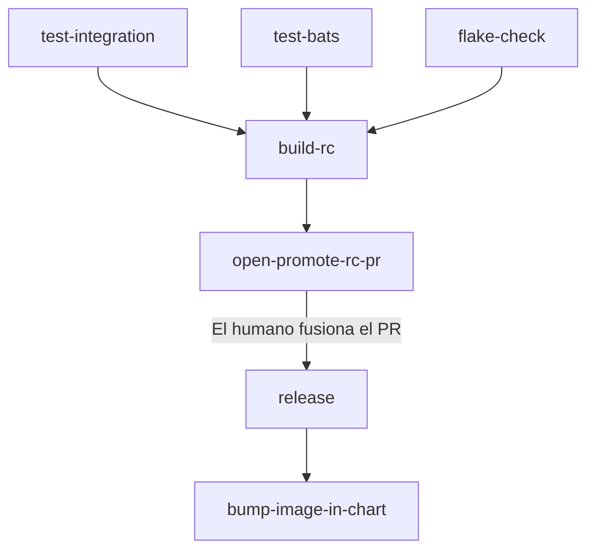

# CI/CD e Ingeniería de Versiones

Esta página recorre el viaje completo de un cambio de código — desde el momento en que un desarrollador abre una solicitud de extracción, hasta llegar a producción. Hay tres sistemas principales involucrados:

- **GitHub Actions** valida el código en cada solicitud de extracción.
- **Concourse** construye versiones, prueba gráficos Helm y despliega en entornos.
- **Cepler** controla qué entornos se actualizan y en qué orden.

La filosofía de diseño es simple: cada paso debe completarse antes de que comience el siguiente, y hay puntos de control humanos en los momentos más importantes. Nada llega a producción por accidente.

## Descripción General de Alto Nivel


```mermaid
graph LR
    subgraph GH["GitHub Actions (PR Checks)"]
        A1["nextest"]
        A2["bats"]
        A3["cypress"]
        A4["check-code-apps"]
        A5["flake-check"]
        A6["codeql + pnpm audit"]
    end
    subgraph CONC_REL["Concourse: lana-bank pipeline"]
        B1["test-integration"]
        B2["test-bats"]
        B3["flake-check"]
        B4["build-rc"]
        B5["release"]
        B6["bump-image-in-chart"]
    end
    subgraph CONC_CHARTS["Concourse: galoy-private-charts"]
        C1["testflight"]
        C2["bump-in-deployments"]
    end
    subgraph DEPLOY["galoy-deployments + Cepler"]
        D1["staging"]
        D2["qa"]
        D3["production"]
    end
    GH -->|"merge to main"| CONC_REL
    CONC_REL -->|"image digests"| CONC_CHARTS
    CONC_CHARTS -->|"vendir sync"| DEPLOY
```

Ahora recorramos cada paso en detalle.

---

## Paso 1: Verificaciones de Solicitud de Extracción (GitHub Actions)

Cuando un desarrollador abre una solicitud de extracción contra `main`, GitHub Actions inicia un conjunto de verificaciones que se ejecutan todas en paralelo. Cada una debe completarse exitosamente antes de que la PR pueda fusionarse — no hay excepciones.

### Qué se verifica

| Flujo de trabajo | Qué hace | Por qué es importante |
|----------|-------------|----------------|
| **nextest** | Ejecuta todas las pruebas unitarias y de integración de Rust mediante `nix run .#nextest` | Detecta errores lógicos y regresiones en el backend |
| **bats** | Levanta la pila completa de la aplicación y ejecuta pruebas de extremo a extremo BATS contra ella | Verifica que todo el sistema funcione en conjunto, no solo piezas individuales |
| **cypress** | Ejecuta pruebas de navegador Cypress contra el panel de administración y el portal del cliente | Asegura que la interfaz de usuario realmente funcione; también genera capturas de pantalla para manuales regulatorios |
| **check-code-apps** | Ejecuta linting, verificación de tipos y construcción de ambos frontends de Next.js | Detecta errores de TypeScript, violaciones de linting y construcciones rotas en el frontend |
| **flake-check** | Ejecuta `nix flake check` para validar el flake de Nix | Garantiza que el sistema de construcción en sí esté saludable |
| **codeql** | Análisis estático CodeQL de GitHub para JS/TS y Rust | Encuentra vulnerabilidades de seguridad potenciales mediante análisis estático |
| **pnpm-audit** | Audita las dependencias de npm en busca de vulnerabilidades conocidas | Bloquea PRs que introduzcan dependencias con CVEs de alta severidad |
| **data-pipeline** | Aprovisiona un entorno BigQuery desechable, ejecuta las pruebas del pipeline de datos y luego lo destruye | Valida que el pipeline de datos Dagster/dbt siga funcionando con cambios de esquema |
| **cocogitto** | Verifica que los mensajes de commit sigan el formato de commits convencionales | Necesario porque el número de versión y el registro de cambios se generan automáticamente a partir de los mensajes de commit |
| **spelling** | Ejecuta la herramienta `typos` para detectar errores ortográficos comunes | Simple pero detecta errores ortográficos vergonzosos en código y documentación |
| **lana-bank-docs** | Construye el sitio completo de documentación (documentación de API, documentación versionada, validación de capturas de pantalla) | Detecta construcciones de documentación rotas, descripciones de API faltantes y configuración inválida del sitio de documentación |

### Cómo el almacenamiento en caché de Nix hace que esto sea rápido

Compilar el código base de Rust desde cero lleva mucho tiempo. Para evitar hacerlo en cada PR, todos los flujos de trabajo de GitHub Actions extraen binarios preconstruidos de una caché binaria compartida de **Cachix** llamada `galoymoney`.

Este es el patrón que verás en cada archivo de flujo de trabajo:

```yaml
- uses: DeterminateSystems/nix-installer-action@v16
- uses: cachix/cachix-action@v15
  with:
    name: galoymoney
    authToken: ${{ secrets.CACHIX_AUTH_TOKEN }}
    skipPush: true
```

La parte `skipPush: true` es clave — GitHub Actions solo **lee** de la caché, nunca escribe en ella. La caché se puebla mediante un pipeline separado de Concourse (descrito en la sección [Pipeline de Caché de Nix](#nix-cache-pipeline) más abajo). Esta separación existe porque Concourse tiene trabajadores de almacenamiento en caché potentes con almacenamiento persistente, mientras que los ejecutores de GitHub Actions son efímeros y producirían envíos redundantes.

La mayoría de los flujos de trabajo también recuperan 10-20 GB de espacio en disco al inicio eliminando software preinstalado (imágenes de Docker, Android SDK, etc.) que los ejecutores de GitHub traen por defecto. Las grandes compilaciones de Rust necesitan ese espacio de maniobra.

### Qué sucede cuando falla una verificación

Si alguna verificación falla, el PR se bloquea y no puede fusionarse. El desarrollador corrige el problema, vuelve a enviar los cambios y las verificaciones se ejecutan nuevamente. No hay forma de evitar una verificación fallida.

---

## Paso 2: Construcción de una versión (Concourse, repositorio lana-bank)

Una vez que un PR se fusiona en `main`, el pipeline de lanzamiento de Concourse toma el control. Este pipeline se encuentra en el directorio `ci/release/` del repositorio lana-bank y está escrito usando plantillas de [YTT](https://carvel.dev/ytt/).

El pipeline tiene una cadena de dependencias clara:


```mermaid
graph TD
    TI["test-integration"] --> BRC["build-rc"]
    TB["test-bats"] --> BRC
    FC["flake-check"] --> BRC
    BRC --> OPR["open-promote-rc-pr"]
    OPR -->|"El humano fusiona el PR"| REL["release"]
    REL --> BIC["bump-image-in-chart"]
```

### 2a. Volver a ejecutar las pruebas en main

Podrías preguntarte: ya ejecutamos las pruebas en GitHub Actions en el PR, ¿por qué ejecutarlas de nuevo? Porque el PR se probó contra una versión potencialmente desactualizada de `main`. Entre el momento en que se abrió el PR y el momento en que se fusionó, es posible que se hayan incorporado otros PRs. Ejecutar las pruebas nuevamente en el commit fusionado real detecta problemas de integración que solo aparecen cuando se combinan múltiples cambios.

Tres trabajos se ejecutan en paralelo:

- **test-integration** ejecuta `cargo nextest` — el mismo conjunto de pruebas de Rust de las verificaciones del PR.
- **test-bats** ejecuta las pruebas end-to-end de BATS (con hasta 2 intentos, ya que las pruebas E2E pueden ser inestables).
- **flake-check** valida el flake de Nix.

Los tres deben pasar antes de que se construya cualquier cosa.

### 2b. Construir el candidato de lanzamiento (`build-rc`)

Una vez que las pruebas pasan, el pipeline construye un candidato de lanzamiento (RC). La idea detrás de los RCs es que puedes construir y probar múltiples candidatos antes de comprometerte con un lanzamiento final. Esto es lo que sucede:

1. **Determinar el número de versión.** Un script de Nix llamado `next-version` usa [cocogitto](https://docs.cocogitto.io/) para escanear los mensajes de commits convencionales desde el último lanzamiento y determinar la siguiente versión semántica. Por ejemplo, si el último lanzamiento fue `0.41.0` y ha habido un commit `feat:`, la siguiente versión se convierte en `0.42.0-rc.1`. Si ya se construyó otro RC para esta versión, se incrementa a `rc.2`, `rc.3`, y así sucesivamente.

2. **Inyectar la versión en las aplicaciones frontend.** El script `prep-release-apps.sh` escribe `NEXT_PUBLIC_APP_VERSION=0.42.0-rc.1` en los archivos `.env` tanto del panel de administración como del portal del cliente, para que la interfaz de usuario pueda mostrar qué versión se está ejecutando.

3. **Compilar el binario de Rust.** `nix build --impure .#lana-cli-release` produce el binario `lana-cli`. La bandera `--impure` es necesaria porque la construcción lee variables de entorno como `VERSION` y `COMMITHASH` que fueron establecidas por el pipeline de CI.

4. **Construir cuatro imágenes Docker** y subirlas a Google Artifact Registry (`gcr.io/galoyorg`):
   - **`lana-bank`** — el servidor principal (construido desde `Dockerfile.rc`, que copia el binario precompilado en una imagen base distroless)
   - **`lana-bank-admin-panel`** — el frontend del panel de administración
   - **`lana-bank-customer-portal`** — el frontend del portal del cliente
   - **`dagster-code-location-lana-dw`** — el código del pipeline de datos de Dagster

5. **Etiquetar las imágenes.** Cada imagen recibe tanto una etiqueta `edge` (que significa "último RC") como una etiqueta específica de versión como `0.42.0-rc.1`.

### 2c. Apertura del PR Promote-RC (`open-promote-rc-pr`)

Después de que se construyen las imágenes RC, el pipeline abre automáticamente un pull request de vuelta en el repositorio lana-bank. Este PR realiza varias acciones:

- Genera una entrada de **CHANGELOG** usando [git-cliff](https://git-cliff.org/), que lee los mensajes de commit convencionales y los agrupa en categorías (características, correcciones de errores, etc.).
- Regenera la **documentación de la API** y los **esquemas de eventos**, y crea una instantánea versionada del sitio de documentación.
- Empuja todo a una rama llamada `bot-promote-rc` y abre un **PR borrador** etiquetado como `promote-rc`.

Este PR es la **compuerta humana** en el pipeline. Un ingeniero revisa el changelog para asegurarse de que se vea correcto, verifica que el RC se vea bien en cualquier prueba ad-hoc, y luego fusiona el PR cuando está listo para publicar un release. Nada sucede automáticamente desde aquí — el release solo procede cuando un humano da el "visto bueno".

También hay una verificación de seguridad: la GitHub Action `promote-rc-file-check` verifica que este PR solo modifique los archivos `CHANGELOG.md` y `docs-site/**`. Si el bot incluyó accidentalmente otros cambios, la verificación falla y bloquea la fusión.

### 2d. Publicación del Release Final (`release`)

Cuando alguien fusiona el PR promote-rc, se activa el job `release`. Realiza tres acciones:

1. **Construye las imágenes Docker finales.** Son las mismas cuatro imágenes que el RC, pero ahora etiquetadas con el número de versión limpio (por ejemplo, `0.42.0`) y también `latest`. Las imágenes de release usan `Dockerfile.release` en lugar de `Dockerfile.rc` — la diferencia es que el Dockerfile de release descarga el binario desde los artefactos del release de GitHub en lugar de copiarlo desde un paso de construcción.

2. **Crea un Release en GitHub.** Esto incluye el binario `lana-cli` como artefacto descargable y el changelog como notas de la versión. El release se etiqueta con el número de versión.

3. **Actualiza el contador de versión.** El pipeline almacena la versión actual en una rama git dedicada llamada `version` (solo un archivo de texto con el número de versión). Esta se incrementa para que el siguiente RC comience desde la base correcta.

### 2e. Actualización del Helm Chart (`bump-image-in-chart`)

Inmediatamente después del lanzamiento, el pipeline necesita informar al Helm chart sobre las nuevas imágenes. Lo hace abriendo un PR en el repositorio **galoy-private-charts**:

1. Obtiene el **digest SHA256** de cada imagen Docker recién construida. Se utilizan digests en lugar de etiquetas porque son inmutables — una etiqueta como `latest` puede apuntar a una imagen diferente más adelante, pero un digest siempre se refiere exactamente a los mismos bytes. Esto es importante para la seguridad en producción.

2. Actualiza `values.yaml` en el Helm chart con los nuevos digests y la versión:
   ```yaml
   lanaBank:
     image:
       digest: "sha256:0a858023..." # METADATA:: repository=https://github.com/GaloyMoney/lana-bank;commit_ref=e348f09;app=lana-bank;
     adminPanel:
       image:
         digest: "sha256:acdb373d..."
     customerPortal:
       image:
         digest: "sha256:5d98584b..."
   ```
   Observa el comentario `METADATA` junto a cada digest. Esta es una pista que vincula la imagen con el commit fuente exacto desde el cual fue construida. Es invaluable al depurar problemas en producción — puedes ver el digest de la imagen en ejecución, encontrar este comentario en el chart y rastrearlo hasta el código fuente.

3. También copia los módulos de Terraform (`tf/bq-setup` y `tf/honeycomb`) desde el repositorio fuente al chart, de modo que el chart siempre incluya la configuración de infraestructura correspondiente.

4. Abre un PR en galoy-private-charts con un cuerpo que incluye un enlace al diff del código (por ejemplo, "compare old_ref...new_ref en GitHub"). Esto facilita ver exactamente qué cambios de código están incluidos en esta actualización del chart.

5. Este PR se **fusiona automáticamente** mediante un flujo de trabajo de GitHub (`bot-automerge-lana.yml`) que vigila los PRs con las etiquetas `galoybot` y `lana-bank`. No se necesita intervención humana aquí — el testflight (descrito a continuación) es lo que valida el chart.

### Cómo funcionan los números de versión

Las versiones siguen [Versionado Semántico](https://semver.org/) y se derivan automáticamente de mensajes de commit convencionales usando [cocogitto](https://docs.cocogitto.io/):

- Los commits `feat:` producen un incremento **minor** (ej., 0.41.0 -> 0.42.0)
- Los commits `fix:` producen un incremento **patch** (ej., 0.42.0 -> 0.42.1)
- `feat!:` o `BREAKING CHANGE` producen un incremento **major** (ej., 0.42.0 -> 1.0.0)

Por eso la GitHub Action de `cocogitto` exige el formato de commit convencional en cada PR — si los mensajes de commit no siguen la convención, la versión no puede calcularse automáticamente.

La versión actual se almacena en una rama de git llamada `version` como un archivo de texto plano. Es gestionada por el [recurso semver](https://github.com/concourse/semver-resource) de Concourse.

---

## Paso 3: Probando el Chart de Helm (galoy-private-charts)

El repositorio **galoy-private-charts** contiene el chart de Helm que agrupa lana-bank y todos los servicios que necesita para ejecutarse. Piensa en el chart de Helm como una "receta de despliegue" — describe no solo el servidor lana-bank, sino también la base de datos, el proveedor de identidad, el gateway de API, el pipeline de datos y todo lo demás.

### Qué incluye el chart

| Componente | Qué es | Imagen |
|-----------|-----------|-------|
| servidor lana-bank | La aplicación bancaria principal | `gcr.io/galoyorg/lana-bank` |
| Panel de Administración | Frontend Next.js para operadores del banco | `gcr.io/galoyorg/lana-bank-admin-panel` |
| Portal del Cliente | Frontend Next.js para clientes del banco | `gcr.io/galoyorg/lana-bank-customer-portal` |
| Dagster | Orquestación de pipeline de datos | `us.gcr.io/galoyorg/dagster-code-location-lana-dw` |
| PostgreSQL | Base de datos (subchart de Bitnami) | PostgreSQL de Bitnami |
| Keycloak | Proveedor de identidad con realms de administrador y cliente (subchart de Codecentric) | Keycloak |
| Oathkeeper | Gateway de API que valida JWTs y enruta solicitudes (subchart de Ory) | Ory Oathkeeper |
| OAuth2 Proxy | Proxy de autenticación OAuth2 | OAuth2 Proxy |
| Gotenberg | Generación de PDF/documentos | Gotenberg |

Todas las imágenes de aplicación están fijadas por **digest SHA256** en lugar de etiqueta. Esto garantiza que lo que se probó es exactamente lo que se despliega — no hay posibilidad de que una etiqueta sea redirigida silenciosamente a una imagen diferente.

### El testflight: un despliegue desechable

Cuando el chart cambia (es decir, después de que el PR de actualización de imagen del Paso 2e se fusiona automáticamente), el pipeline de Concourse en este repositorio ejecuta un trabajo llamado **testflight**. El nombre proviene de la idea de un "vuelo de prueba" — despliegas el chart en un entorno temporal y aislado para ver si realmente funciona, y luego desechas el entorno.

Esto es lo que sucede durante un testflight:

1. **Terraform crea un namespace nuevo** en el clúster GKE de staging, con un nombre como `lana-bank-testflight-e348f09`. Provisiona secretos de prueba (credenciales de base de datos, claves de API, etc.) copiándolos del entorno de staging.

2. **Helm instala el chart completo** en este namespace, con un timeout de 15 minutos. Esto despliega el servidor lana-bank, ambos frontends, PostgreSQL, Keycloak, Oathkeeper, Dagster — todo el stack.

3. **Se ejecuta un smoketest** contra los servicios desplegados. Esto verifica que los endpoints principales estén activos y respondiendo.

4. **Terraform destruye el namespace**, limpiando todos los recursos. Ya sea que la prueba haya pasado o fallado, el namespace se elimina.

Si el smoketest falla, el pipeline se detiene aquí. El chart no se promueve hacia adelante, y alguien necesita investigar qué salió mal.

### Enviando el chart a galoy-deployments

Si el testflight pasa, se ejecuta un segundo trabajo: **bump-lana-bank-in-deployments**. Este es el puente entre el repositorio del chart y el repositorio de despliegue.

Realiza un checkout del repositorio **galoy-deployments**, ejecuta `make bump-vendored-ref DEP=lana-bank REF=<git_ref>` para apuntar la configuración de vendir al nuevo commit del chart, luego ejecuta `vendir sync` para realmente extraer los nuevos archivos del chart al directorio vendor. Finalmente, hace commit y push de este cambio a `galoy-deployments/main`.

En este punto, el repositorio de despliegue conoce la nueva versión del chart. El siguiente paso es que Cepler lo tome y comience a desplegar en los entornos.

---

## Paso 4: Despliegue de Entornos (galoy-deployments + Cepler)

El repositorio **galoy-deployments** es donde la teoría se convierte en práctica. Contiene configuraciones de Terraform para cada entorno (staging, QA, producción), el gráfico de Helm vendorizado y la configuración de Cepler que controla la progresión entre entornos.

### ¿Qué es Cepler y por qué lo necesitamos?

[Cepler](https://github.com/bodymindarts/cepler) es una herramienta de promoción de despliegues. El problema que resuelve es directo: cuando tienes múltiples entornos (staging, QA, producción), no quieres que un cambio llegue a producción hasta que haya sido validado primero en los entornos anteriores.

Cepler rastrea qué archivos han cambiado y qué entornos han desplegado exitosamente esos cambios. Aplica reglas como "QA solo puede desplegar cambios que ya hayan tenido éxito en staging". Esto previene el error clásico de desplegar accidentalmente código no probado en producción.

Cepler tiene algunos conceptos fundamentales:

- **Deployment (Despliegue)**: Una unidad de trabajo con nombre (por ejemplo, `lana-bank`). Cada despliegue tiene su propio archivo de configuración y su propio conjunto de entornos.
- **Environment (Entorno)**: Un destino de despliegue como `gcp-galoy-staging` o `gcp-volcano-qa`. Cada entorno define qué patrones de archivo monitorea en busca de cambios.
- **`latest`**: Una lista de patrones glob. Cuando cambian archivos que coinciden con estos patrones, Cepler considera que este entorno está "desactualizado" y activa un despliegue.
- **`passed`**: El nombre de otro entorno que debe haber desplegado exitosamente los mismos cambios primero. Así es como creas una cadena de promoción (staging -> QA -> producción).
- **`propagated`**: Archivos que deben heredarse del entorno `passed` en lugar de rastrearse independientemente. Así es como el código de módulos compartidos fluye desde staging a QA sin que QA necesite rastrear esos archivos de forma independiente.
- **Archivos de estado**: Cepler mantiene archivos de estado en el directorio `.cepler/` que registran exactamente qué commit y versiones de archivos se han desplegado en cada entorno.

### Configuración de Cepler en la práctica

Aquí hay una versión simplificada de la configuración de Cepler para lana-bank:

```yaml

# cepler/lana-bank.yml

deployment: lana-bank
environments:
  gcp-galoy-staging:
    latest:
      - modules/lana-bank/**
      - modules/lana-bank-gcp-pg/**
      - modules/infra/vendor/tf/postgresql/**
      - gcp/galoy-staging/shared/*
      - gcp/galoy-staging/lana-bank/*

  gcp-volcano-qa:
    passed: gcp-galoy-staging
    propagated:
      - modules/lana-bank/**
      - modules/lana-bank-gcp-pg/**
      - modules/infra/vendor/tf/postgresql/**
    latest:
      - gcp/volcano-qa/shared/*
      - gcp/volcano-qa/lana-bank/*

  azure-volcano-staging:
    latest:
      - modules/lana-bank/**
      - modules/lana-bank-azure-pg/**
      - modules/infra/vendor/tf/postgresql/**
      - azure/volcano-staging/lana-bank/*
```

Leyendo esto de arriba hacia abajo:

- **Staging** (`gcp-galoy-staging`) monitorea el módulo lana-bank, el módulo PostgreSQL de GCP y su propia configuración específica del entorno. Cada vez que cambia cualquiera de esos archivos, staging obtiene un nuevo despliegue.

- **QA** (`gcp-volcano-qa`) tiene `passed: gcp-galoy-staging`, lo que significa que solo desplegará cambios que ya se hayan desplegado exitosamente en staging. La sección `propagated` enumera los módulos compartidos — Cepler hereda las versiones probadas en staging de estos archivos en lugar de rastrearlos independientemente. QA también monitorea su propia configuración específica del entorno en `latest`, por lo que los cambios en configuraciones exclusivas de QA se despliegan inmediatamente sin esperar a staging.

- **Azure staging** (`azure-volcano-staging`) es una pista independiente. Utiliza un módulo de base de datos diferente (`lana-bank-azure-pg` en lugar de `lana-bank-gcp-pg`) y tiene sus propios patrones de archivos. No depende del entorno staging de GCP — es una nube separada.

### Cómo funciona Cepler con Concourse

El pipeline de Concourse de galoy-deployments utiliza dos tipos de recursos personalizados para integrarse con Cepler:

1. **`cepler-in`** es un recurso de Concourse que verifica periódicamente la rama git `cepler-gates`. Cuando detecta que hay cambios pendientes para un entorno determinado (según las reglas en la configuración de cepler), activa un trabajo de despliegue.

2. El trabajo de despliegue luego realiza el trabajo real: ejecuta Terraform para aprovisionar bases de datos y configurar secretos, despliega el chart de Helm en Kubernetes y ejecuta cualquier verificación posterior al despliegue.

3. **`cepler-out`** se invoca después de un despliegue exitoso. Actualiza el archivo de estado de cepler, registrando que este entorno ahora está en la nueva versión. Esto es lo que desbloquea los entornos posteriores — cuando se actualiza el estado de staging, Cepler sabe que QA ahora puede proceder.

Si un despliegue falla, el estado no se actualiza y los entornos posteriores permanecen bloqueados. Esta es la red de seguridad que evita que el código defectuoso se propague en cascada a través de los entornos.

### Estructura del repositorio

```
galoy-deployments/
├── modules/
│   ├── lana-bank/                   # Módulo de despliegue base
│   │   ├── main.tf                  # Terraform: despliega versión Helm
│   │   ├── variables.tf             # Variables de entrada (dominio, flags, etc.)
│   │   ├── lana-bank-values.yml.tmpl  # Plantilla de valores Helm
│   │   └── vendor/lana-bank/        # Chart versionado de galoy-private-charts
│   ├── lana-bank-gcp-pg/           # Aprovisiona 3 instancias PostgreSQL en GCP
│   └── lana-bank-azure-pg/         # Aprovisiona PostgreSQL en Azure
├── gcp/
│   ├── galoy-staging/
│   │   ├── shared/                  # Configuración de proyecto GCP compartida por todos los módulos
│   │   └── lana-bank/main.tf       # Configuraciones específicas de staging
│   └── volcano-qa/
│       └── lana-bank/main.tf       # Configuraciones específicas de QA
├── azure/
│   └── volcano-staging/
│       └── lana-bank/main.tf       # Configuraciones de staging en Azure
├── cepler/
│   ├── lana-bank.yml               # Reglas de progresión de entornos
│   └── .cepler/lana-bank/          # Archivos de estado (uno por entorno)
└── vendir.yml                       # Configuración de Vendir para sincronización de charts
```

### Sobrescritura de módulos

El módulo base en `modules/lana-bank/` define la lógica de despliegue común. Luego, cada entorno instancia este módulo con su propia configuración. Así es como puedes tener el mismo código de aplicación ejecutándose en diferentes configuraciones en distintos entornos.

Por ejemplo, staging habilita el tiempo artificial (útil para probar funcionalidades dependientes del tiempo como el devengo de intereses) y apunta a un dominio de staging:

```hcl

# gcp/galoy-staging/lana-bank/main.tf

module "lana-bank" {
  source                 = "../../../modules/lana-bank/"
  lana_domain            = "staging.galoy.io"
  enable_artificial_time = true
  additional_bq_owners   = ["dev-team@galoy.io"]
}
```

Mientras que producción deshabilita el tiempo artificial y usa el dominio real:

```hcl

# gcp/volcano-production/lana-bank/main.tf

module "lana-bank" {
  source                 = "../../../modules/lana-bank/"
  lana_domain            = "app.lana.galoy.io"
  enable_artificial_time = false
}
```

El módulo de base de datos (`lana-bank-gcp-pg`) aprovisiona tres instancias PostgreSQL separadas para el servidor lana-bank, Dagster y Keycloak respectivamente. Cada entorno puede configurarlas de forma diferente (por ejemplo, habilitando alta disponibilidad y replicación para producción, pero no para staging).

### Cómo sincroniza Vendir el chart

[Vendir](https://carvel.dev/vendir/) es una herramienta del proyecto Carvel que "vende" (copia) dependencias externas en un repositorio. En galoy-deployments, se utiliza para extraer el chart de Helm lana-bank desde galoy-private-charts hacia un directorio local `vendor/`.

La configuración se ve así:

```yaml

# vendir.yml (simplificado)

directories:
  - path: modules/lana-bank/vendor/lana-bank
    contents:
      - path: chart
        git:
          url: git@github.com:GaloyMoney/galoy-private-charts.git
          ref: c81465e06a81725560919ef746d0e1a0e4f8a2ac
        includePaths:
          - charts/lana-bank/**/*
        newRootPath: charts/lana-bank
```

Cuando se ejecuta el job `bump-lana-bank-in-deployments` (desde el Paso 3b), actualiza el campo `ref` para apuntar al nuevo commit del chart y ejecuta `vendir sync`. Vendir entonces clona el repositorio galoy-private-charts en ese commit exacto, extrae los archivos del chart y los copia en el directorio vendor. De esta manera, galoy-deployments siempre tiene una copia completa y autónoma del chart — nunca accede a otro repositorio en tiempo de despliegue.

---

## Paso 5: Promoción a Producción

Los despliegues a producción siguen el mismo patrón impulsado por Cepler que staging y QA, pero con una capa adicional de supervisión humana.

1. **Los cambios deben pasar primero por staging.** El campo `passed:` de la configuración de cepler garantiza que cualquier cambio dirigido a producción ya se haya desplegado exitosamente en staging (y potencialmente en QA). Si staging está roto, ni siquiera se intentará producción.

2. **La rama `cepler-gates` añade una compuerta manual.** Incluso después de que staging tenga éxito, producción no se despliega automáticamente. El repositorio galoy-deployments tiene una rama git especial llamada `cepler-gates` que contiene controles de promoción. Cepler verifica esta rama para determinar si un despliegue a producción está "permitido".

3. **Un humano aprueba la promoción.** Para liberar a producción, un ingeniero actualiza la rama `cepler-gates` para indicar que la versión actual de staging está aprobada para producción. Esta es una acción explícita y auditable.

4. **Cepler detecta que la compuerta está abierta** y el pipeline de Concourse despliega a producción usando Terraform y Helm, tal como lo hace para staging. Después de un despliegue exitoso, se actualiza el estado de cepler.

Este diseño significa que siempre sabes exactamente qué se está ejecutando en producción, y siempre puedes rastrearlo a través de QA, staging, el chart de Helm, las imágenes Docker, hasta llegar al commit de origen.

---

## Pipeline de Caché Nix

Junto al pipeline de lanzamiento, existe un pipeline de Concourse independiente dedicado a mantener activa la **caché binaria de Cachix**. Este pipeline está definido en `ci/nix-cache/pipeline.yml` en el repositorio lana-bank.

### ¿Por qué existe esto?

Compilar Rust desde cero es lento. El código base de lana-bank tiene muchas dependencias, y una compilación en frío puede llevar mucho tiempo. El pipeline de caché Nix garantiza que los binarios precompilados estén siempre disponibles, para que tanto los desarrolladores como los sistemas de CI puedan omitir el paso de compilación y simplemente descargar el resultado.

La caché está alojada en [Cachix](https://app.cachix.org/) bajo el nombre `galoymoney`.

### Cómo funciona en la práctica

Existe una separación intencional de responsabilidades entre Concourse y GitHub Actions:

- **Concourse** hace el trabajo pesado: construye las derivaciones de Nix y las **envía** a la caché de Cachix. Los workers de Concourse tienen almacenamiento persistente y pueden ejecutar compilaciones largas de manera eficiente.
- **GitHub Actions** es un consumidor: **lee** de la caché (con `skipPush: true`) pero nunca escribe en ella. Los runners de GitHub Actions son efímeros, y hacer que envíen a la caché produciría muchas cargas redundantes.

Esta separación mantiene las cosas eficientes y evita la contaminación de la caché por ejecuciones paralelas de GitHub Actions.

### Trabajos del pipeline de caché

| Trabajo | Cuándo se ejecuta | Qué hace |
|-----|-------------|-------------|
| **build-release-main** | En cada push a `main` | Construye el binario de lanzamiento y envía todas las derivaciones a Cachix. Esto mantiene la caché actualizada para la ruta de compilación más común. |
| **cache-dev-profile** | Cuando se abre o actualiza un PR | Cachea el shell `nix develop` y los scripts de utilidad de CI. Esto hace que `nix develop` sea rápido para los desarrolladores que usan Cachix localmente. |
| **populate-nix-cache-pr** | Cuando se abre o actualiza un PR | El principal motor de trabajo. Construye derivaciones por etapas: primero `lana-deps` (el árbol de dependencias de Rust), luego `nextest`, `simulation`, `lana-cli-debug` y `bats` en paralelo, y finalmente `nix flake check` y la compilación de lanzamiento completa. Cada derivación se envía a Cachix tan pronto como se completa. |
| **rebuild-nix-cache** | Activación manual | Recorre todos los PRs abiertos y vuelve a activar las compilaciones de caché para ellos. Útil cuando la caché se ha vuelto obsoleta o ha cambiado una dependencia. |

### La experiencia del desarrollador

Cuando todo funciona correctamente, esto es lo que ve un desarrollador:

1. Abre un PR.
2. En segundo plano, el trabajo de Concourse `populate-nix-cache-pr` comienza a construir las derivaciones para el código de ese PR.
3. GitHub Actions también comienza a ejecutarse, pero muchas de las derivaciones de Nix que necesita ya están en la caché del paso 2 (o de una compilación anterior de `main`), por lo que descarga binarios precompilados en lugar de compilarlos.
4. Si la compilación de caché de Concourse finaliza antes de que GitHub Actions necesite una derivación en particular, el trabajo de GitHub Actions obtiene un acierto de caché y procede rápidamente. Si no, el trabajo puede compilarlo desde cero, pero la siguiente ejecución será más rápida.

El script de utilidad `wait-cachix-paths` está disponible para casos en los que un paso de CI necesita esperar a que se complete la caché antes de continuar. Sondea la API de Cachix hasta que la derivación solicitada esté disponible.

Los desarrolladores también pueden usar la caché localmente ejecutando `cachix use galoymoney`. Después de eso, `nix develop` y `nix build` descargarán artefactos precompilados siempre que sea posible.

---

## Juntando Todo

Aquí está el recorrido completo una vez más, pero ahora deberías entender qué está sucediendo en cada paso y por qué:

1. **El desarrollador abre un PR.** GitHub Actions ejecuta más de 10 verificaciones en paralelo (pruebas, lint, escaneos de seguridad). Mientras tanto, Concourse comienza a precompilar derivaciones de Nix y las envía a Cachix.

2. **El PR se fusiona en `main`.** Concourse vuelve a ejecutar las pruebas contra el commit fusionado real para detectar problemas de integración. En caso de éxito, construye un candidato de lanzamiento: cuatro imágenes de Docker etiquetadas con una versión RC.

3. **El pipeline abre un PR promote-rc.** Este PR contiene el CHANGELOG generado y la documentación actualizada. Un ingeniero lo revisa y lo fusiona cuando está listo para lanzar. Este es el primer punto de control humano.

4. **Se ejecuta el trabajo de lanzamiento.** Construye las imágenes finales de Docker, crea un GitHub Release y actualiza los resúmenes de imagen en el chart de Helm galoy-private-charts.

5. **El PR del chart se fusiona automáticamente en galoy-private-charts.** Concourse despliega el chart en un namespace testflight desechable, ejecuta una prueba de humo y lo desmonta. Si pasa, la referencia del chart se envía a galoy-deployments.

6. **Cepler detecta el cambio en galoy-deployments.** Despliega primero en staging. Solo después de que staging tenga éxito, QA se vuelve elegible.

7. **Un ingeniero aprueba la puerta de producción.** Actualiza la rama `cepler-gates`, Cepler detecta el cambio y Concourse despliega a producción. Este es el segundo punto de control humano.

En cualquier momento, puedes rastrear lo que se está ejecutando en un entorno hasta el commit de origen, a través del estado de cepler, la configuración de vendir, los comentarios de metadatos del values.yaml del chart, el resumen de la imagen de Docker y el GitHub Release.

---

## Referencia Rápida

| Herramienta | Qué hace | Dónde se configura |
|------|-------------|----------------------|
| **GitHub Actions** | Ejecuta comprobaciones de validación de PR | `.github/workflows/` en lana-bank |
| **Concourse** | Construye versiones, prueba charts, despliega en entornos | `ci/` en lana-bank, galoy-private-charts y galoy-deployments |
| **Cachix** | Almacena binarios Nix precompilados (caché `galoymoney`) | Pipeline nix-cache de Concourse + flujos de trabajo de GitHub Actions |
| **YTT** | Plantillas YAML de pipeline de Concourse | `ci/release/` y `ci/nix-cache/` en lana-bank |
| **Cocogitto** | Calcula la siguiente versión desde commits convencionales | `cog.toml` en lana-bank |
| **git-cliff** | Genera el CHANGELOG desde commits convencionales | `ci/vendor/config/git-cliff.toml` en lana-bank |
| **Vendir** | Importa el chart Helm desde galoy-private-charts a galoy-deployments | `vendir.yml` en galoy-deployments |
| **Cepler** | Controla la promoción de entornos (staging → QA → producción) | `cepler/*.yml` en galoy-deployments |
| **Helm** | Empaqueta la aplicación y sus dependencias para Kubernetes | `charts/lana-bank/` en galoy-private-charts |
| **Terraform / OpenTofu** | Aprovisiona bases de datos, secretos y despliega releases de Helm | `modules/` en galoy-deployments |
