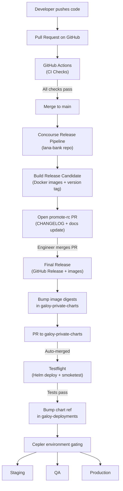
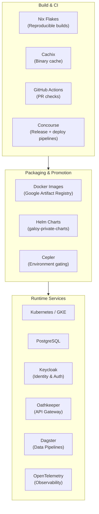

# Despliegue e Ingeniería de Lanzamientos

Llevar el código desde la computadora de un desarrollador hasta producción implica varios sistemas trabajando juntos. Esta sección explica cada paso de ese recorrido — desde cómo compilamos el software, hasta cómo se prueba, se empaqueta en imágenes Docker, se agrupa en charts de Helm y finalmente se despliega en múltiples entornos.

Si eres nuevo en el proyecto, comienza con la página [CI/CD e Ingeniería de Lanzamientos](ci-cd). Recorre todo el pipeline de principio a fin en el orden en que las cosas realmente suceden.

## El Panorama General

El diagrama a continuación muestra la ruta completa que sigue un cambio de código. No te preocupes si parece mucho — cada paso se explica en detalle en las páginas enlazadas.

```mermaid
graph TD
    DEV["Developer pushes code"] --> PR["Pull Request on GitHub"]
    PR --> GHA["GitHub Actions<br/>(CI Checks)"]
    GHA -->|"All checks pass"| MERGE["Merge to main"]
    MERGE --> CONC["Concourse Release Pipeline<br/>(lana-bank repo)"]
    CONC --> RC["Build Release Candidate<br/>(Docker images + version tag)"]
    RC --> PROMOTE_PR["Open promote-rc PR<br/>(CHANGELOG + docs update)"]
    PROMOTE_PR -->|"Engineer merges PR"| REL["Final Release<br/>(GitHub Release + images)"]
    REL --> BUMP["Bump image digests<br/>in galoy-private-charts"]
    BUMP --> CHARTS_PR["PR to galoy-private-charts"]
    CHARTS_PR -->|"Auto-merged"| TF["Testflight<br/>(Helm deploy + smoketest)"]
    TF -->|"Tests pass"| DEPLOY_BUMP["Bump chart ref<br/>in galoy-deployments"]
    DEPLOY_BUMP --> CEPLER["Cepler environment gating"]
    CEPLER --> STAGING["Staging"]
    CEPLER --> QA["QA"]
    CEPLER --> PROD["Production"]
```

En resumen: el código pasa por **tres repositorios** antes de llegar a producción. Cada repositorio tiene su propio pipeline de CI, y cada uno añade una capa de validación.

## Tres Repositorios, Tres Pipelines

| Repositorio | Qué contiene | Qué hace su CI |
|------------|----------------|-----------------|
| **lana-bank** | Código fuente de la aplicación | Ejecuta pruebas en los PRs (GitHub Actions), compila imágenes Docker y crea lanzamientos (Concourse) |
| **galoy-private-charts** | Chart de Helm que agrupa la aplicación con todas sus dependencias | Despliega el chart en un namespace temporal para verificar que funciona ("testflight"), luego avanza la referencia del chart |
| **galoy-deployments** | Configuraciones de Terraform por entorno y reglas de control de Cepler | Despliega en staging, QA y producción — en ese orden, con controles de seguridad entre cada uno |

## La Pila Tecnológica

```mermaid
graph TD
    subgraph Build["Build & CI"]
        NIX["Nix Flakes<br/>(Reproducible builds)"]
        CACHIX["Cachix<br/>(Binary cache)"]
        GHA2["GitHub Actions<br/>(PR checks)"]
        CONC2["Concourse<br/>(Release + deploy pipelines)"]
    end
    subgraph Packaging["Packaging & Promotion"]
        DOCKER["Docker Images<br/>(Google Artifact Registry)"]
        HELM["Helm Charts<br/>(galoy-private-charts)"]
        CEPLER2["Cepler<br/>(Environment gating)"]
    end
    subgraph Runtime["Runtime Services"]
        K8S["Kubernetes / GKE"]
        PG["PostgreSQL"]
        KC["Keycloak<br/>(Identity & Auth)"]
        OAT["Oathkeeper<br/>(API Gateway)"]
        DAG["Dagster<br/>(Data Pipelines)"]
        OTEL["OpenTelemetry<br/>(Observability)"]
    end
    Build --> Packaging --> Runtime
```

## Próximos Pasos

- **[Sistema de Compilación](build-system)** — Cómo funcionan las compilaciones de Nix, cómo el caché binario de Cachix mantiene todo rápido y cómo se producen las imágenes de Docker.
- **[CI/CD e Ingeniería de Releases](ci-cd)** — La guía principal. Recorre cada paso desde un PR hasta producción, incluyendo GitHub Actions, pipelines de Concourse, pruebas de charts de Helm, control de entornos con Cepler y promoción a producción.
