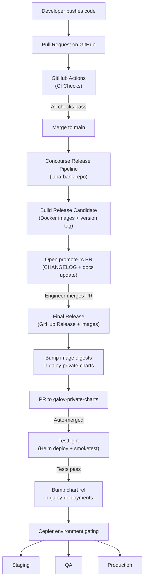
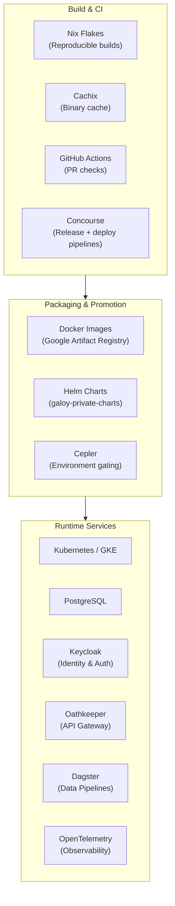

# Despliegue e Ingeniería de Releases

Llevar el código desde la laptop de un desarrollador hasta producción involucra varios sistemas trabajando en conjunto. Esta sección explica cada paso de ese recorrido — desde cómo construimos el software, hasta cómo se prueba, se empaqueta en imágenes Docker, se agrupa en charts de Helm, y finalmente se despliega en múltiples entornos.

Si eres nuevo en el proyecto, comienza con la página de [CI/CD e Ingeniería de Releases](ci-cd). Allí se recorre el pipeline completo de principio a fin, en el orden en que las cosas realmente suceden.

## La Visión General

El diagrama a continuación muestra el camino completo que toma un cambio de código. No te preocupes si parece mucho — cada paso se explica en detalle en las páginas enlazadas.

En resumen: el código pasa por **tres repositorios** antes de llegar a producción. Cada repositorio tiene su propio pipeline de CI, y cada uno agrega una capa de validación.

## Tres Repositorios, Tres Pipelines

| Repositorio | Qué contiene | Qué hace su CI |
|-------------|-------------|----------------|
| **lana-bank** | Código fuente de la aplicación | Ejecuta pruebas en PRs (GitHub Actions), construye imágenes Docker y crea releases (Concourse) |
| **galoy-private-charts** | Chart de Helm que agrupa la app con todas sus dependencias | Despliega el chart en un namespace temporal para verificar que funciona ("testflight"), luego avanza la referencia del chart |
| **galoy-deployments** | Configuraciones de Terraform por entorno y reglas de control de Cepler | Despliega a staging, QA y producción — en ese orden, con puertas de seguridad entre cada uno |

## El Stack Tecnológico

## Qué Leer a Continuación

- **[Sistema de Build](build-system)** — Cómo funcionan los builds con Nix, cómo la caché binaria de Cachix mantiene las cosas rápidas, y cómo se producen las imágenes Docker.
- **[CI/CD e Ingeniería de Releases](ci-cd)** — La guía principal. Recorre cada paso desde un PR hasta producción, incluyendo GitHub Actions, pipelines de Concourse, pruebas de charts de Helm, control de entornos con Cepler, y promoción a producción.
