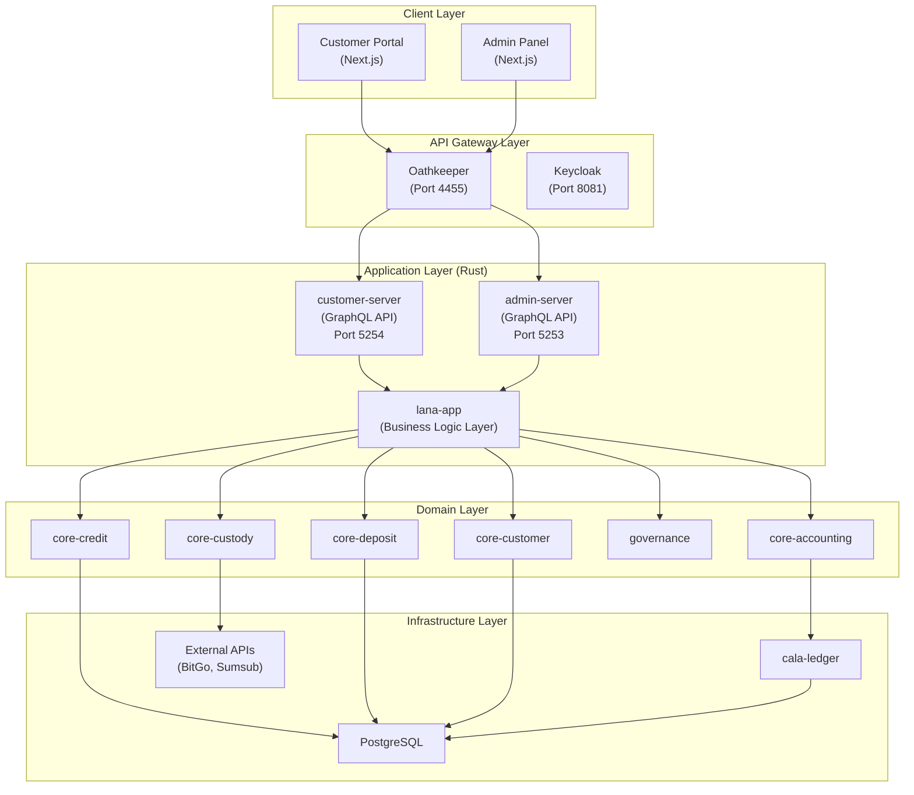
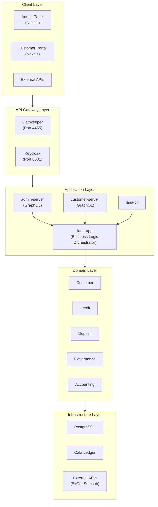
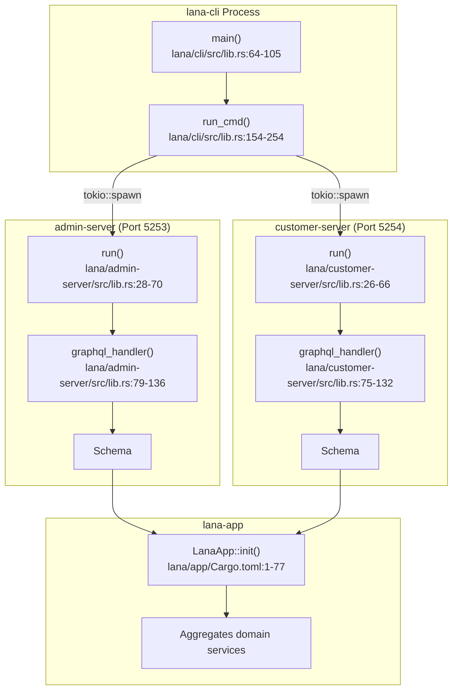
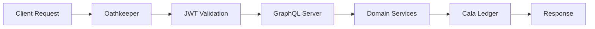
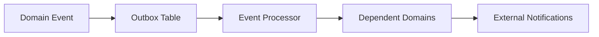

# Arquitectura del Sistema

Este documento describe la arquitectura del sistema de Lana, incluyendo capas, componentes y flujo de datos.

## Resumen de Capas del Sistema

Lana sigue una arquitectura por capas que separa las responsabilidades y permite el mantenimiento:

## Capa de Cliente

### Panel de Administración

Aplicación web para operaciones bancarias:
- Gestión de clientes
- Administración de créditos
- Informes financieros
- Configuración

### Portal del Cliente

Interfaz de cara al cliente:
- Vista de cuenta
- Solicitudes de crédito
- Historial de transacciones
- Documentos

## Capa de API Gateway

### Oathkeeper (Puerto 4455)

Gestiona la validación de JWT y el enrutamiento de solicitudes:
- Valida los tokens emitidos por Keycloak
- Enruta las solicitudes a los servidores apropiados
- Aplica políticas de autenticación

### Keycloak (Puerto 8081)

Gestión de identidad y acceso:
- Dos reinos: `admin` y `customer`
- OAuth 2.0 / OpenID Connect
- Autenticación de usuarios y gestión de sesiones

## Capa de Aplicación

### admin-server

API GraphQL para operaciones administrativas:
- Acceso completo al sistema
- Autorización basada en RBAC
- Se conecta al reino admin de Keycloak

### customer-server

API GraphQL para operaciones de clientes:
- Alcance limitado a los datos propios del cliente
- Interfaz simplificada
- Se conecta al reino customer de Keycloak

### lana-cli

Herramienta de línea de comandos para:
- Iniciar servidores
- Ejecutar migraciones
- Tareas administrativas
- Operaciones por lotes

### lana-app

Orquestador central de la lógica de negocio:
- Inicializa todos los servicios de dominio
- Coordina operaciones entre dominios
- Gestiona el ciclo de vida de la aplicación

## Capa de Dominio

Implementa la lógica de negocio principal usando Diseño Orientado al Dominio:

| Dominio | Propósito |
|--------|---------|
| Customer | Ciclo de vida del cliente y KYC |
| Credit | Facilidades de crédito y desembolsos |
| Deposit | Cuentas de depósito y retiros |
| Governance | Flujos de aprobación multipartita |
| Accounting | Gestión de períodos financieros |

## Capa de Infraestructura

### PostgreSQL

Almacén de datos principal:
- Almacenamiento de eventos
- Estado de entidades
- Registros de auditoría

### Cala Ledger

Sistema de contabilidad por partida doble:
- Jerarquía de cuentas
- Registro de transacciones
- Cálculo de saldos

### Integraciones Externas

- **BitGo/Komainu**: Custodia de criptomonedas
- **Sumsub**: Verificación KYC
- **SMTP**: Notificaciones por correo electrónico

## Flujo de Datos

### Procesamiento de Solicitudes

### Flujo de Eventos

## Decisiones Arquitectónicas Clave

### Event Sourcing

Todos los cambios de estado se capturan como eventos:
- Registro de auditoría completo
- Consultas temporales
- Capacidad de reproducción de eventos

### Arquitectura Hexagonal

Separación clara de responsabilidades:
- Lógica de dominio aislada de la infraestructura
- Patrón adaptador para servicios externos
- Lógica de negocio testeable

### Patrón CQRS

Segregación de responsabilidad de comandos y consultas:
- Rutas de lectura optimizadas
- Operaciones de escritura separadas
- Consistencia eventual cuando sea apropiado
