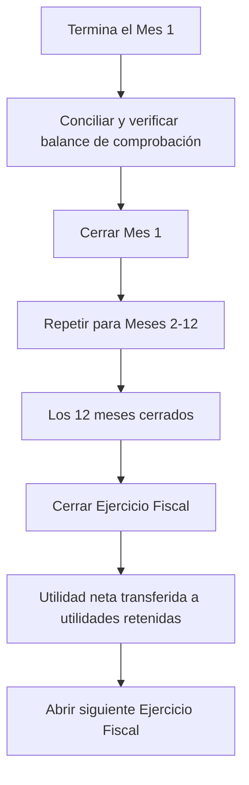

# Cierre de Período

El cierre de período es el proceso contable de finalizar los registros financieros de un período de tiempo completado. En Lana, el cierre cumple dos propósitos fundamentales: bloquea el libro mayor contra transacciones retroactivas (previniendo modificaciones accidentales o no autorizadas de registros históricos) y transfiere el ingreso neto del Estado de Resultados al Balance General al final del año.

## Cierre Mensual

El cierre mensual es la más frecuente de las dos operaciones de cierre. Cuando se cierra un mes, el sistema bloquea todo el libro mayor contra cualquier transacción con fecha efectiva en o antes de la fecha de cierre. Esta es una operación irreversible.

### Cómo Funciona el Cierre Mensual

1. **Verificación de condiciones previas**: El sistema verifica que el mes calendario haya transcurrido efectivamente. Un mes no puede cerrarse hasta que la fecha actual del sistema haya pasado el final de ese mes. Esto previene cierres prematuros.
2. **Aplicación secuencial**: Los cierres mensuales deben realizarse en orden. El sistema siempre aplica el cierre al mes sin cerrar más antiguo del año fiscal actual. Un operador no puede adelantarse y cerrar diciembre antes de cerrar noviembre.
3. **Bloqueo del libro mayor**: Una vez ejecutado el cierre, se actualiza la fecha `month_closed_as_of`. Los controles de velocidad del libro mayor de Cala rechazan entonces cualquier transacción que intente registrarse con una fecha efectiva en o antes de esta fecha. Esto proporciona una garantía absoluta de que los períodos cerrados no pueden modificarse.
4. **Ventana de reportes**: Después de cerrar un mes, todos los estados financieros de ese período quedan finalizados. El balance de comprobación, el balance general y el estado de resultados del mes cerrado no cambiarán.

### Cuándo Cerrar un Mes

Los operadores deben cerrar los meses después de completar toda la conciliación necesaria para el período:

- Verificar que el balance de comprobación esté cuadrado (el total de débitos sea igual al total de créditos)
- Confirmar que todas las transacciones esperadas para el período hayan sido registradas (devengos de intereses, reconocimientos de comisiones, ajustes manuales)
- Revisar y resolver cualquier discrepancia antes de cerrar, ya que no pueden corregirse mediante retrodatación después del cierre

## Cierre del Ejercicio Fiscal

El cierre del ejercicio fiscal es una operación de fin de año que transfiere el resultado neto del Estado de Resultados al Balance General. Este es el procedimiento contable estándar para reiniciar las cuentas temporales (ingresos y gastos) y trasladar los resultados del período a las cuentas de patrimonio permanentes.

### Requisitos Previos

El ejercicio fiscal solo puede cerrarse después de que los doce meses (o la cantidad de meses que abarque el ejercicio fiscal) hayan sido cerrados individualmente. Si algún mes permanece abierto, el cierre de fin de año no puede proceder.

### El Asiento de Cierre

Cuando se cierra el ejercicio fiscal, el sistema registra un asiento contable especial que:

1. **Salda las cuentas de ingresos**: Todos los saldos de las cuentas de ingresos se compensan, llevándolos a cero. Esto prepara las cuentas para el próximo ejercicio fiscal.
2. **Salda las cuentas de gastos**: De manera similar, todos los saldos de las cuentas de gastos y costos de ingresos se compensan.
3. **Transfiere el resultado neto a las ganancias retenidas**: La diferencia entre ingresos y gastos (el resultado neto o la pérdida neta) se registra en la cuenta de ganancias retenidas en la sección de Patrimonio del Balance General.
   - Si el banco obtuvo ganancias, se acredita la cuenta de ganancia de ganancias retenidas.
   - Si el banco incurrió en pérdidas, se debita la cuenta de pérdida de ganancias retenidas.

La fecha efectiva de este asiento de cierre se establece como la fecha de cierre del ejercicio fiscal.

Después de este asiento, las cuentas del Estado de Resultados comienzan el nuevo ejercicio fiscal en cero, mientras que el Balance General traslada el resultado acumulado en las ganancias retenidas.

## Gestión de Saldos Negativos y Cuentas Compensatorias

### Cálculo del Saldo Efectivo

El libro mayor de Cala calcula los saldos efectivos según el tipo de saldo normal de la cuenta:

- **Cuentas de saldo deudor** (activos, gastos): Saldo efectivo = Débitos - Créditos
- **Cuentas de saldo acreedor** (pasivos, patrimonio, ingresos): Saldo efectivo = Créditos - Débitos

Los saldos efectivos pueden ser negativos. Por ejemplo, una cuenta de gastos con más créditos que débitos tiene un saldo efectivo negativo. El proceso de cierre debe gestionar correctamente estos saldos negativos al construir el asiento de cierre de fin de año.

### Cuentas Compensatorias

Una cuenta compensatoria es una cuenta dentro de un conjunto de cuentas en el plan de cuentas que tiene un tipo de saldo normal diferente al de su cuenta principal. Las cuentas compensatorias se utilizan para reducir el saldo de una cuenta relacionada mientras se mantiene un seguimiento detallado.

Por ejemplo, un banco podría tener una provisión para pérdidas crediticias modelada como una cuenta de saldo acreedor dentro de la sección de gastos. Si las pérdidas crediticias reales de un período fueran menores que la provisión, un contador acreditaría esta cuenta de gastos, reduciendo efectivamente el reconocimiento total de gastos. El proceso de cierre debe considerar estos saldos compensatorios al calcular la utilidad neta.

## Secuencia Operativa

El flujo de trabajo completo de cierre de período para un ejercicio fiscal sigue esta secuencia:

1. **Ciclo mensual**: A medida que transcurre cada mes, el operador concilia los libros y cierra el mes.
2. **Fin de año**: Después de cerrar el último mes, el operador inicia el cierre del ejercicio fiscal.
3. **Nuevo año**: Después de cerrar el ejercicio fiscal, el siguiente ejercicio fiscal debe abrirse explícitamente antes de poder registrar transacciones del nuevo año.

Cada paso es irreversible, lo que garantiza un registro de auditoría claro y evita modificaciones retroactivas a períodos finalizados.
