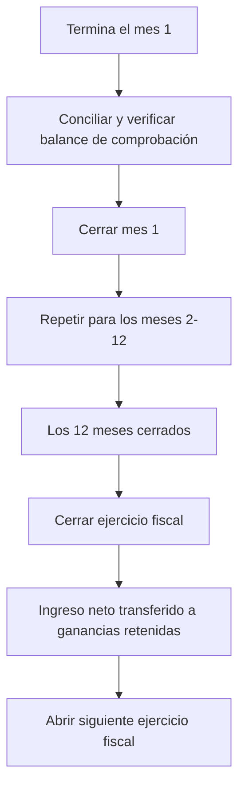

# Cierre - Transferir Ingreso Neto del EstadoDeResultados al BalanceGeneral

## Compensación de Saldos Efectivos de Cuentas del EstadoDeResultados

### Tipos de Saldo Normal Negativo

Los saldos efectivos de Cala pueden ser negativos. Compensar saldos normales negativos con una entrada de transacción de cierre funciona diferente que un tipo de saldo normal positivo.

```rust
pub fn settled(&self) -> Decimal {
    if self.direction == DebitOrCredit::Credit {
        self.details.settled.cr_balance - self.details.settled.dr_balance
    } else {
        self.details.settled.dr_balance - self.details.settled.cr_balance
    }
}
```

### Cuentas Contra

Una cuenta contra es una `Cuenta` de un `ConjuntoDeCuentas` en el `PlanDeCuentas`, que tiene un tipo de saldo normal diferente al de su padre.

Ejemplo, cuentas de operador de `lana-bank` con una provisión para pérdidas de préstamos. En un mes dado, las pérdidas de préstamos realizadas fueron menores que la provisión para un período. Un Contador/CFO, hará una transacción manual con una entrada acreditando una cuenta de `Gasto` de saldo normal crédito - reduciendo las pérdidas realizadas.

### Cuándo cerrar un mes

Los operadores deben cerrar los meses después de completar toda la conciliación necesaria para el período:

- Verificar que el balance de comprobación cuadre (el total de débitos sea igual al total de créditos)
- Confirmar que todas las transacciones esperadas para el período hayan sido registradas (acumulaciones de intereses, reconocimientos de comisiones, ajustes manuales)
- Revisar y resolver cualquier discrepancia antes del cierre, ya que no pueden corregirse mediante retroactividad después del cierre

## Cierre del ejercicio fiscal

El cierre del ejercicio fiscal es una operación de fin de año que transfiere el resultado neto del estado de pérdidas y ganancias al balance general. Este es el procedimiento contable estándar para restablecer las cuentas temporales (ingresos y gastos) y trasladar los resultados del período a las cuentas de patrimonio permanentes.

### Requisitos previos

El ejercicio fiscal solo puede cerrarse después de que los doce meses (o la cantidad de meses que abarque el ejercicio fiscal) hayan sido cerrados individualmente. Si algún mes permanece abierto, el cierre de fin de año no puede proceder.

### La transacción de cierre

Cuando se cierra el ejercicio fiscal, el sistema registra un asiento contable especial que:

1. **Pone a cero las cuentas de ingresos**: Todos los saldos de las cuentas de ingresos se compensan, llevándolos a cero. Esto prepara las cuentas para el próximo ejercicio fiscal.
2. **Pone a cero las cuentas de gastos**: De manera similar, todos los saldos de las cuentas de gastos y costos de ingresos se compensan.
3. **Transfiere el resultado neto a las ganancias retenidas**: La diferencia entre ingresos y gastos (el resultado neto o la pérdida neta) se registra en la cuenta de ganancias retenidas en la sección de patrimonio del balance general.
   - Si el banco obtuvo ganancias, se acredita la cuenta de ganancias de ganancias retenidas.
   - Si el banco incurrió en pérdidas, se debita la cuenta de pérdidas de ganancias retenidas.

La fecha efectiva de esta transacción de cierre se establece en la fecha de cierre del ejercicio fiscal.

Después de esta transacción, las cuentas de pérdidas y ganancias comienzan el nuevo ejercicio fiscal en cero, mientras que el balance general traslada el resultado acumulado en las ganancias retenidas.

## Manejo de saldos negativos y contracuentas

### Cálculo del saldo efectivo

El libro mayor de Cala calcula los saldos efectivos según el tipo de saldo normal de la cuenta:

- **Cuentas de saldo deudor** (activos, gastos): Saldo efectivo = Débitos - Créditos
- **Cuentas de saldo acreedor** (pasivos, patrimonio, ingresos): Saldo efectivo = Créditos - Débitos

Los saldos efectivos pueden ser negativos. Por ejemplo, una cuenta de gastos con más créditos que débitos tiene un saldo efectivo negativo. El proceso de cierre debe manejar correctamente estos saldos negativos al construir el asiento de diario de fin de año.

### Contracuentas

Una contracuenta es una cuenta dentro de un conjunto de cuentas en el plan de cuentas que tiene un tipo de saldo normal diferente al de su cuenta principal. Las contracuentas se utilizan para reducir el saldo de una cuenta relacionada mientras se mantiene un seguimiento detallado.

Por ejemplo, un banco podría tener una provisión para pérdidas crediticias modelada como una cuenta de saldo acreedor dentro de la sección de gastos. Si las pérdidas crediticias reales de un período fueran menores que la provisión, un contador acreditaría esta cuenta de gastos, reduciendo efectivamente el reconocimiento total de gastos. El proceso de cierre debe tener en cuenta estos saldos contrarios al calcular el ingreso neto.

## Secuencia operativa

El flujo de trabajo completo de cierre de período para un ejercicio fiscal sigue esta secuencia:



1. **Ciclo mensual**: A medida que pasa cada mes, el operador concilia los libros y cierra el mes.
2. **Fin de año**: Después de cerrar el último mes, el operador inicia el cierre del ejercicio fiscal.
3. **Año nuevo**: Después de cerrar el ejercicio fiscal, el siguiente ejercicio fiscal debe abrirse explícitamente antes de que se puedan registrar transacciones del nuevo año.

Cada paso es irreversible, lo que garantiza una pista de auditoría clara y evita modificaciones retroactivas a períodos finalizados.
