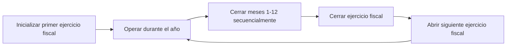
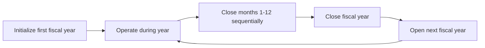

# AñoFiscal

## Supuestos Importantes

- Las cuentas del `EstadoDeResultados` operan solo en USD.

## Inicialización

No se pueden registrar transacciones hasta que la primera entidad `AñoFiscal` haya sido inicializada. Una actualización de metadatos del conjunto de cuentas realizada al conjunto de cuentas raíz del `Plan` al que se relaciona el `AñoFiscal` permite que los controles de velocidad sean satisfechos.

Hay 2 formas de inicializar el primer `AñoFiscal`:

- En el inicio inicial si `accounting_init` tiene una `chart_of_accounts_opening_date` establecida en YAML.
- A través de mutación GraphQL.

## Cierre de Meses de un AñoFiscal

Los cierres mensuales bloquean todo el libro mayor contra transacciones con una `effective_date` anterior a `month_closed_as_of`. Para ejecutar este comando de entidad, la precondición de que el mes haya pasado (según `crate::time::now()`) debe ser satisfecha. El comando aplica al mes más antiguo no cerrado del `AñoFiscal`.

## Cierre del AñoFiscal

Si el último mes de un `AñoFiscal` ha sido cerrado, el ciclo de vida del `AñoFiscal` puede ser completado. Esto registra una transacción en el libro mayor, con una `effective_date` establecida al `closed_as_of` del `AñoFiscal`.

La significancia contable de esta transacción es transferir el ingreso neto del `AñoFiscal` del `EstadoDeResultados` al `BalanceGeneral`.

## Abrir el siguiente AñoFiscal

Requerido como una acción explícita.

Cuando se inicializa un año fiscal, el sistema:

1. Crea la entidad del año fiscal con sus fechas de inicio y fin.
2. Actualiza los metadatos del conjunto de cuentas en la raíz del plan de cuentas para habilitar los controles de velocidad.
3. Abre el libro mayor para transacciones dentro del rango de fechas del año fiscal.

Después de la inicialización, se pueden registrar depósitos, crear facilidades de crédito y proceder con todas las demás operaciones financieras.

## Cierre mensual

Cada año fiscal está compuesto por meses individuales que deben cerrarse secuencialmente. El cierre mensual bloquea el libro mayor contra transacciones con fecha efectiva en o antes de la fecha de cierre.

### Requisito de cierre secuencial

Los meses deben cerrarse en orden cronológico. El sistema siempre aplica el cierre al mes sin cerrar más antiguo del año fiscal. Un operador no puede cerrar marzo antes de cerrar febrero. Esto garantiza que los registros de cada período se revisen y finalicen antes de continuar.

### Condiciones previas

Un mes solo puede cerrarse si el mes calendario ha transcurrido según la hora actual del sistema. Enero no puede cerrarse hasta el 1 de febrero como mínimo. Esto evita el cierre prematuro que podría bloquear transacciones legítimas.

### Efecto en el libro mayor

Una vez que se cierra un mes, los controles de velocidad del libro mayor de Cala rechazan cualquier transacción que intente registrarse con una fecha efectiva dentro o antes del mes cerrado. Esto proporciona una garantía sólida de que los registros históricos son inmutables. Si se descubre un error después del cierre, debe corregirse con una nueva transacción en el período abierto actual, no modificando el período cerrado.

### Mejores prácticas operativas

Antes de cerrar un mes, los operadores deben:

1. **Revisar el balance de comprobación** para confirmar que los débitos sean iguales a los créditos.
2. **Verificar los asientos automatizados** — comprobar que todos los asientos contables automatizados esperados de acumulación de intereses, reconocimiento de comisiones y otros hayan sido registrados para el período.
3. **Procesar ajustes manuales** — registrar cualquier ajuste de fin de período (provisiones para pérdidas crediticias, correcciones de acumulaciones, reclasificaciones) antes del cierre.
4. **Conciliar datos externos** — comparar extractos bancarios, informes de custodia y otras fuentes externas con los saldos del libro mayor.

## Cierre del ejercicio fiscal

Después de que los doce meses hayan sido cerrados individualmente, el ejercicio fiscal en sí puede cerrarse. Este es el procedimiento de fin de año que transfiere el resultado neto del estado de pérdidas y ganancias al balance general.

### El asiento de cierre

El cierre del ejercicio fiscal registra una transacción especial en el libro mayor con una fecha efectiva establecida en la fecha de cierre del ejercicio fiscal. Esta transacción:

- Compensa todos los saldos de las cuentas de ingresos, costo de ingresos y gastos, llevándolos a cero.
- Registra el resultado neto (ingresos menos gastos) en las cuentas de ganancias retenidas en la sección de patrimonio del balance general.
- Si el resultado es una ganancia, se acredita a la cuenta de ganancias retenidas.
- Si el resultado es una pérdida, se debita a la cuenta de pérdidas retenidas.

Después de este asiento, las cuentas de pérdidas y ganancias comienzan el siguiente ejercicio fiscal con saldos en cero, mientras que el balance general arrastra las ganancias retenidas acumuladas.

### Irreversibilidad

Al igual que los cierres mensuales, el cierre del ejercicio fiscal es irreversible. Una vez completado, el asiento de cierre de fin de año no puede revertirse ni modificarse. Los estados financieros del año cerrado son definitivos.

Al igual que los cierres mensuales, el cierre del ejercicio fiscal es irreversible. Una vez completado, el asiento de cierre de fin de año no se puede revertir ni modificar. Los estados financieros del año cerrado son definitivos.

## Apertura del siguiente ejercicio fiscal

Después de cerrar un ejercicio fiscal, el siguiente ejercicio fiscal debe abrirse explícitamente antes de que se puedan registrar transacciones en el nuevo período. Esta es una decisión de diseño intencional que requiere una decisión consciente para avanzar el calendario contable.

El nuevo ejercicio fiscal comienza el día después de la fecha de cierre del año anterior y abarca doce meses. Hasta que se abra, el sistema rechazará cualquier transacción con fechas efectivas en el nuevo período.

### Resumen del flujo de trabajo

Este ciclo se repite anualmente. Cada ejercicio fiscal proporciona un límite claro para la presentación de informes financieros y garantiza que los libros del banco se cierren y trasladen adecuadamente a intervalos regulares.

Este ciclo se repite anualmente. Cada año fiscal proporciona un límite claro para la presentación de informes financieros y garantiza que los libros del banco se cierren y se trasladen adecuadamente a intervalos regulares.

Este ciclo se repite anualmente. Cada año fiscal proporciona un límite claro para la presentación de informes financieros y garantiza que los libros del banco se cierren y se trasladen adecuadamente a intervalos regulares.

Este ciclo se repite anualmente. Cada año fiscal proporciona un límite claro para la presentación de informes financieros y garantiza que los libros del banco se cierren y se trasladen correctamente a intervalos regulares.

Este ciclo se repite anualmente. Cada año fiscal proporciona un límite claro para la presentación de informes financieros y garantiza que los libros del banco se cierren y se trasladen correctamente a intervalos regulares.
